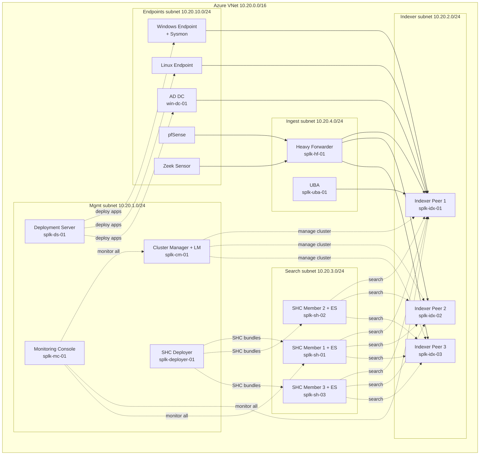

# Chat Summary — Setup Conversation

> Canonical record of the conversation that produced this repo. Every decision and its rationale. Claude Code reads this on the first session as part of bootstrap.

---

## My profile

- **Role:** Threat Detection Engineer (TDE). Previously SOC Analyst.
- **Splunk experience:** 1+ year. Daily: SPL queries, incident analysis, correlation rule tuning, lookup files, content engineering for Splunk Enterprise Security.
- **Self-assessed:** strong on content/detection side. Intentionally weak on platform infrastructure — the gap this project closes.
- **Location:** Baku, Azerbaijan.

## Trajectory

- **Short-term:** SPLK-1002 (Power User) + SPLK-1003 (Admin).
- **Mid-term:** SPLK-3001 (ES Admin) — already work with ES from content side.
- **Long-term:** **SIEM Architect**. Capacity planning, multi-site clustering, ITSI, SOAR integration, design and review.
- **Future certs:** SPLK-2002 (Architect), Splunk Cloud Certified Admin.

---

## Target lab architecture (Azure)

Full distributed Splunk Enterprise Security + UBA deployment. Mermaid source:



### Subnets

| Subnet | CIDR | Role |
|---|---|---|
| Mgmt | 10.20.1.0/24 | Control plane: CM+LM, DS, SHC Deployer, MC |
| Indexer | 10.20.2.0/24 | 3-node indexer cluster |
| Search | 10.20.3.0/24 | 3-member SHC with Enterprise Security |
| Ingest | 10.20.4.0/24 | Heavy Forwarder (syslog from pfSense, Zeek); UBA |
| Endpoints | 10.20.10.0/24 | AD DC, Win+Sysmon, Linux, Zeek sensor, pfSense |

### Data flow conventions

- **Solid arrows** = event data flow (forwarders to indexers)
- **Dashed arrows** = control plane (management, search, deployment, monitoring)
- UFs on Windows/Linux/DC send directly to indexers
- pfSense + Zeek emit syslog → HF parses → forwards to indexers
- HF load-balances cooked events across all 3 indexers
- SHC members fan out searches to all 3 indexers

---

## The Udemy course

**Title:** Complete Splunk Enterprise Certified Admin Course (NEW)
**Instructor:** Saif Al-Shoker (former Splunk Architect employee, Splunk Certified Core Consultant)
**URL:** https://www.udemy.com/course/the-splunk-enterprise-certified-admin-course-2022-with-labs
**Runtime:** 10.5 hours
**Rating:** ~4.5 from ~1000+ reviews
**Updated:** July 2024 (covers Splunk 9.x)
**Target exam:** SPLK-1003 — Splunk Enterprise Certified Admin

### Full 68-lecture TOC, grouped by theme

#### Theme 1: Splunk fundamentals & architecture (items 1–4, ~27 min)
1. Getting started with Splunk — 3 min
2. What does Splunk do? — 4 min
3. Splunk Components at a glance and Architecture Overview — 5 min
4. Splunk Components in Depth — 15 min

#### Theme 2: Install + Linux best practices (items 5–16, ~45 min)
5. Splunk Deployment Prerequisites — 12 min
6. Document — Splunk download / install (Linux tgz) — 1 min
7. Document — Network settings and resources — 1 min
8. Document — Splunk System Requirements — 1 min
9. LAB: Deploy Splunk on a Linux Machine — 11 min
10. LAB: Disable Transparent Huge Pages on Linux — 5 min
11. Document — Disable THP on Linux — 1 min
12. LAB: Increase ulimit on Linux — 1 min
13. LAB: Configure Splunk to start at boot — 3 min
14. Document — Ulimit and resources — 1 min
15. LAB: Post-Installation Health Check — 4 min
16. Deploy Splunk on a Windows Machine — 3 min

#### Theme 3: Apps, add-ons, conf files, layering (items 17–21, ~40 min)
17. Intro to Splunk Apps/Add-ons + deploy first App via web — 13 min
18. Deploying Splunk Apps/Add-ons via CLI — 5 min
19. Demo: Configuration Files structure — 11 min
20. Splunk configuration Layering (Global vs App/User context) — 10 min
21. Document — Splunk Configuration file Resources — 1 min

#### Theme 4: Indexes, buckets, retention, fishbucket (items 22–28, ~58 min)
22. Introduction to Splunk Indexes — 7 min
23. Demo: Splunk Index Structure — 10 min
24. Splunk Index — Buckets Life Cycle and Retention Policy — 5 min
25. LAB: Splunk Indexes — Add via web and CLI — 19 min
26. Splunk Indexes: Backup and deletion — 10 min
27. The Fishbucket Concept in Splunk — 6 min
28. Document — Fishbucket resources — 1 min

#### Theme 5: Users, roles, LDAP (items 29–30, ~24 min)
29. Splunk User roles + Custom roles — 9 min
30. LAB: Integrate Splunk with LDAP — 15 min

#### Theme 6: Forwarders + distributed setup (items 31–36, ~80 min)
31. LAB: UF on Linux — 7 min
32. LAB: Configure UF for monitoring input → Indexer — 18 min
33. LAB: Configure Indexer for log receiving — 16 min
34. LAB: UF on Windows — 10 min
35. LAB: Configure Indexer + Windows App on UF and Indexer — 19 min
36. LAB: Deploy Search Head (distributed architecture) — 10 min

#### Theme 7: Data flow concepts (items 37–43, ~53 min)
37. Data Collection Methods in distributed env — 7 min
38. Metadata Fields and data flow — 9 min
39. Why Sourcetype Matters — 11 min
40. Data consolidation, Load balancing, Event breaking — 18 min
41. Forwarding via Routing and Filtering — 2 min
42. Intermediate Forwarders — 3 min
43. Why UF over HF — 3 min

#### Theme 8: Deployment Server (items 44–45, ~33 min)
44. Intro to Deployment Server, Clients, Server Class — 9 min
45. LAB: Deploy DS and Clients — 24 min

#### Theme 9: Data inputs deep dive (items 46–53, ~88 min)
46. Intro to data inputs — 7 min
47. LAB: UF + monitoring inputs — 14 min
48. LAB: UF monitor specific files — 6 min
49. LAB: file pathname wildcards & host_regex & host_segment — 15 min
50. LAB: whitelist to include files — 8 min
51. LAB: Configure Firewall → UF (Network Input) — 15 min
52. LAB: Scripted Inputs — 7 min
53. LAB: HTTP Event Collector — 16 min

#### Theme 10: Capstone AWS lab (items 54–61, ~147 min — ~2.5 hours)
54. Lab setup Overview — 5 min
55. LAB: Intro to AWS + Deploy Splunk Instances on AWS — 12 min
56. Splunk Deployment Walkthrough (distributed) — 6 min
57. LAB: Deploy Splunk Components + forward logs — 32 min
58. LAB: Deploy UFs, IFs (Linux), UF (Windows), join DS — 17 min
59. LAB: Deploy Base Apps via DS — 21 min
60. LAB: Use cases on Universal Forwarders — 36 min
61. LAB: Deploy HF via DS + Fortigate Firewall Logs — 18 min

#### Theme 11: Data onboarding (items 62–68, ~50 min)
62. LAB: Data Onboarding + props.conf, transforms.conf — 6 min
63. Document — Data Onboarding Resources — 1 min
64. Document — Regular Expressions resources — 1 min
65. LAB: Data Preview to validate event creation (parsing) — 12 min
66. LAB: Field extractions with props.conf — 7 min
67. LAB: SEDCMD in props.conf — 11 min
68. LAB: Mask data via props + transforms — 12 min

### Identified course gaps

**Not covered in Saif's course** (verified from the TOC; goes into `06-supplementary/`):

- **Indexer clustering** (CM, peers, RF/SF, multi-site, bucket fixup)
- **Search Head Clustering** (deployer, captain, members, KV store replication)
- **Monitoring Console** setup at scale
- **Enterprise Security admin** (separate cert path SPLK-3001)
- **UBA** (separate product, separate training)

The capstone lab uses AWS; I'm on Azure. Concepts 1:1 — only IaaS plumbing differs (VNet vs VPC, NSG vs SG, Entra ID vs IAM).

---

## All decisions made in setup (with rationale)

| Decision | Choice | Rationale |
|---|---|---|
| OS | Windows 11 + WSL2 | Existing setup; WSL2 is the canonical Claude Code environment on Windows |
| Lab platform | Azure paid subscription, full diagram | Real-world scale matters for architect track |
| Project location | Windows side at `C:\Users\<me>\Documents\splunk-journey\` | Obsidian indexes cleanly on NTFS; WSL accesses via `/mnt/c/`. Performance hit negligible for notes/transcripts |
| Note tools | Obsidian + Notion (initially both) | Will pick one in ~a month. Obsidian for working notes, Notion for polished/mobile |
| Note style | Hybrid | Course-mirrored raw notes + topic synthesis + lab journal + atomic concepts (organic) |
| IaC | None for now | Manual build teaches more; Terraform/Ansible later. Log `az` commands in `05-labs/azure-setup/` |
| Spaced repetition | No Anki | Labs + NotebookLM quizzes handle recall |
| Version control | Public GitHub | Portfolio value; strict `.gitignore` from day one |
| Session rhythm | Variable / opportunistic | Structure must be self-explanatory after multi-day gaps |
| Course position | Saif's Admin course = primary | Cert + lab spine; supplement separately for clustering/MC/ES/UBA |
| Session handoff | Mandatory `handoff.md` at root + archive in `00-meta/handoffs/` | Variable rhythm requires structured state transfer; rolling root file for speed, archive for timeline/portfolio |
| NBLM role | Production target — all four outputs (podcast, quiz, mind map, briefing) | Structured `99-notebooklm/` bundles per topic; not just review layer |
| Detail level for context files | Detailed but disciplined, ~50% larger than v1 | Variable rhythm = forgetting own conventions; thoroughness offsets that |
| Roadmap structure | Phase/chapter-based, no calendar | Variable rhythm; deliverables over deadlines |
| Claude shell | WSL Ubuntu, not PowerShell | Unix-first design; matches lab work |

---

## Key recommendations baked into the setup

### Cost control (Azure)

- **Auto-shutdown every VM** from creation. Azure built-in feature, ~23:00 local.
- "Tear down Friday, rebuild Monday" for non-essential VMs.
- Log every `az` CLI command in `05-labs/azure-setup/azure-cli-commands.md` — semi-IaC by hand.
- Claude must remind me to enable auto-shutdown whenever I describe spinning up a VM.

### Public repo discipline

- Strict `.gitignore` from commit #1.
- Never commit: real IPs (work env), license keys, Azure subscription/tenant IDs, `.env`, SSH keys, credentials, real customer data, screenshots with tokens.
- Lab IPs in `10.20.x.x` are fine — that's the architecture diagram, not production.
- Pre-commit scan: `git diff --cached | grep -iE "license|password|secret|token|api[_-]?key|bearer|\.lic\b"` and `grep -E "10\.[0-9]+\.[0-9]+\.[0-9]+" | grep -v "10\.20\."`.

### Power User cert efficiency

- I do Power User-level work daily. Don't re-learn — exam-familiarize.
- Focus heavy learning on Admin (SPLK-1003) and beyond.

### Hybrid notes implementation

- Lab journal entries (`05-labs/journal/YYYY-MM-DD-*.md`) are most valuable artifacts for portfolio + architect interviews. Treat as deliverables, not scratch.
- Synthesis notes (`03-topics/`) written *after* understanding, not during. Skip until I can explain the topic in my own words.

### Session handoff

- Rolling `handoff.md` at root for fast pickup.
- Archive in `00-meta/handoffs/YYYY-MM-DD-HHMM-<slug>.md` builds learning timeline (portfolio value).
- "Next step" is **one** concrete action — variable rhythm + multi-item next steps = decision paralysis.
- Trigger words: "wrap up", "I have to go", "save state", "handoff", "let's stop here".
- If session ended abruptly without proper handoff, next session's first job is reconstruct from `git log` + recent file changes.

### NotebookLM workflow

- NBLM is a **production target**, not just review.
- Bundles in `99-notebooklm/<topic-slug>/` ready for upload.
- Each bundle generates: podcast, quizzes, mind map, briefing doc.
- Keep the *prompts* used for each NBLM output in `<topic-slug>/prompts.md` for reproducibility.
- Claude prompts me to bundle after completing a course theme or topic synthesis.

### Tool roles

- **Claude Code:** primary tool. Reads repo, edits files, helps reason. Sessions reference `CLAUDE.md` automatically.
- **Obsidian:** working surface for note-taking. Vault = the repo folder. Graph view for concept relationships.
- **Notion:** mobile review + polished surface. Optional. May consolidate to Obsidian-only.
- **NotebookLM:** production layer for podcast/quiz/mindmap/briefing outputs from `99-notebooklm/` bundles.
- **GitHub:** version history + public portfolio.
- **VS Code:** editor; Claude Code in WSL terminal inside it.

---

## Tools NOT used and why

- **Anki:** I prefer doing over memorizing. NotebookLM quizzes + labs serve the same role.
- **Terraform / Ansible / IaC:** later. Manual first for pedagogy.
- **Splunk Cloud trial:** redundant — building the full Azure lab.
- **BOTS dataset:** flagged for later (ES/hunting practice phase).
- **PowerShell for Claude Code:** Unix-first design; WSL is canonical.

---

## Future cert/learning path

```
Now ──► SPLK-1002 ──► SPLK-1003 ──► SPLK-3001 ──► SIEM Architect role
            │              │              │
        quick exam     primary focus   already in
        familiarize    (Saif course)   daily orbit
                       + supplementary
                       (clustering, MC)
```

Architect cert (SPLK-2002) and Cloud Admin are stretch goals after the above.

---

## Recommended `.gitignore` (canonical version lives in repo root)

```gitignore
# OS / editor
.DS_Store
Thumbs.db
*.swp
*~
desktop.ini

# VS Code
.vscode/

# Obsidian
.obsidian/workspace.json
.obsidian/workspace-mobile.json
.obsidian/cache/
.trash/

# Secrets — NEVER commit
.env
.env.*
*.key
*.pem
*.pfx
*.crt
id_rsa
id_ed25519
secrets/
credentials/
.aws/
.azure/

# Splunk-specific
*.lic
*.License
splunk.license
**/local/server.conf
**/local/web.conf
**/local/authentication.conf
**/local/passwd
hashFile
**/etc/auth/
**/etc/passwd

# Azure
azure-credentials.json
*.pfx

# Logs / temp
*.log
*.tmp
*.bak
*.cache

# NotebookLM exports (often have personal context)
99-notebooklm/**/exports/

# Node / Python (if/when added)
node_modules/
__pycache__/
*.pyc
.venv/
.pytest_cache/

# Terraform (when added later)
*.tfstate
*.tfstate.*
.terraform/
.terraform.lock.hcl
*.tfvars
!example.tfvars
```
