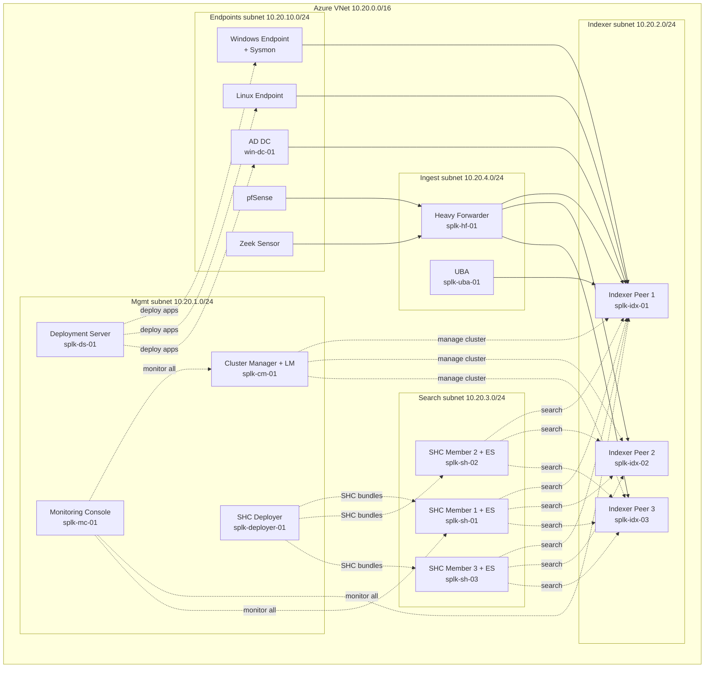

# Target Architecture — Splunk ES + UBA on Azure

The full distributed deployment this lab builds toward. Built manually (no IaC yet) on an Azure paid subscription. Saif's capstone uses AWS; the concepts map 1:1 — only the IaaS plumbing differs (VNet vs VPC, NSG vs SG, Entra ID vs IAM).

---

## Topology

---

## Subnet purpose & CIDR

| Subnet | CIDR | Role |
|---|---|---|
| Mgmt | 10.20.1.0/24 | Control plane: CM+LM, DS, SHC Deployer, MC |
| Indexer | 10.20.2.0/24 | 3-node indexer cluster |
| Search | 10.20.3.0/24 | 3-member SHC with Enterprise Security |
| Ingest | 10.20.4.0/24 | Heavy Forwarder (syslog from pfSense, Zeek); UBA |
| Endpoints | 10.20.10.0/24 | AD DC, Win+Sysmon, Linux, Zeek sensor, pfSense |

---

## Component-to-role mapping

| Hostname | Role | Subnet |
|---|---|---|
| `splk-cm-01` | Cluster Manager + License Manager | Mgmt |
| `splk-ds-01` | Deployment Server | Mgmt |
| `splk-deployer-01` | SHC Deployer | Mgmt |
| `splk-mc-01` | Monitoring Console | Mgmt |
| `splk-idx-01/02/03` | Indexer cluster peers | Indexer |
| `splk-sh-01/02/03` | SHC members running Enterprise Security | Search |
| `splk-hf-01` | Heavy Forwarder (parses pfSense + Zeek syslog) | Ingest |
| `splk-uba-01` | Splunk UBA | Ingest |
| `win-dc-01` | Active Directory Domain Controller (UF) | Endpoints |
| Windows endpoint | Workstation + Sysmon (UF) | Endpoints |
| Linux endpoint | Linux host (UF) | Endpoints |
| Zeek sensor | Network metadata sensor → syslog to HF | Endpoints |
| pfSense | Firewall → syslog to HF | Endpoints |

---

## Data flow conventions

- **Solid arrows** = event data flow (forwarders → indexers).
- **Dashed arrows** = control plane (management, search, deployment, monitoring).
- UFs on Windows / Linux / DC send cooked-ish events directly to indexers (UF does minimal processing).
- pfSense + Zeek emit syslog → HF parses → forwards to indexers.
- HF load-balances cooked events across all 3 indexers.
- SHC members fan out searches to all 3 indexers (search affinity / map-reduce).

---

## Course gaps this architecture exposes

Saif's SPLK-1003 course does **not** cover these (verified against the 68-lecture TOC). They live in `06-supplementary/` and are tackled in roadmap Phase 4+:

- **Indexer clustering** — CM, peers, RF/SF, multi-site, bucket fixup. (The diagram has a 3-peer cluster + CM; the course only teaches single-indexer + distributed search.)
- **Search Head Clustering** — deployer, captain election, members, KV store replication. (Diagram has a 3-member SHC + deployer; course teaches a single search head.)
- **Monitoring Console** at scale — distributed monitoring of the whole deployment.
- **Enterprise Security admin** — separate cert path (SPLK-3001); the course doesn't touch ES.
- **UBA** — separate product, separate training entirely.

The capstone (lectures 54–61) is AWS-based; this lab translates it to Azure. The simplified pre-clustering version is built in Phase 3; clustering/SHC/MC are layered on in Phase 4.

---

## Planned NSG rules (TBD — fill in during lab build)

One bullet per logical direction; actual port/source/priority values to be defined in `05-labs/azure-setup/` when each component is provisioned.

- **Inbound management → all Splunk hosts** (SSH/RDP from a jump source, Splunk Web 8000, mgmt 8089): **TBD**
- **Forwarders (Endpoints) → Indexers** (receiving port, typically 9997): **TBD**
- **Ingest HF → Indexers** (9997 cooked forwarding): **TBD**
- **Syslog sources (pfSense, Zeek) → HF** (514/UDP-TCP or custom syslog ports): **TBD**
- **Search subnet → Indexer subnet** (distributed search / replication 8089, rep port): **TBD**
- **Mgmt (CM/DS/Deployer/MC) → managed peers** (8089 control plane both directions as needed): **TBD**
- **Indexer ↔ Indexer** (cluster replication port): **TBD**
- **Egress / deny-all baseline** (default-deny posture, explicit allows only): **TBD**
