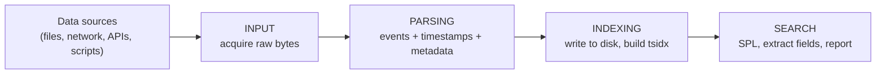
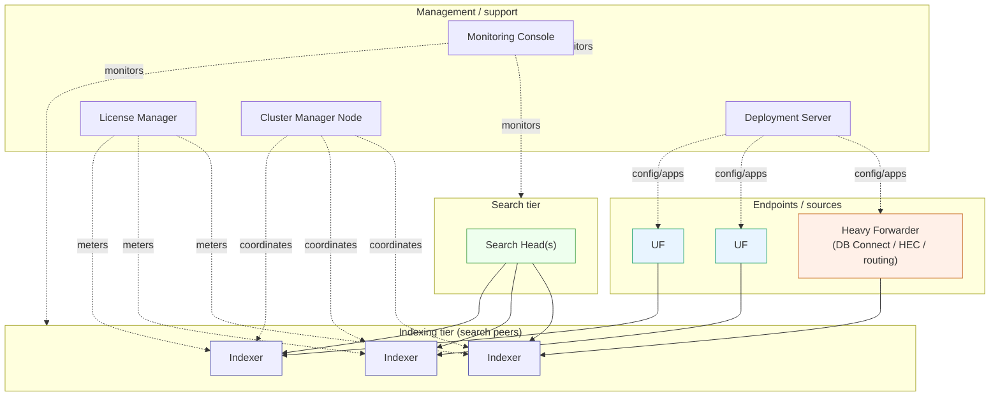

# Splunk Fundamentals & Architecture

> Deep reference notes on what Splunk is, how it processes data, and the components that do the work. Self-contained study material; the companion `pre-class.md` is the short primer and holds the official-doc references.

---

## 0. Orientation

Two questions define the foundation of Splunk administration:

1. **What problem does Splunk solve, and how does it turn raw data into answers?** — the **data pipeline**.
2. **What are the moving parts that perform that processing?** — the **components**.

Everything else in platform administration — installing software, layering configuration files, designing indexes, deploying forwarders, managing a deployment server, onboarding new data — is the detailed mechanics of the pipeline and the components introduced here. This is the skeleton; the rest of the discipline is filling in detail. Learn it thoroughly and the advanced material becomes far easier.

---

## 1. The problem: machine data

**Machine data** (machine-generated data) is the continuous stream of records produced by virtually every piece of IT and electronic equipment: servers, operating systems, applications, network gear, security appliances, containers, IoT sensors, mobile devices. Almost every meaningful action — a login, a packet, a transaction, a process start, a power cycle — emits a log record.

Why machine data is hard to work with, and why generic tools struggle:

- **Unstructured or semi-structured.** There is no single schema. A firewall syslog line, a JSON REST API log, a Windows Event, and an Apache access log share almost nothing in layout. Each format needs its own interpretation.
- **Time-series by nature.** Every record is anchored to a moment in time. Time is the one universal key across all of it — which is why Splunk treats time as a first-class citizen.
- **High-volume, high-velocity.** It is produced continuously and relentlessly, often at gigabytes-to-terabytes per day in a real enterprise.
- **Highly valuable but perishable.** It is the ground truth of what actually happened — the evidence for security incidents, outages, fraud, capacity problems, and compliance. But its value is highest when it can be searched *quickly* and *together*.

**The traditional pain.** When something breaks, an engineer logs into many machines and manually reads scattered, inconsistent log files to reconstruct what happened. This does not scale: data lives in silos, formats differ, correlation across systems is manual, and by the time the root cause is found the incident has widened.

**What Splunk does about it.** Splunk is a platform that ingests data from *any* source, makes every event searchable, and lets you query, correlate, alert on, and visualize across all of it from one place — in near real time. The recurring loop is **data → insight → action**: ingest telemetry, detect a meaningful pattern, raise an alert, and surface the state on a dashboard or KPI. A canonical example: a fleet of remote devices streams sensor and health data into Splunk; Splunk continuously evaluates it, detects anomalies, fires alerts on abnormal readings, and presents fleet performance on dashboards — turning a firehose of raw readings into operational awareness.

---

## 2. The key mental model: schema-on-read (late-binding schema)

This is the single most important concept in the platform, and it is what separates Splunk from a traditional database or a rigid legacy SIEM.

| | Traditional RDBMS / legacy SIEM | Splunk |
|---|---|---|
| When is structure applied? | **Schema-on-write** — define tables/columns *before* loading. Data that doesn't fit is rejected, truncated, or dropped. | **Schema-on-read** — store the raw event as-is; apply structure (fields) *at search time*. |
| What is physically stored? | Parsed, normalized rows | The original raw event (`_raw`) plus a time-keyed searchable index |
| Cost of adding a new field or parse rule | Re-design schema, often re-ingest historical data | Write a new search-time extraction — no re-indexing |
| Risk of losing information | High — anything off-schema is gone | Low — the verbatim raw data is preserved |
| Flexibility for unknown future questions | Poor — you must anticipate questions up front | High — you can ask new questions of old data |

Splunk calls this the **late-binding schema**: the "schema" — the rules that slice an event into named fields — is bound to the data *late*, at the moment you search, not when you ingest. Concretely:

- Splunk keeps the verbatim raw event (`_raw`) until it ages out by your retention policy.
- At index time it does only the **minimum** necessary: assign a timestamp, attach a few metadata fields, and build the keyword index that makes search fast.
- At search time it extracts whatever fields your search actually needs, on the fly.

**Why this matters to an administrator.** Most "I need a new field / a different parse" requests cost nothing at the platform level — they are search-time configuration and are fully reversible. Only a small, deliberate set of decisions are made *irreversibly* at index time. Knowing which is which (Section 4) is one of the core judgment skills of the job. It also explains why Splunk rarely "loses" data to a bad parser: the raw is always there to re-interpret.

---

## 3. The data pipeline — how data moves through Splunk

Splunk processes data in **four ordered segments**: **Input → Parsing → Indexing → Search**. Some informal explanations collapse this into three "stages" by merging parsing and indexing; use the four-segment model, because different work happens in parsing versus indexing and — critically — *different configuration files control each segment*.

### 3.1 Input segment
Splunk acquires raw data from a source — a monitored file or directory, a network port (TCP/UDP), a scripted input, the HTTP Event Collector, a Windows event channel, and so on. At this stage Splunk:

- reads the data as an undifferentiated **stream of bytes** — there are no "events" yet,
- breaks the stream into **64 KB blocks** for handling,
- tags the entire stream with the source-wide metadata keys **`source`**, **`sourcetype`**, **`host`**, and the destination **`index`**.

No event boundaries are decided and no timestamps are extracted yet. A **universal forwarder** operates almost entirely within this segment.

### 3.2 Parsing segment
This is the segment that turns a raw byte stream into individual, annotated **events**. Internally the parsing pipeline is composed of **three sub-pipelines — parsing, merging, and typing** — which together perform:

1. **Line breaking / event boundaries** — split the stream into lines and decide where one event ends and the next begins (controlled by attributes such as `LINE_BREAKER`, `SHOULD_LINEMERGE`, `BREAK_ONLY_BEFORE`, `MUST_BREAK_AFTER`).
2. **Timestamp recognition** — locate each event's timestamp and assign it to the internal **`_time`** field (`TIME_PREFIX`, `TIME_FORMAT`, `MAX_TIMESTAMP_LOOKAHEAD`, `TZ`). If no timestamp is found, Splunk falls back to heuristics or the input time.
3. **Metadata annotation** — stamp each event with the `host`, `source`, and `sourcetype` carried from the input segment.
4. **Index-time transforms** — apply regular-expression rules for masking (`SEDCMD`), routing, filtering (e.g., dropping events to `nullQueue`), or creating index-time fields (`transforms.conf`).
5. **Character-set normalization** and other event munging.

The parsing segment is performed by an **indexer**, or by a **heavy forwarder** (which contains the full parsing pipeline). It is **controlled chiefly by `props.conf` and `transforms.conf`** — the heart of data onboarding.

### 3.3 Indexing segment
Splunk takes the parsed events and writes them to disk. In this segment Splunk:

- writes the compressed **rawdata** journal,
- builds the **`tsidx`** (time-series index) structures that make the data searchable,
- breaks event text into searchable **segments** (segmentation, which influences index size and search behavior),
- and — importantly for administrators — **meters the license**, because license volume is measured here, against the raw data entering the indexing pipeline.

The indexing segment is performed by an **indexer** and is controlled largely by **`indexes.conf`**.

> Keep parsing and indexing mentally distinct even though they are often jointly called "indexing": **parsing makes events; indexing writes them and makes them searchable.**

### 3.4 Search segment
A user, alert, report, or dashboard submits a search expressed in **SPL** (Search Processing Language). Splunk:

- extracts **search-time fields** from `_raw`,
- runs the SPL commands (filtering, statistics, transformations),
- and in a distributed deployment **dispatches** the search to the indexers (acting as *search peers*), which each search their own slice of data and return partial results that the **search head** merges and presents — a map-reduce pattern that lets search scale across many indexers.

The search segment is performed by a **search head** and is controlled by `props.conf` (search-time extractions), `authorize.conf` (what a role may do), `savedsearches.conf`, and related files.

### 3.5 A single event's journey (worked example)
Consider one line written to `/var/log/secure` on a Linux host:

1. **Input** — a universal forwarder monitoring that file reads the new bytes, tags them `source=/var/log/secure`, `sourcetype=linux_secure`, `host=web01`, target `index=os`, chunks them into 64 KB blocks, and forwards them *unparsed*.
2. **Parsing** — the receiving indexer breaks the stream into individual lines, finds the syslog timestamp and sets `_time`, confirms the metadata, and applies any `props/transforms` rules for that sourcetype.
3. **Indexing** — the indexer compresses the raw line into the `os` index's hot bucket journal, updates the `tsidx`, and the event's raw volume is counted against the license.
4. **Search** — later, a search like `index=os sourcetype=linux_secure "Failed password"` scans the tsidx for those keywords, pulls the matching events from rawdata, extracts fields such as `user` and `src_ip` at search time, and returns them to the search head.

### 3.6 The segment → tier → component → config map (core reference)

| Pipeline segment | Processing tier | Component that performs it | Primary config files |
|---|---|---|---|
| Input | Data input tier | Universal/Heavy Forwarder (or an indexer reading directly) | `inputs.conf`, `outputs.conf` |
| Parsing | Indexing tier | Indexer **or** Heavy Forwarder | `props.conf`, `transforms.conf` |
| Indexing | Indexing tier | Indexer | `indexes.conf` |
| Search | Search management tier | Search Head | `props.conf` (search-time), `authorize.conf`, `savedsearches.conf` |

> Internalize this table. The majority of "where do I configure X?" questions are answered by first asking *"which pipeline segment does X belong to?"*

---

## 4. Index-time vs. search-time processing

Because of the late-binding schema, *when* a piece of processing happens has large consequences.

- **Index time** = everything between data being consumed and being written to disk (the parsing and indexing segments). Decisions made here are **baked into the bucket** and are effectively **irreversible** — to change them you must delete and **re-index** the affected data.
- **Search time** = work done when a search runs. Splunk creates these fields on the fly and **does not store them**. This processing is cheap, flexible, and fully reversible — change the config and the next search reflects it.

**Default fields assigned at index time** (you always get these):

| Field | Meaning |
|---|---|
| `_time` | Event timestamp — the universal key for everything in Splunk |
| `_raw` | The original, verbatim event text |
| `host` | Originating host of the event |
| `source` | Origin: the file path, input, or stream that produced it |
| `sourcetype` | The format/category of the data — drives parsing and search-time extraction |
| `index` | Which index the event was written to |
| `_indextime` | When Splunk indexed the event (distinct from `_time`) |
| `linecount`, `_cd`, `splunk_server`, … | Housekeeping internals |

**Best-practice rule:** perform as much knowledge work as possible — especially **field extraction** — **at search time**. Index-time custom fields slow indexing *and* search (they enlarge the index, and searches over a larger index take longer) and cannot be undone without re-indexing. Reserve index-time field creation for a few specific situations:

- a field you search constantly with negation (`field!=value` or `NOT field=value`), where a search-time extraction measurably hurts performance;
- mapping headers of well-structured formats (CSV, TSV, pipe-delimited, JSON) at index time;
- values you must guarantee are present and consistent for downstream routing or compliance.

> This is *the* recurring administrative judgment call: "Do I solve this in props/transforms at index time, or as a search-time extraction?" The default answer is **search time**, unless you have a specific, measured reason to do otherwise.

---

## 5. Metadata & default fields — the "big three"

Three metadata fields are assigned at input and govern how Splunk treats every event:

- **`host`** — *where* the data came from (the originating machine or device).
- **`source`** — *what* produced it: the full path or name of the file/input (for example `/var/log/secure`, `udp:514`, `WinEventLog:Security`).
- **`sourcetype`** — *the format/type* of the data (for example `linux_secure`, `cisco:asa`, `access_combined`).

**Sourcetype is the most consequential of the three for an administrator**, because it is the key Splunk uses to decide **how to parse** the data (line breaking, timestamp rules) and **how to extract fields at search time**. Assign the right sourcetype and onboarding largely works automatically and normalization (e.g., to a common information model) falls into place; assign the wrong one and events break apart, timestamps are mis-detected, and field extractions fail. A great deal of data-onboarding work is, in essence, getting sourcetypes right.

Beyond the big three, useful internal fields include `_time`, `_raw`, `_indextime`, and `index`. Splunk also maintains internal indexes — notably **`_internal`** (Splunk's own logs and metrics), **`_audit`** (audit trail), and **`_introspection`** (resource usage) — which are invaluable for troubleshooting the platform itself.

---

## 6. How the indexer stores data: indexes & buckets

An **index** is a logical data store. Physically, it is a set of directories called **buckets**, organized by age. Each bucket directory contains:

- **`rawdata/journal.gz`** — the compressed original events. It holds everything needed to *rebuild* the searchable index files if they are lost or corrupted.
- **`*.tsidx` (time-series index) files** — these map every unique **keyword** in the data to **location references** (pointers) into the rawdata journal. A search scans the tsidx for the search terms, then jumps to those locations in rawdata to retrieve the matching events. The tsidx is, in effect, the searchable lookup; the rawdata is the source of truth.
- **bloom filters** — compact probabilistic structures that let a search quickly rule a bucket *out* ("this keyword is definitely not here"), avoiding unnecessary scans.
- **metadata files** — bucket manifests, host/source/sourcetype summaries, and similar.

**Why multiple indexes (not one giant index)?** Administrators separate data into multiple indexes to control:
- **Access** — roles are granted access per index, so sensitive data can be isolated;
- **Retention** — each index can have its own aging/retention policy;
- **Performance** — searches scoped to a smaller, relevant index scan less data;
- **Data management** — different data types can live on different storage tiers.

**Bucket lifecycle.** Data flows through bucket states by age:

New events are written to a **hot** bucket (open for writing). When it fills, ages out, or the indexer restarts, it **rolls to warm** (searchable but read-only) and a new hot bucket opens. As warm buckets accumulate, the oldest **roll to cold** (typically on cheaper/larger storage). Eventually buckets **roll to frozen**, at which point they are **deleted** by default — or **archived** if you configure a frozen path. Archived data can be **thawed** back into a searchable state. (Detailed sizing and retention tuning belongs to the indexes-and-retention topic.)

**Sizing rule of thumb.** Indexed data occupies roughly **~50%** of the original ingest volume on average — about **~15%** for the compressed rawdata journal plus **~35%** for tsidx and metadata. This varies considerably with data type and segmentation settings, but ~50% is a reasonable planning baseline.

> A special internal store called the **fishbucket** tracks how far Splunk has read into each monitored file (by CRC checkpoints), so it does not re-ingest data it has already read. It is *not* a data bucket — don't confuse the two.

---

## 7. Standalone vs. distributed — and the rule that ties components together

**Standalone deployment.** A single Splunk Enterprise instance performs *all* roles — input, parsing, indexing, and search. It is ideal for learning, testing, proofs of concept, and very small environments. Installing Splunk Enterprise gives you exactly this out of the box.

**Distributed deployment.** The roles are split across dedicated machines so each can be scaled and tuned independently — forwarders collect, indexers parse/index/store and search their own data, and search heads coordinate searches. This is what real-world, high-volume, and highly-available environments use. You scale **ingest and search throughput** mainly by adding indexers, and you add **resilience** by clustering indexers and search heads.

**The rule that makes all of this possible — and a point people often get wrong:**

> **Every full Splunk component installs from the *same* Splunk Enterprise package. What makes an instance a search head, an indexer, or a heavy forwarder is its *configuration / enabled role*, not a different download.** The Universal Forwarder is the single exception — it is a separate, stripped-down package.

So "deploying a search head" does not mean installing special software; it means installing Splunk Enterprise and configuring that instance to act as a search head.

---

## 8. The processing components (in depth)

Processing components **handle the data** itself.

### 8.1 Universal Forwarder (UF)
- **Purpose: forward data only.** It **cannot index or search** data.
- A separate, **lightweight package** (tens of MB) with a **minimal footprint**, **no bundled Python interpreter** for Python-based modular inputs, and **no web UI**.
- Sends **unparsed ("uncooked") data**: it does not break events, but it *does* tag the stream with `source`/`sourcetype`/`host`, divide it into 64 KB blocks, and apply rudimentary timestamping the receiving indexer can fall back on if the events lack discernible timestamps.
- **Free** — it runs under an automatic **forwarder license** and does not consume your indexing-volume license.
- It is the **best and most common way to get data in.** In large environments, "universal forwarders everywhere" is the default collection pattern because of its low resource cost and central manageability.

### 8.2 Heavy Forwarder (HF)
- A **full Splunk Enterprise instance** running in a forwarding role. It contains the **complete parsing pipeline**, so it can **parse, route, filter, and modify** data before forwarding.
- Sends **parsed ("cooked") data**, which means the receiving **indexer skips its parsing pipeline** — the work is already done. (You can force any forwarder to send raw, unparsed data by setting `sendCookedData=false` in `outputs.conf`.)
- Includes Python and (optionally) a UI, so it can run **modular/scripted inputs and add-ons** a UF cannot — for example **DB Connect** (pulling structured data from databases), acting as an **HTTP Event Collector (HEC)** receiver, or running cloud/API pull add-ons.
- **Larger footprint; uses an Enterprise license.** Local indexing on an HF is normally **disabled** — you use it to forward, not to store.

**UF vs. HF — decision criteria:**

| Need | Use |
|---|---|
| Lightweight collection from many endpoints | **UF** (default choice) |
| Lowest resource cost / no parsing at the edge | **UF** |
| Parse, route, or filter data *before* the indexers | **HF** |
| Run a Python-based add-on (DB Connect, some cloud inputs) near the source | **HF** |
| Receive HEC or other event-collector data at the edge | **HF** |
| Reduce license volume by dropping junk before indexing | **HF** (or transforms at the indexer) |

> Default to the **UF**. Reach for an **HF** only when you specifically need edge parsing/routing/filtering or a capability the UF lacks. The point that "an HF sends cooked data, so the indexer does not re-parse it" is a common point of confusion — lock it in.

### 8.3 Light Forwarder — deprecated
An older forwarder type that sent only unparsed data; **deprecated since Splunk 6.0** and superseded by the universal forwarder. Recognize the name; you will not deploy one today.

### 8.4 Indexer (a.k.a. search peer)
- Provides **data processing and storage**: it parses incoming data (unless it arrives pre-parsed from a heavy forwarder), writes events to buckets, and hosts the primary data store.
- It also **searches its own data** in response to requests from a search head; in that role it is called a **search peer**.
- The workhorse of the platform — adding indexers horizontally is the primary way to scale both ingest and search.

### 8.5 Search Head (SH)
- Provides the **UI and SPL** for users, **distributes searches to indexers (search peers)**, and **consolidates** the returned results for display.
- A **dedicated** search head holds **no event data of its own** (only internal indexes); it is a coordinator and merger of results.
- Multiple search heads can be joined into a **Search Head Cluster (SHC)** for horizontal scale and high availability, sharing configuration and search artifacts.

> **Cooked vs. uncooked recap:** a UF sends **uncooked/unparsed** data (the indexer parses it); an HF sends **cooked/parsed** data (the indexer skips parsing). This single distinction explains much of how forwarders are chosen and where parsing load lands.

### 8.6 Intermediate forwarding (brief)
In larger or segmented networks, forwarders are sometimes chained — endpoint UFs send to an **intermediate forwarder** (often an HF) that aggregates and relays to the indexers. This is useful for crossing network boundaries, consolidating egress points, or applying parsing/filtering at a choke point. (Detailed in the forwarding/data-flow topic.)

---

## 9. The management / support components (in depth)

Management components do **not** touch event data; they **coordinate and support** the processing components.

### 9.1 Deployment Server (DS)
- A **centralized configuration manager for forwarders** (and other clients). In a deployment with hundreds or thousands of universal forwarders, you do not edit each one by hand — you manage them centrally from the DS.
- Clients are **deployment clients**; you group them into **server classes** (by OS, role, location, etc.) and push **deployment apps** (bundles of configuration) to the appropriate classes.
- **Pull model:** clients **phone home** to the DS at a configurable interval, compare configuration **checksums/hashes**, and **pull** anything new or changed. The DS never pushes unsolicited; clients always pull.

### 9.2 License Manager (formerly *License Master*)
- A **centralized license repository** to which all indexers report their daily indexed volume for metering. You define **license pools** and **stacks** to allocate capacity across the deployment.

### 9.3 Indexer Cluster Manager Node (formerly *Cluster Master*)
- Coordinates an **indexer cluster**: it instructs peer nodes how to **replicate** data so multiple copies exist, enforces the **Replication Factor (RF)** (how many raw copies) and the **Search Factor (SF)** (how many searchable copies), and orchestrates recovery and re-replication when a peer fails.
- This delivers **high availability and disaster recovery** and removes the **single point of failure** that a lone indexer represents. (Indexer clustering is an advanced topic beyond the core admin scope but conceptually required here.)

### 9.4 Search Head Cluster Deployer
- Distributes the **configuration bundle** (apps and certain configuration) to the members of a **Search Head Cluster (SHC)**.
- **Mental model:** the Deployer is to **search heads** what the Deployment Server is to **forwarders** — but they are *distinct components with distinct mechanisms*, and the Deployer is **not** itself a cluster member. (Confusing the Deployment Server with the SHC Deployer is a classic mistake.)

### 9.5 Monitoring Console (MC)
- The **single-pane health, topology, and performance dashboard** for the entire deployment — indexing throughput, search load, CPU/memory, queue health, and the status of every component (search heads, indexers, cluster manager, deployment server, license manager).
- It can run as a standalone instance or be **co-located on the cluster manager node** when resources permit.

### 9.6 Component reference table

| Component | Category | Role in one line | Legacy name |
|---|---|---|---|
| Universal Forwarder | Processing | Forward data only (lightweight agent) | — |
| Heavy Forwarder | Processing | Full instance that parses/routes, then forwards | — |
| Indexer / search peer | Processing | Parse, index, store, and search its own data | — |
| Search Head | Processing | Run SPL, dispatch to peers, merge results | — |
| Deployment Server | Management | Push config/apps to forwarders (pull model) | — |
| License Manager | Management | Meter and manage licenses | License **Master** |
| Cluster Manager Node | Management | Coordinate indexer-cluster replication (RF/SF) | Cluster **Master** |
| SHC Deployer | Management | Push config bundle to SHC members | — |
| Monitoring Console | Management | Health/performance dashboard for the deployment | DMC |

---

## 10. Licensing essentials

License behavior drives architecture and cost decisions, so administrators must understand it.

- **Volume-based metering at the indexing pipeline.** License usage equals the **raw data volume** entering the indexing pipeline — **not** the compressed size written to disk.
- **Measured daily, midnight to midnight**, using the system clock on the **license manager**.
- **Data filtered or dropped *before* indexing does not count.** Routing/filtering unwanted events to `nullQueue` at a heavy forwarder or indexer is therefore a legitimate way to **reduce license consumption**.
- **Metrics events** are also volume-metered, but each metric event's measured size is **capped at 150 bytes**.
- **Warnings vs. violations.** Exceeding the licensed daily volume in a calendar day produces a **license warning**; a **violation** state follows after a *series* of warnings.

**License types to recognize:** **Splunk Enterprise** (volume/ingest-based or workload-based), **Splunk Free** (capped at roughly 500 MB/day, single-user, no authentication or clustering), developer/trial licenses, and **Splunk Cloud** ingest/workload pricing. Universal and heavy forwarders forward under a **forwarder license** at no cost for the forwarding function itself.

> **Version note:** older Splunk releases **blocked searching** during a license-violation state (internal searches excepted). Current Splunk **no longer disables search** on violation — enforcement is now warning-based and contractual. Treat "you get locked out of search" as outdated.

---

## 11. Putting it together — reference distributed topology

A typical mapping of roles to infrastructure tiers: a **management tier** hosts the cluster manager node, license manager, deployment server, SHC deployer, and monitoring console; an **indexing tier** hosts the indexer peers; a **search tier** hosts the search head(s); an **ingest tier** hosts heavy forwarders and other collectors; and the **endpoints** run universal forwarders. Separating tiers this way lets each scale and fail independently.

---

## 12. Terminology & version notes (current vs. legacy)

Splunk renamed several components and behaviors around version 9.0. Older tutorials, books, and screenshots use the legacy vocabulary; map it to the current terms:

| Legacy term | Current term | Note |
|---|---|---|
| Cluster **Master** | Cluster **Manager Node** | Renamed in 9.0. The repository directory `master-apps` became `manager-apps`, and the peers' `slave-apps` became `peer-apps`. Old directories still function on upgraded systems but are deprecated. |
| License **Master** | License **Manager** | Same role. |
| "slave" (cluster peer) | **peer** | Inclusive-language change across the product. |
| whitelist / blacklist | **allowlist / denylist** | Newer configuration attributes; the old ones are still parsed. |
| License violation → search disabled | warning-based only | The search-lockout behavior was removed. |
| Light forwarder | (deprecated) | Use the universal forwarder. |

The **concepts** — the pipeline, the component roles, cooked vs. uncooked, index-time vs. search-time — are unchanged. Only names and the licensing-enforcement behavior shifted.

---

## 13. Common misconceptions

- **"The universal forwarder parses data."** It does not. It tags metadata and chunks the stream; the *indexer* (or a heavy forwarder) parses.
- **"Parsing and indexing are the same step."** They are distinct pipeline segments controlled by different config files (`props/transforms` vs. `indexes.conf`).
- **"Heavy forwarder data gets parsed twice."** No — because an HF sends cooked data, the indexer skips its parsing pipeline.
- **"Extract everything at index time so searches are faster."** The opposite is usually true: index-time fields enlarge the index and slow both indexing and search. Prefer search-time extraction.
- **"License is based on disk usage."** It is based on the raw volume entering the indexing pipeline, not on compressed on-disk size.
- **"A dedicated search head stores the data it searches."** It does not; indexers (search peers) hold the data and a dedicated search head only coordinates and merges.
- **"The Deployment Server manages search head clusters."** No — the SHC **Deployer** does; the Deployment Server manages forwarders.

---

## 14. Mastery checklist — what you should be able to explain

If you've understood this topic, you can confidently explain:

- The **order of the data pipeline**: Input → Parsing → Indexing → Search, and what each does.
- **Which component parses** — an indexer or a heavy forwarder; the **UF does not parse**.
- **UF vs. HF** — forward-only/no-license vs. full-instance/parses/licensed.
- **Cooked vs. uncooked** — HF sends cooked, so the indexer skips parsing.
- **Same package, role determined by configuration** (the UF being the separate package).
- **Index-time vs. search-time**, and the best-practice default (search time).
- **Default/metadata fields**: `host`, `source`, `sourcetype`, `_time`, `index`, `_raw`.
- **Deployment Server vs. SHC Deployer** (forwarders vs. search head cluster members).
- **License metering** = raw volume at the indexing pipeline, measured by the license manager.

---

## 15. Key terms (flashcard seeds)

- **Machine data** — log/telemetry emitted by IT systems; unstructured, time-series, high-volume.
- **Schema-on-read / late-binding schema** — apply structure at search time, not at ingest.
- **Data pipeline** — Input → Parsing → Indexing → Search.
- **Event** — a single time-stamped record created during parsing.
- **`_time` / `_raw`** — the event's timestamp / original verbatim text.
- **host / source / sourcetype** — the three metadata fields; sourcetype drives parsing and extraction.
- **Index-time vs. search-time** — irreversible/baked vs. cheap/reversible processing.
- **Index** — a logical store; physically a set of buckets.
- **Bucket** — directory of rawdata (`journal.gz`) + `tsidx` + metadata; ages hot→warm→cold→frozen.
- **tsidx** — time-series index mapping keywords to locations in rawdata.
- **Bloom filter** — structure that quickly rules a bucket out for a keyword.
- **Fishbucket** — internal store tracking read position in monitored files (not a data bucket).
- **Universal Forwarder (UF)** — lightweight, forward-only agent; uncooked data; free.
- **Heavy Forwarder (HF)** — full instance that parses/routes; cooked data; licensed.
- **Cooked vs. uncooked** — parsed vs. unparsed data on the wire.
- **Indexer / search peer** — parses, indexes, stores, and searches its own data.
- **Search head** — runs SPL, dispatches to peers, merges results.
- **Deployment Server** — pushes config/apps to forwarders (pull model, server classes).
- **Cluster Manager Node** — coordinates indexer-cluster replication (RF/SF, HA).
- **Replication Factor / Search Factor** — copies of raw / searchable data in an indexer cluster.
- **SHC Deployer** — pushes the configuration bundle to search head cluster members.
- **License Manager** — meters daily ingest volume.
- **Monitoring Console** — deployment-wide health/performance dashboard.
- **Standalone vs. distributed** — one instance doing all roles vs. roles split across machines.

---

## 16. Questions to drill (quiz seeds)

1. List the four data-pipeline segments in order and name one thing that happens in each.
2. Which components can perform the parsing segment? Which component never parses?
3. A UF forwards data to an indexer — does the indexer parse it? What changes if a *heavy* forwarder forwards it, and why?
4. You need a new field on existing data for a dashboard. Index time or search time? Justify the choice.
5. Name the three metadata fields assigned at input. Which most affects how data is parsed and extracted, and why?
6. What is inside a bucket directory, and what is the difference between `rawdata` and `tsidx`?
7. Why would an administrator create several indexes instead of a single large one?
8. Walk a bucket through its lifecycle states from creation to deletion/archive.
9. "All full Splunk components come from the same install package." True or false, and what is the one exception?
10. At what point is license volume measured, and does data dropped by a filter before indexing count against the license?
11. Distinguish the Deployment Server from the SHC Deployer, and the Cluster Manager Node from both.
12. What were "Cluster Master" and "License Master" renamed to, and roughly when?
13. Give two reasons to choose a heavy forwarder over a universal forwarder.
14. Why is "extract everything at index time for speed" usually wrong?
