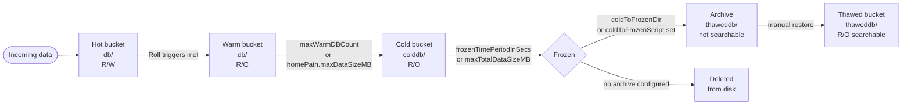
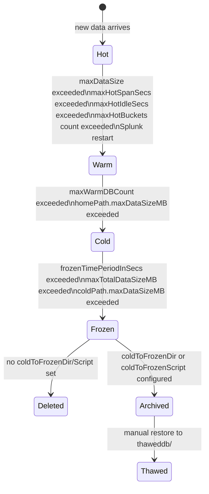

# Indexes & Bucket Lifecycle

> Deep reference on what a Splunk index is, how data is physically laid out on disk, the full bucket lifecycle from hot to frozen, and the retention controls that drive it. This is the foundational infrastructure topic for anyone who needs to plan storage, diagnose missing data, tune performance, or reason about what Splunk is doing with data after it's been ingested. Companion `pre-class.md` holds the short primer and official-doc links.

---

## 0. Orientation

When data enters a Splunk indexer it does not land in a flat file or a relational table — it lands in a structured on-disk layout of time-partitioned directories called **buckets**, grouped into an **index**. Understanding this layout answers three categories of operational question that come up constantly:

- *Where is my data physically stored, and what is in each directory?*
- *Why did data I thought was retained suddenly become unsearchable?*
- *How do I size storage, and how does Splunk enforce limits?*

Everything in this document flows from two core facts: (1) an index is a logical grouping of time-ordered buckets, and (2) each bucket moves through a defined lifecycle — hot, warm, cold, frozen — driven by configurable thresholds in `indexes.conf`. Get these two facts solid and the rest is detail.

---

## 1. What is an index?

A Splunk **index** is a logical store for event data. From the outside, it is what you name in `index=<name>` in SPL. From the inside, it is a set of directories on disk containing compressed raw data and associated search-acceleration files.

Indexes exist for two primary reasons:

**Segmentation.** Keeping different data types — firewall logs, authentication events, web proxy traffic, internal platform logs — in separate indexes means a search against `index=firewall` only reads firewall buckets. The indexer does not open unrelated data. This time-range and index-scoping is how Splunk achieves fast retrieval at scale.

**Differentiated retention and access control.** Different data types carry different regulatory, business, or security retention requirements. Security alerts may need to be held for 12 months; web proxy logs for 90 days; debug logs for 30 days. Separate indexes allow per-index retention policies. Separately, role-based access can be scoped to indexes — one team searches `index=security`, another searches `index=network`, and neither sees the other's data by default.

### 1.1 Events index vs. metrics index

Splunk supports two index data types, set at creation time and **not convertible** after the fact:

| Type | `datatype` value | Stores | Search syntax |
|---|---|---|---|
| Events | `event` (default) | Log events, raw text, structured records | SPL `search` commands |
| Metrics | `metric` | Numeric time-series metric data points | `mstats` command |

A metrics index stores data in a highly compressed columnar format optimized for aggregation over time ranges. It cannot hold event data, and an events index cannot hold metrics data. When creating an index, leave the type at `event` unless the data source is explicitly metrics (infrastructure telemetry, APM, etc.).

### 1.2 Built-in indexes

Splunk ships with several pre-configured indexes that serve platform functions. These cannot be deleted and should not be confused with user data indexes:

| Index | Purpose |
|---|---|
| `main` | **Default index** — user data lands here when no index is specified at ingest |
| `_internal` | Splunk platform operational logs: `splunkd.log`, metrics log, scheduler log |
| `_audit` | Audit trail — search activity, configuration changes, user actions |
| `_introspection` | System performance and resource usage data (CPU, memory, I/O, parsing pipeline metrics) |
| `_telemetry` | Anonymized platform usage telemetry sent to Splunk (can be disabled) |
| `_thefishbucket` | Checkpoint database for monitored file inputs (covered in Topic 04.2) |

The `_internal` and `_introspection` indexes are the two you'll search most frequently during platform troubleshooting. `_internal` is where `splunkd.log` lives; `_introspection` is where resource contention and indexing latency surface. Both are searchable with explicit `index=_internal` or `index=_introspection` in SPL; neither appears in a wildcard `index=*` search by default.

---

## 2. The on-disk index layout

Every index occupies a set of directories under `$SPLUNK_DB`, which defaults to `$SPLUNK_HOME/var/lib/splunk/`. Each index gets its own subdirectory named after the index, and within that directory there are exactly three canonical subdirectories plus one directory that appears when thawed data is present:

```
$SPLUNK_DB/
└── <index_name>/
    ├── db/          ← hot and warm buckets live here
    ├── colddb/      ← cold buckets live here
    └── thaweddb/    ← manually restored (thawed) data lives here
```

The mapping of directory to bucket state is worth memorizing explicitly:

| Directory | Bucket states it holds | Access mode |
|---|---|---|
| `db/` | Hot (active write) + Warm (read-only, recently aged) | Hot = R/W; Warm = R/O |
| `colddb/` | Cold (read-only, aged from warm) | R/O |
| `thaweddb/` | Thawed (manually restored from archive) | R/O; **never auto-managed** |

These paths correspond to the `homePath`, `coldPath`, and `thawedPath` attributes in `indexes.conf`. In `indexes.conf` the canonical way to express them is:

```ini
[myindex]
homePath   = $SPLUNK_DB/myindex/db
coldPath   = $SPLUNK_DB/myindex/colddb
thawedPath = $SPLUNK_DB/myindex/thaweddb
```

The `$SPLUNK_DB` variable is defined in `$SPLUNK_HOME/etc/splunk-launch.conf`. If you want to store indexes on a separate disk or network-attached storage, you change `SPLUNK_DB` in that file, or you set explicit absolute paths in `homePath`/`coldPath` per index. Pointing `coldPath` at a slower, higher-capacity volume (NAS, spinning disk) while keeping `homePath` on SSD is a common tiered storage pattern.

### 2.1 What is inside a bucket?

Each bucket is a directory, not a file. Inside that directory, the key contents are:

| File/directory | Purpose |
|---|---|
| `rawdata/journal.gz` | Compressed raw event data — the actual log text |
| `*.tsidx` | Time-series index — the search acceleration structure enabling fast field lookup |
| `*.cidx` | Bloom filter — probabilistic structure for fast keyword-not-found checks |
| `Hosts.data`, `Sources.data`, `Sourcetypes.data` | Metadata files tracking the host, source, and sourcetype values in this bucket |

The `rawdata` and `tsidx` together represent approximately **50% of the pre-indexed (original) data volume** — meaning 100 GB of raw logs ingested results in roughly 50 GB on disk once indexed and compressed. This 50% figure is the standard starting point for storage capacity planning. The actual ratio varies by data type (highly repetitive structured logs compress better; varied text compresses less), but 50% is the safe baseline.

### 2.2 Bucket naming format

Hot bucket names follow the pattern:
```
hot_v1_<guid>
```

When a hot bucket rolls to warm, it is **renamed in-place** (stays in `db/`) to the warm bucket naming convention:
```
db_<latest_epoch>_<earliest_epoch>_<id>
```

The two epoch timestamps embedded in the name are the latest and earliest event times in that bucket. This is how Splunk performs **time-based search optimization** — when a query specifies a time range, the indexer can compare the query's time window against each bucket's embedded time range and skip buckets that cannot contain matching events. This is why including time bounds in every search matters: it lets Splunk eliminate entire buckets without opening them.

When a warm bucket rolls to cold, it **moves** from `db/` to `colddb/` but **keeps the same name** (`db_<latest>_<earliest>_<id>`). The directory changes; the bucket name does not.

---

## 3. The bucket lifecycle

The lifecycle of a bucket follows a strict state machine. Understanding the triggers for each transition is the key operational knowledge.



### 3.1 Hot — the active write bucket

**What it is:** A hot bucket is open for writing. Incoming events are written to the current hot bucket as they are indexed. There can be more than one hot bucket open simultaneously (controlled by `maxHotBuckets`).

**Roll triggers (hot → warm):**
- `maxDataSize` threshold reached for that bucket (the individual bucket size limit, in MB; default `auto` which resolves to approximately 750 MB, but configurable to fixed sizes like `10000` for 10 GB)
- `maxHotSpanSecs` exceeded — the age of the oldest event in the hot bucket exceeds this time span (default 7,776,000 seconds = 90 days)
- `maxHotIdleSecs` exceeded — the bucket has received no new data for this long (default 0 = disabled)
- `maxHotBuckets` exceeded — when a new hot bucket must be created and the count would exceed the maximum, the oldest existing hot bucket rolls to warm (default 3)
- Splunk process restart — all open hot buckets roll to warm on clean shutdown

A common point of confusion: there is not one hot bucket per index. There can be up to `maxHotBuckets` hot buckets open simultaneously. This matters when data arrives with varied or out-of-order timestamps — Splunk may open multiple hot buckets to accommodate events that span different time ranges.

### 3.2 Warm — recently aged, read-only

**What it is:** A warm bucket has been closed for writing. It lives in the same `db/` directory as hot buckets but is renamed. It is fully searchable. Warm buckets are where most active operational data resides — the weeks or months before data gets pushed to cold.

**Roll triggers (warm → cold):**
- `maxWarmDBCount` exceeded — the number of warm buckets in `homePath` would exceed this value, so the oldest warm bucket moves to `colddb/` (default 300)
- `homePath.maxDataSizeMB` exceeded — if the total size of `db/` (hot + warm combined) would exceed this value, the oldest warm buckets are moved to cold until the size is within limit

The separation of `homePath` and `coldPath` enables a tiered storage strategy: hot and warm buckets (actively searched, performance-sensitive) stay on fast storage; cold buckets (rarely searched, large volume) move to cheaper, higher-capacity storage.

### 3.3 Cold — aged, read-only, separate directory

**What it is:** A cold bucket has moved from `db/` to `colddb/`. It is still fully indexed and fully searchable. The only difference from warm is its location on disk, which allows it to live on a different, slower storage tier.

**Roll triggers (cold → frozen):**
- `frozenTimePeriodInSecs` exceeded — the age of the **youngest** event in the bucket exceeds this retention period (the bucket's latest_epoch timestamp is older than `now - frozenTimePeriodInSecs`). Default: 188,697,600 seconds ≈ 6 years.
- `maxTotalDataSizeMB` exceeded — the total size of the entire index (hot + warm + cold combined) exceeds this value, so the **oldest** cold buckets are frozen first. Default: 500,000 MB (≈ 500 GB), though 0 = unlimited.
- `coldPath.maxDataSizeMB` exceeded — if `colddb/` exceeds this size, oldest cold buckets freeze first.

**Whichever trigger fires first wins.** Size-based enforcement can cause data to be frozen well before its time-based retention expires if the index grows large faster than expected. This is the most common cause of "data disappeared earlier than expected."

### 3.4 Frozen — end of the searchable lifecycle

**What it is:** A bucket that has been frozen is **removed from the index**. By default it is **deleted from disk entirely**. It is no longer searchable. There is no "frozen bucket" sitting somewhere on disk by default.

**Archive exception:** If you configure `coldToFrozenDir` or `coldToFrozenScript` in `indexes.conf`, frozen buckets are **archived** rather than deleted. `coldToFrozenDir` moves the bucket directory to a specified archive location. `coldToFrozenScript` invokes a custom script to handle archiving (to S3, tape, or other systems). Archived data is **not searchable** until it is manually restored.

```ini
[myindex]
coldToFrozenDir = /archive/splunk/myindex
```

### 3.5 Thawed — manually restored archive data

**What it is:** A thawed bucket is a formerly-frozen bucket that has been manually copied back into `thaweddb/`. Splunk picks it up on next restart or config reload and makes it searchable.

Key properties of thawed buckets:
- They are **never automatically managed** — Splunk will not freeze or roll them. They stay in `thaweddb/` until you manually remove them.
- `maxTotalDataSizeMB` and `frozenTimePeriodInSecs` do **not** apply to thawed buckets — retention settings only govern hot/warm/cold.
- Useful for regulatory investigations: restore a specific month's cold-archive data temporarily without affecting the live index.

---

## 4. Retention controls in `indexes.conf`

The following table consolidates the key retention and sizing attributes. All live in the `[<index_name>]` stanza:

| Attribute | What it controls | Default | Notes |
|---|---|---|---|
| `frozenTimePeriodInSecs` | Age (in seconds) at which a bucket's youngest event triggers freezing | 188697600 (≈6 yr) | Requires restart to change; cannot be reloaded |
| `maxTotalDataSizeMB` | Max size of the entire index (hot + warm + cold). Oldest data freezes when exceeded | 500000 | Set this to match your actual disk allocation |
| `maxWarmDBCount` | Max warm buckets in `homePath` before oldest roll to cold | 300 | |
| `homePath.maxDataSizeMB` | Max size of `homePath` (hot + warm combined). Excess rolls to cold | 0 (unlimited) | Useful for tiered storage |
| `coldPath.maxDataSizeMB` | Max size of `coldPath` (cold buckets). Excess freezes oldest | 0 (unlimited) | |
| `maxDataSize` | Per-bucket max size (MB) before hot rolls to warm | `auto` (≈750 MB) | Can be set to a fixed MB value |
| `maxHotBuckets` | Max number of concurrent hot buckets per index | 3 | |
| `maxHotSpanSecs` | Max time span (seconds) a hot bucket can cover | 7776000 (90 days) | |
| `maxHotIdleSecs` | How long (seconds) a hot bucket can sit idle before rolling | 0 (disabled) | |
| `coldToFrozenDir` | Archive path; frozen buckets moved here instead of deleted | unset | Set to enable archiving |
| `coldToFrozenScript` | Custom script for archiving frozen buckets | unset | |
| `homePath` | Path for hot/warm buckets | `$SPLUNK_DB/<index>/db` | |
| `coldPath` | Path for cold buckets | `$SPLUNK_DB/<index>/colddb` | |
| `thawedPath` | Path for thawed buckets | `$SPLUNK_DB/<index>/thaweddb` | Cannot use `volumes` here |

**A worked example — sizing for a 90-day firewall index:**

Assume: 50 GB/day ingest, 50% compression ratio, 90-day retention target.
- Raw data over 90 days: 50 GB × 90 = 4,500 GB
- On-disk size after compression: 4,500 GB × 0.50 = 2,250 GB ≈ 2,300 GB (with headroom)
- `maxTotalDataSizeMB` = 2,300,000 (2.3 TB)
- `frozenTimePeriodInSecs` = 7,776,000 (90 days)
- Both limits are set; whichever fires first enforces retention.

```ini
[cisco_fw]
homePath   = $SPLUNK_DB/cisco_fw/db
coldPath   = $SPLUNK_DB/cisco_fw/colddb
thawedPath = $SPLUNK_DB/cisco_fw/thaweddb
maxTotalDataSizeMB = 2300000
frozenTimePeriodInSecs = 7776000
coldToFrozenDir = /archive/splunk/cisco_fw
```

### 4.1 Size vs. time: which fires first?

Both constraints are enforced simultaneously and independently. Splunk checks size-based limits on a `rotatePeriodInSecs` cycle (default 60 seconds). It checks time-based limits on the same cycle. Whichever threshold is crossed first triggers the freeze. This means:

- If you provision exactly enough storage for `maxTotalDataSizeMB` to match your `frozenTimePeriodInSecs` at your ingestion rate, both will tend to fire together.
- If ingest rate spikes unexpectedly, `maxTotalDataSizeMB` fires first and data is frozen earlier than the time-based policy.
- If ingest rate drops, `frozenTimePeriodInSecs` fires first.

A classic mistake is setting `frozenTimePeriodInSecs` to 365 days to satisfy a "one year retention" requirement, but not setting `maxTotalDataSizeMB` large enough — data gets frozen after only a few months because the disk limit is hit.

---

## 5. The 50% on-disk sizing rule

When planning storage for a Splunk deployment, the standard starting estimate is:

> **On-disk size ≈ 50% of ingested (pre-indexed) data volume**

This accounts for:
- Raw data compression (Splunk stores rawdata in `journal.gz`, achieving significant compression)
- TSIDX overhead (search acceleration files add back some size, partly offsetting compression)

In practice the ratio ranges from roughly 30–75% depending on data entropy. Highly repetitive structured logs (syslog with repeating field names) compress very well. High-entropy logs (binary-encoded data, already-compressed formats) compress poorly. 50% is the safe planning number for a mixed environment.

For a distributed indexer cluster, multiply by the replication factor (RF): a 3-index cluster with RF=3 means you need 3× the per-indexer storage in total across the cluster, though each peer only holds 1× its share.

---

## 6. Diagram: bucket state machine with triggers



---

## 7. Terminology & version notes

- **Bucket** — a directory containing a time-bounded slice of an index, with raw data (`rawdata/`) and search acceleration files (`.tsidx`, `.cidx`).
- **`db/`** — the `homePath` directory; contains hot and warm buckets.
- **`colddb/`** — the `coldPath` directory; contains cold buckets.
- **`thaweddb/`** — the `thawedPath` directory; contains manually restored buckets.
- **Hot bucket** — actively being written to; read/write.
- **Warm bucket** — closed for writing, still in `db/`; read-only.
- **Cold bucket** — moved to `colddb/`; read-only.
- **Frozen** — removed from the index; deleted (default) or archived.
- **Thawed** — manually restored from archive to `thaweddb/`; searchable but not auto-managed.
- **`frozenTimePeriodInSecs`** — the time-based retention limit; requires a restart to change, not a reload.
- **`maxTotalDataSizeMB`** — the size-based retention limit for the whole index.
- **`homePath.maxDataSizeMB`** — size cap for hot+warm together; excess moves to cold (not frozen).
- **`$SPLUNK_DB`** — the environment variable pointing to the root data directory; default `$SPLUNK_HOME/var/lib/splunk/`; configurable in `splunk-launch.conf`.
- **`datatype`** — `event` (default) or `metric`; set at index creation, not changeable afterward.
- **SmartStore** — cloud-storage-backed indexing where warm rolls directly to frozen (remote object store); cold state does not exist in SmartStore. Not covered here; see SmartStore documentation.

---

## 8. Common misconceptions

- **"Hot buckets are just the most recent data."** Partially true — but the bucket's age is determined by the events inside it, not when Splunk received it. Out-of-order or late-arriving events can cause multiple hot buckets to be open simultaneously.
- **"Frozen means the data is in `frozen/` somewhere."** No — by default frozen means **deleted**. There is no frozen directory unless you explicitly configure `coldToFrozenDir`. If you want data to survive freezing, configure archiving before you hit your retention limits.
- **"Setting `frozenTimePeriodInSecs` to 1 year guarantees a year of retention."** Only if the disk is also large enough. `maxTotalDataSizeMB` can cause earlier data loss. Both limits must be planned together.
- **"Warm buckets are in a different directory from hot."** No — hot and warm both live in `db/` (`homePath`). The distinction is whether the bucket is still open for writes, not its location.
- **"Thawed buckets obey retention settings."** No — thawed buckets are completely outside the lifecycle management system. They stay in `thaweddb/` until manually removed.
- **"Changing `frozenTimePeriodInSecs` takes effect immediately."** No — this attribute requires a full Splunk restart. A configuration reload is not sufficient.
- **"The 50% sizing rule means Splunk compresses data in half."** The 50% rule is a planning estimate combining raw compression plus tsidx overhead. Some data types compress far better, others worse. Measure your actual data before committing to production storage sizing.

---

## 9. Mastery checklist — what you should be able to explain

- Why multiple indexes are used instead of one `main` index (search performance, retention differentiation, access control).
- The difference between an events index and a metrics index, and why the type cannot be changed after creation.
- The five internal indexes (`main`, `_internal`, `_audit`, `_introspection`, `_thefishbucket`) and the distinct purpose of each.
- The three `db/` path directories (`db/`, `colddb/`, `thaweddb/`) and which bucket states each holds.
- What is physically inside a bucket (`rawdata/journal.gz`, `.tsidx`, `.cidx`, metadata files).
- Why bucket names embed epoch timestamps and how Splunk uses them for time-based search optimization.
- All five states (hot, warm, cold, frozen, thawed) and the specific `indexes.conf` attributes that trigger each transition.
- Why both hot and warm buckets live in `db/` despite being different states.
- What happens to data when it is frozen with and without `coldToFrozenDir` configured.
- Why thawed buckets are exempt from all retention enforcement.
- The difference between `frozenTimePeriodInSecs` (time-based) and `maxTotalDataSizeMB` (size-based) and what happens when both are set.
- The 50% on-disk sizing estimate and where it comes from.
- That `frozenTimePeriodInSecs` changes require a restart, not just a reload.

---

## 10. Key terms (flashcard seeds)

- **Index** — logical data store, physically a set of time-partitioned bucket directories under `$SPLUNK_DB`.
- **Events index** — default type (`datatype=event`); holds log records; searched with SPL.
- **Metrics index** — `datatype=metric`; holds numeric time-series; searched with `mstats`; not interconvertible with events index.
- **`main`** — default index; receives data when no index is specified at ingest.
- **`_internal`** — platform log index; holds `splunkd.log` and other daemon logs.
- **`_introspection`** — resource and performance telemetry for the Splunk instance itself.
- **`$SPLUNK_DB`** — root path for index data; default `$SPLUNK_HOME/var/lib/splunk/`; changeable in `splunk-launch.conf`.
- **`db/`** — `homePath`; holds hot (R/W) and warm (R/O) buckets.
- **`colddb/`** — `coldPath`; holds cold (R/O) buckets; typically on slower storage.
- **`thaweddb/`** — `thawedPath`; manually restored archive buckets; never auto-managed.
- **Hot bucket** — actively written to; naming `hot_v1_<guid>`; R/W; rolls to warm on triggers.
- **Warm bucket** — read-only; stays in `db/`; renamed to `db_<latest>_<earliest>_<id>`.
- **Cold bucket** — moved to `colddb/`; same name as warm bucket; read-only.
- **Frozen** — removed from index; deleted by default; archived if `coldToFrozenDir` set.
- **Thawed** — manually restored frozen data; searchable; lives in `thaweddb/`; no auto-management.
- **`frozenTimePeriodInSecs`** — time-based retention limit; default ≈6 years; requires restart.
- **`maxTotalDataSizeMB`** — size-based limit for whole index; oldest freezes first.
- **`maxWarmDBCount`** — warm bucket count limit; oldest roll to cold; default 300.
- **`maxDataSize`** — per-bucket size limit triggering hot→warm roll; default `auto` ≈750 MB.
- **`coldToFrozenDir`** — archive directory for frozen buckets; prevents deletion.
- **50% sizing rule** — on-disk size ≈ 50% of ingested volume; planning baseline only.
- **TSIDX** — time-series index file inside a bucket; enables fast field-level search without reading rawdata.

---

## 11. Questions to drill (quiz seeds)

1. Name the three subdirectories under an index's `$SPLUNK_DB/<index>/` path and state which bucket states each holds.
2. What is physically inside a bucket? Name at least three file types and the role of each.
3. A bucket named `db_1717200000_1716595200_7` is in the `db/` directory. What state is it in, and what do the two epoch numbers represent?
4. List all the triggers that cause a hot bucket to roll to warm. Which `indexes.conf` attributes control each one?
5. Both `frozenTimePeriodInSecs` and `maxTotalDataSizeMB` are configured. Ingest spikes and the index hits `maxTotalDataSizeMB` with 4 months of data remaining under the time policy. What happens?
6. You set `frozenTimePeriodInSecs = 7776000` for a 90-day retention requirement but do not set `maxTotalDataSizeMB`. What risks does this introduce?
7. What is the difference between frozen data and thawed data? Can thawed data be frozen again automatically?
8. An administrator changes `frozenTimePeriodInSecs`. They reload the configuration. Is the change live? What should they have done?
9. You are designing a deployment with 80 GB/day ingest, 180-day retention. Estimate the required `maxTotalDataSizeMB` value.
10. Why do both hot and warm buckets live in `db/` (`homePath`) rather than in separate directories?
11. What is a metrics index, and what makes it unsuitable for log event data?
12. An event search is running slowly. You know the index uses time-based bucket naming. What single change to the search query would most improve performance, and why?
