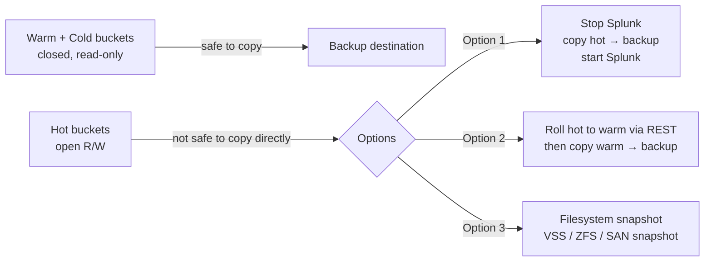
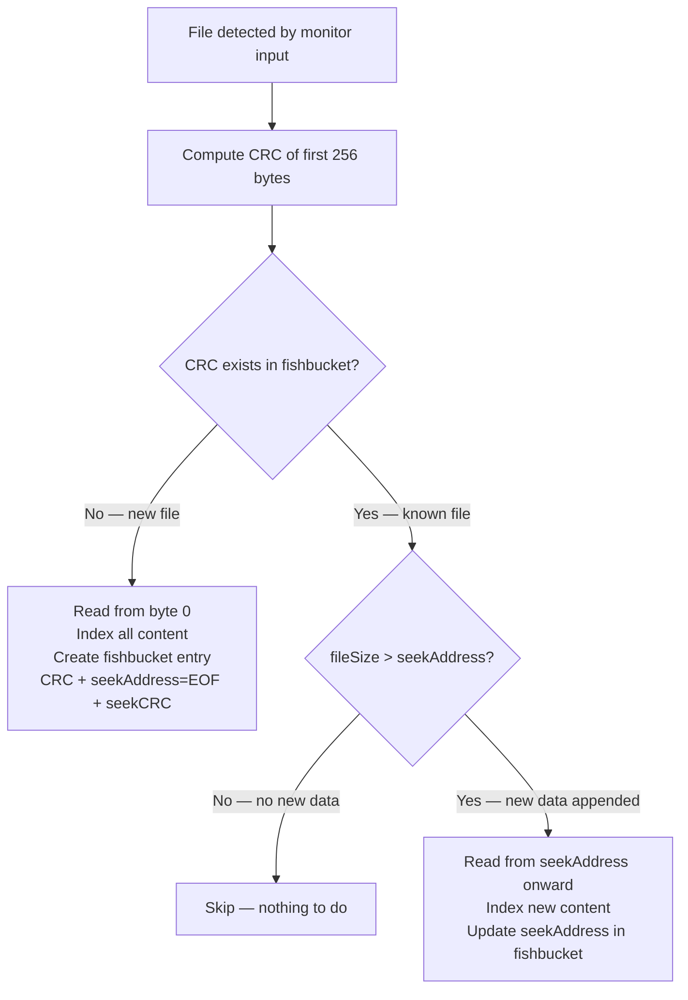

# Managing Indexes & the Fishbucket

> Deep reference covering index creation (Splunk Web, CLI, `indexes.conf` directly), the distributed/clustered deployment model for indexes, backup strategy for indexed data, the two data deletion methods (`| delete` and `splunk clean eventdata`) and their very different behaviors, and the fishbucket — Splunk's internal checkpoint system that prevents re-indexing of already-read monitored files. Companion `pre-class.md` holds the short primer and official-doc links.

---

## 0. Orientation

Once the bucket lifecycle model from Topic 04.1 is solid, the next layer is operational management: how do you actually create an index, how do you safely back it up, how do you delete data when you need to, and what is the mechanism that stops Splunk from re-reading and duplicating data it has already ingested?

The last question — the fishbucket — is the one that trips up the most administrators and engineers, because it looks like a bucket (it has "bucket" in the name) but it is fundamentally different from the data buckets covered in Topic 04.1. Getting this distinction solid prevents a category of hard-to-diagnose duplication and missed-data bugs.

---

## 1. Creating indexes

There are three ways to create an index: Splunk Web, the CLI, and direct `indexes.conf` editing. All three result in the same thing: a stanza in `indexes.conf` in a `local/` directory. The choice is about context, precision, and operational practice.

### 1.1 Via Splunk Web

Navigate to **Settings → Indexes → New Index**.

The form presents the key `indexes.conf` attributes — index name, home path, cold path, thawed path, max total size, max cold bucket size — as form fields. When you save, Splunk writes the configuration to `indexes.conf` under the `local/` directory of whichever app is currently active in the Splunk Web session.

**This is a critical detail:** The app context in your browser session determines where the `indexes.conf` stanza is written. If you are in the Search & Reporting app (`search`), the configuration lands in `$SPLUNK_HOME/etc/apps/search/local/indexes.conf`. If you are in a custom admin app, it lands there. The app context is visible in the browser URL. This is why creating a dedicated admin app for custom configurations is recommended practice — it keeps your work explicitly separated from the shipped default apps and makes it portable.

**Index naming constraints:** Index names must contain only lowercase letters, numbers, underscores, and hyphens. They cannot begin with an underscore or hyphen, and cannot contain the word "kvstore". The leading-underscore restriction is what distinguishes internal indexes (which do start with `_`) from user-created ones.

After creation, the index is immediately live — no restart required for a new index created this way.

### 1.2 Via CLI

```
splunk add index <index_name>
```

Additional attributes can be passed as flags. The most important:

```bash
splunk add index myindex \
  -homePath   $SPLUNK_DB/myindex/db \
  -coldPath   $SPLUNK_DB/myindex/colddb \
  -thawedPath $SPLUNK_DB/myindex/thaweddb \
  -maxTotalDataSizeMB 500000 \
  -frozenTimePeriodInSecs 7776000
```

The CLI writes to `$SPLUNK_HOME/etc/system/local/indexes.conf` by default, which is the highest-precedence location in the global config context. This is functionally fine but means your index definition is scattered into `system/local` rather than organized in a dedicated app. For production deployments, prefer editing `indexes.conf` directly in a controlled app, especially in clustered environments.

You can list existing indexes with:
```bash
splunk list index
```

### 1.3 Via `indexes.conf` directly

This is the most precise and automation-friendly method. Create or edit `indexes.conf` in the appropriate `local/` directory (an admin app, or `system/local`) and add the stanza:

```ini
[myindex]
homePath   = $SPLUNK_DB/$_index_name/db
coldPath   = $SPLUNK_DB/$_index_name/colddb
thawedPath = $SPLUNK_DB/$_index_name/thaweddb
maxTotalDataSizeMB = 500000
frozenTimePeriodInSecs = 7776000
coldToFrozenDir = /archive/splunk/myindex
```

`$_index_name` is a special variable that expands to the name of the current stanza — useful for keeping paths consistent without repeating the index name. After editing, trigger a config reload or restart.

**Restart vs. reload for new indexes:** For most new `indexes.conf` changes (adding a new index, changing `maxTotalDataSizeMB`, changing paths), a full Splunk restart is safest and cleanest. Specifically, `frozenTimePeriodInSecs` changes **require a restart** — a reload is not sufficient. Other attributes may accept a reload but the documentation consistently recommends a restart for index configuration changes.

---

## 2. Indexes in distributed and clustered deployments

In a standalone single-instance deployment, `indexes.conf` lives wherever you choose to put it — system/local, or an app. In a distributed deployment, the location matters significantly.

### 2.1 Distributed (non-clustered) indexers

In a distributed deployment where multiple indexers receive data but are not part of a clustered replication scheme, each indexer manages its own indexes independently. The `indexes.conf` for each indexer is maintained locally on that indexer. If you are using a Deployment Server to manage heavy forwarders and apps, you can push `indexes.conf` as part of an app to keep indexer configs consistent.

### 2.2 Clustered indexers (indexer cluster)

In an **indexer cluster**, the architecture changes the workflow fundamentally.

**The cluster manager (formerly: master node)** is the authoritative source for configuration that must be consistent across all peer nodes. Index definitions are one of those configurations. The process is:

1. Edit `indexes.conf` on the **cluster manager** in the `manager-apps/` directory (a special directory the manager maintains for pushing configs to peers).
2. Run the apply-config bundle command (via Splunk Web or CLI) to push the configuration to all peer nodes simultaneously.
3. All peers receive and apply the `indexes.conf` changes as a coordinated bundle.

**You do not edit `indexes.conf` directly on individual peer nodes in a cluster.** Doing so creates configuration drift — peers with different definitions, which causes bucket replication and search inconsistencies.

**The `repFactor` attribute** is required for indexes in a cluster. Setting `repFactor = auto` tells the cluster to replicate this index's buckets to meet the replication factor (RF) configured for the cluster:

```ini
[clustered_index]
repFactor  = auto
homePath   = $SPLUNK_DB/$_index_name/db
coldPath   = $SPLUNK_DB/$_index_name/colddb
thawedPath = $SPLUNK_DB/$_index_name/thaweddb
```

Without `repFactor = auto`, a new index on a clustered peer will not be replicated — events go in but are not protected against peer failure.

The terminology note: in Splunk documentation prior to version 9.0, the cluster manager was called the "master node" and the peer nodes were "slave nodes". Current documentation uses "manager node" and "peer nodes". The functional behavior is the same.

---

## 3. Backing up indexed data

Splunk does not have a built-in backup solution. Backing up indexed data means backing up bucket directories. The key constraint is that **hot buckets cannot be safely backed up while Splunk is running** — they are open files actively being written to. Backing them up with a file-copy tool while Splunk is running produces inconsistent snapshots (partial writes, torn files).



**Recommended backup approach:**

1. **Warm and cold buckets** (in `db/` closed-warm portion and `colddb/`) — safe to copy with any standard backup tool while Splunk is running. These are closed, read-only files. Schedule incremental backups of newly-closed warm buckets regularly.

2. **Hot buckets** — three options:
   - **Stop Splunk, copy, restart.** Stopping Splunk rolls all open hot buckets to warm as part of clean shutdown. After restart, yesterday's hot data is warm and safely copyable. Downside: downtime.
   - **Roll hot to warm via the REST endpoint**, then back up the newly-warmed buckets:
     ```bash
     splunk _internal call /data/indexes/<index_name>/roll-hot-buckets \
       -auth admin:password
     ```
     This forces a hot→warm roll without stopping Splunk. After the roll completes, the previously-hot buckets are closed warm and can be copied safely.
   - **Filesystem snapshot** (VSS on Windows/NTFS, ZFS snapshot, SAN/NAS snapshot facility). A point-in-time snapshot captures a consistent image of open files. This works for hot buckets but requires appropriate infrastructure.

3. **Configuration backup** — back up `$SPLUNK_HOME/etc/system/local/`, `$SPLUNK_HOME/etc/apps/`, and `$SPLUNK_HOME/etc/users/`. These hold all your customizations. The `$SPLUNK_HOME/var/lib/splunk/` directory holds the data; `etc/` holds the configuration.

**What to back up (summary):**

| What | Why |
|---|---|
| `$SPLUNK_HOME/var/lib/splunk/<index>/db/` (warm buckets) | Index data — hot/warm tier |
| `$SPLUNK_HOME/var/lib/splunk/<index>/colddb/` | Index data — cold tier |
| `$SPLUNK_HOME/etc/system/local/` | Instance-level config customizations |
| `$SPLUNK_HOME/etc/apps/` | App configs, custom knowledge objects |
| `$SPLUNK_HOME/etc/users/` | Per-user settings |

---

## 4. Deleting data from indexes

There are two distinct mechanisms for removing data from a Splunk index. They have very different behaviors and use cases.

### 4.1 The `| delete` search command — surgical, non-destructive (disk-wise)

**What it does:** The `delete` command marks matched events as unsearchable. After running `| delete`, those events no longer appear in any search, for any user. However, the underlying data is **not removed from disk** — the bucket and its compressed raw data remain intact. Disk space is not reclaimed.

```
index=security source=/var/log/auth.log earliest=-7d latest=-6d | delete
```

The data will age out normally through the bucket lifecycle and be physically freed when the bucket eventually freezes.

**Who can run it:** The `delete` command requires the `delete_by_keyword` capability. Splunk ships with a role named `can_delete` that holds this capability and nothing else — it is designed to be granted to a specific user for a targeted delete operation, not held permanently. Notably, the `admin` role does **not** have `delete_by_keyword` by default. You must explicitly add the `can_delete` role (or the capability directly) to a user before they can run `| delete`.

**When to use it:** Use `| delete` when you need to make specific events invisible immediately — for example, a data breach where PII was accidentally indexed, or data indexed to the wrong index that you want to suppress while the retention policy ages it out. It is the right tool for targeted, surgical suppression.

**Key limitation:** `| delete` does not reclaim disk space. If you need to immediately free disk, or if you need to completely remove all data from an index, use `splunk clean eventdata` instead.

### 4.2 `splunk clean eventdata` — destructive, complete, requires stop

**What it does:** The `clean eventdata` command **completely and permanently deletes all data** from a specified index. It physically removes the bucket directories.

```bash
# Splunk must be stopped first
splunk stop

# Clean a specific index
splunk clean eventdata -index <index_name> -f

# WARNING: omitting -index deletes ALL user-defined indexes
splunk clean eventdata -f
```

**Critical requirements:**
- Splunk **must be stopped** before running `clean eventdata`. The command will fail or produce errors if Splunk is running.
- The `-f` flag bypasses the interactive confirmation prompt (needed for scripting).
- If you omit `-index`, Splunk will delete event data from all indexes. The `-f` flag bypasses any warning. There is no undo.

After `clean eventdata` completes, restart Splunk normally. The index definition in `indexes.conf` is preserved — the index structure exists but contains no data.

**When to use it:** Complete index wipe for a fresh start, removing a development index before deleting its `indexes.conf` definition, or clearing accidentally ingested data in bulk. Not appropriate for surgical event removal.

### 4.3 Removing an index entirely

To fully remove an index (definition + data):
1. Stop Splunk.
2. Run `splunk clean eventdata -index <name> -f` to delete the data.
3. Remove the `[<name>]` stanza from `indexes.conf` in `local/`.
4. Delete the index directories from disk (`db/`, `colddb/`, `thaweddb/`).
5. Start Splunk.

Removing the stanza from `indexes.conf` without cleaning the data first leaves orphaned data directories on disk. Cleaning the data without removing the stanza leaves an empty index definition.

---

## 5. The fishbucket

The fishbucket is one of the most important — and most misunderstood — internal mechanisms in Splunk. It is not a data bucket. It does not hold indexed events. It is a **checkpoint database** that tracks how far Splunk has read into each monitored file, specifically to prevent re-indexing data that has already been sent to the indexer.

### 5.1 What problem does it solve?

Splunk's `monitor` input watches files and directories for new data. When a file is first seen, Splunk reads it from the beginning and sends the contents to the indexer. When the file grows (new log lines are appended), Splunk needs to know: *where did I stop last time?* Without a checkpoint, Splunk would re-read the entire file on every poll cycle, sending duplicates to the indexer.

The fishbucket is that checkpoint.

### 5.2 What it stores — the three values

For each monitored file, the fishbucket stores three values per file entry:

| Value | Description |
|---|---|
| **CRC** (Cyclic Redundancy Check) | A hash of the first 256 bytes of the file. Used to identify the file. |
| **seekAddress** (seek pointer) | The byte offset at which Splunk last stopped reading — i.e., where to resume. |
| **seek CRC** | A CRC of the data at the seekAddress position — a fingerprint of the "last read" location to detect truncation or rotation. |

When Splunk's monitoring processor encounters a file:
1. It computes the CRC of the first 256 bytes.
2. It looks up that CRC in the fishbucket database.
3. If **not found** — this is a new file; read from the beginning, add an entry.
4. If **found** — look up the seekAddress; if the file size is greater than seekAddress, new data has been appended; read from seekAddress onward. Update the seekAddress in the fishbucket.



### 5.3 Where the fishbucket lives

The fishbucket database is stored in:
```
$SPLUNK_HOME/var/lib/splunk/fishbucket/splunk_private_db/
```

It is also surfaced as a searchable internal index named `_thefishbucket`. Searching `index=_thefishbucket` in SPL lets you inspect checkpoint entries for monitored files — useful for confirming whether a file has been seen and how far it has been read.

The fishbucket is present on **every Splunk instance** that runs a monitor input — both universal forwarders (which monitor files on endpoints and forward to indexers) and indexers configured to monitor local files directly.

### 5.4 The CRC problem: identical first 256 bytes

Because the CRC is computed on only the first 256 bytes, two files with identical headers or short boilerplate content (log files from the same application, each starting with the same version header) will produce the same CRC. Splunk will treat them as the same file — only one will be indexed; the other will be ignored (its CRC is already in the fishbucket and the seekAddress will be wrong for the second file).

The fix is `crcSalt`:

```ini
[monitor:///var/log/myapp/*.log]
crcSalt = <SOURCE>
index   = myapp
```

When `crcSalt = <SOURCE>` (the literal string `<SOURCE>` including angle brackets), Splunk appends the full file path to the data before hashing. This makes the CRC unique per file path, even if the file contents start identically. The `<SOURCE>` token is the standard recommended value — it is not a placeholder, it is the literal value to set.

An alternative is `initCrcLength`, which increases the number of bytes included in the CRC (beyond the default 256). If files share a common header but diverge after a few hundred bytes, increasing `initCrcLength` solves the collision without needing `crcSalt`.

### 5.5 Log rotation and the CRC

Log rotation is a closely related concern. When a log file is rotated (renamed from `app.log` to `app.log.1` and a new empty `app.log` created), the new `app.log` starts fresh with a different CRC (different content from byte 0). Splunk treats it as a new file and reads it from the beginning. The old `app.log.1` may have the same CRC as what was previously `app.log` — Splunk's fishbucket entry tracks this, preventing the rotated file from being re-read.

However, if a file is truncated (the inode reused with the same filename and identical first 256 bytes — as in some truncation-based rotation schemes), the CRC matches but the seek CRC at the old seekAddress will differ, alerting Splunk to the truncation. Splunk handles this by re-reading from the beginning when truncation is detected.

### 5.6 Resetting the fishbucket — the `btprobe` tool

`btprobe` is the command-line tool for inspecting and manipulating the fishbucket database. It is located in `$SPLUNK_HOME/bin/`.

**Before using `btprobe`, stop Splunk.** Changes take effect only after restart. Running `btprobe` against an active fishbucket risks corruption.

```bash
# Query all entries in the fishbucket
./btprobe -d $SPLUNK_HOME/var/lib/splunk/fishbucket/splunk_private_db --validate

# Query the entry for a specific file
./btprobe -d $SPLUNK_HOME/var/lib/splunk/fishbucket/splunk_private_db \
          --file /var/log/syslog

# Reset the entry for a specific file (forces re-read from beginning)
./btprobe -d $SPLUNK_HOME/var/lib/splunk/fishbucket/splunk_private_db \
          --file /var/log/syslog --reset
```

`--reset` on a specific file clears the seekAddress entry for that file. On the next Splunk start, Splunk will re-read that file from the beginning and re-index its contents. This causes duplicate data in the index unless the index already has the data deleted.

**Resetting the entire fishbucket** (all monitored files):

```bash
splunk stop
splunk clean inputdata
splunk start
```

`splunk clean inputdata` deletes the entire fishbucket database. On restart, Splunk treats every monitored file as new and re-reads all of them from the beginning. This is a high-risk operation in production — it will re-ingest potentially gigabytes or terabytes of log files, causing massive duplication and license burn. Use only when intentionally re-ingesting or when troubleshooting a corrupted fishbucket on a development system.

Alternatively, the raw directory can be deleted recursively:
```bash
rm -rf $SPLUNK_HOME/var/lib/splunk/fishbucket/
```

This achieves the same result as `splunk clean inputdata` for the fishbucket specifically.

### 5.7 What happens when the fishbucket is deleted

The consequence of deleting (or resetting) the fishbucket is immediate and serious:

1. On next start, Splunk finds no checkpoint entries for any monitored file.
2. Every file is treated as new — read from byte 0.
3. Every event in every monitored file is re-sent to the indexer.
4. Duplicate events appear in the index for everything in those files.
5. License usage spikes with the re-ingested volume.

In a production environment with months of log files on monitored endpoints, accidental fishbucket deletion causes significant operational problems. This is why the fishbucket directory should be included in backup procedures for any instance running monitor inputs.

---

## 6. Common misconceptions

- **"The fishbucket is a data storage bucket like hot/warm/cold."** No — the fishbucket is a checkpoint database. It contains only file tracking metadata (CRC, seekAddress, seekCRC). It holds zero event data.
- **"`| delete` removes data from disk."** No — it marks events as unsearchable but leaves the compressed data in the bucket. Disk space is only reclaimed when the bucket freezes naturally.
- **"`| delete` can be run by any admin."** No — `admin` does not have `delete_by_keyword` by default. A user needs the `can_delete` role or the capability explicitly granted.
- **"`splunk clean eventdata` can run while Splunk is running."** No — Splunk must be stopped first. Running it against a live instance risks corruption.
- **"The fishbucket only matters for Universal Forwarders."** No — any Splunk instance running a monitor input has and uses a fishbucket. Indexers configured to monitor local files maintain their own fishbucket.
- **"Deleting the fishbucket is safe if you want a fresh start."** Only in controlled circumstances. Deleting it in production causes re-indexing of all monitored files, producing duplicates and consuming license.
- **"In a clustered deployment, I can add an index via Splunk Web on a peer node."** No — in a clustered environment, index definitions must be managed through the cluster manager and pushed as a bundle. Direct editing on peers causes drift.
- **"`crcSalt = <SOURCE>` is a placeholder — fill in your source path."** No — `<SOURCE>` including the angle brackets is the literal value to set. It is a special token that tells Splunk to use the file path as the salt.

---

## 7. Terminology & version notes

- **Fishbucket** — the checkpoint database tracking monitored file read progress; not event data; lives at `$SPLUNK_HOME/var/lib/splunk/fishbucket/splunk_private_db/`; also visible as `index=_thefishbucket`.
- **CRC** — cyclic redundancy check; computed on the first 256 bytes of a monitored file; used as the file identifier key in the fishbucket.
- **seekAddress** — byte offset of last read position in a monitored file; stored in fishbucket; tells Splunk where to resume reading.
- **`crcSalt`** — `inputs.conf` attribute; set to `<SOURCE>` to make CRCs unique per file path (prevents CRC collision on files with identical headers).
- **`initCrcLength`** — `inputs.conf` attribute; increases the number of bytes used for CRC calculation beyond the default 256.
- **`btprobe`** — CLI tool to inspect and reset fishbucket entries; requires Splunk to be stopped.
- **`splunk clean inputdata`** — CLI command that wipes the entire fishbucket; triggers re-ingestion of all monitored files on next start.
- **`| delete`** — SPL command; marks events unsearchable; does not reclaim disk; requires `delete_by_keyword` capability (`can_delete` role).
- **`splunk clean eventdata -index <name>`** — CLI command; physically destroys all bucket data in an index; requires Splunk to be stopped; irreversible.
- **`can_delete` role** — Splunk built-in role containing only `delete_by_keyword`; grants `| delete` capability without broader permissions.
- **`repFactor = auto`** — `indexes.conf` attribute required for clustered indexes; enables bucket replication.
- **Cluster manager** — the node that coordinates cluster operations and distributes `indexes.conf` (and other config bundles) to peer nodes; formerly called "master node" in pre-9.0 docs.
- **`manager-apps/`** — the directory on the cluster manager from which configuration bundles are distributed to peers.
- **`roll-hot-buckets` REST endpoint** — forces hot-to-warm roll for an index without stopping Splunk; enables hot bucket backup.

---

## 8. Mastery checklist — what you should be able to explain

- The three ways to create an index (Web, CLI, `indexes.conf` directly) and the key tradeoff of each.
- Why the app context in Splunk Web determines where `indexes.conf` is written, and why this matters.
- Why `indexes.conf` for a clustered deployment lives on the cluster manager and is pushed to peers — not edited on peers directly.
- The `repFactor = auto` requirement for clustered indexes.
- Why hot buckets cannot be safely backed up with a simple file copy, and the three safe options.
- The exact command syntax for rolling hot buckets to warm without stopping Splunk.
- The difference between `| delete` (marks unsearchable, no disk recovery, needs `can_delete`) and `splunk clean eventdata` (physically destroys data, needs Splunk stopped).
- What the fishbucket is, what it is not, and where it lives.
- The three values the fishbucket stores per file (CRC, seekAddress, seekCRC) and the role of each.
- What CRC collision means, when it happens, and how `crcSalt = <SOURCE>` prevents it.
- What `btprobe` does and why Splunk must be stopped before using it.
- The consequence of deleting the fishbucket and why it causes duplicates.
- Why the fishbucket exists on Universal Forwarders and on indexers running monitor inputs — not just one or the other.

---

## 9. Key terms (flashcard seeds)

- **`splunk add index <name>`** — CLI command to create an index; writes to `system/local/indexes.conf` by default.
- **App context (Splunk Web)** — the active app at time of index creation determines which `indexes.conf` the definition is written to.
- **`$_index_name`** — special variable in `indexes.conf` that expands to the current stanza name; use in path definitions.
- **Cluster manager** — distributes `indexes.conf` and other config to peers; formerly "master node".
- **`repFactor = auto`** — enables replication for a clustered index; required for cluster-managed indexes.
- **`manager-apps/`** — directory on cluster manager for configs pushed to peers.
- **Hot bucket backup** — not safe with live file copy; use `roll-hot-buckets` REST endpoint, stop/copy/start, or filesystem snapshot.
- **`roll-hot-buckets`** — REST endpoint to force hot→warm roll without downtime; enables safe backup of previously-hot data.
- **`| delete`** — marks events unsearchable; does not reclaim disk; requires `delete_by_keyword` / `can_delete` role.
- **`delete_by_keyword`** — capability required to run `| delete`; not in `admin` by default; granted via `can_delete` role.
- **`can_delete`** — built-in Splunk role with only `delete_by_keyword`; grant for targeted delete operations.
- **`splunk clean eventdata -index <name> -f`** — physically wipes all data from an index; irreversible; Splunk must be stopped.
- **Fishbucket** — checkpoint DB for monitored file inputs; stores CRC + seekAddress + seekCRC per file; no event data.
- **`$SPLUNK_HOME/var/lib/splunk/fishbucket/splunk_private_db/`** — fishbucket on-disk location.
- **`index=_thefishbucket`** — SPL-searchable index exposing fishbucket checkpoint data.
- **CRC (first 256 bytes)** — default file identifier; hash of file's first 256 bytes; used to look up fishbucket entry.
- **seekAddress** — byte offset of last read position; stored in fishbucket; resumes reading from here.
- **`crcSalt = <SOURCE>`** — forces unique CRC per file path; prevents collisions on files with identical headers.
- **`initCrcLength`** — increases CRC byte range beyond 256; alternative to `crcSalt` for some collision scenarios.
- **`btprobe`** — CLI tool to inspect/reset fishbucket entries; stop Splunk first.
- **`splunk clean inputdata`** — wipes entire fishbucket; triggers full re-ingestion of all monitored files.
- **Duplicate events** — consequence of fishbucket deletion; all monitored files re-read from byte 0 on next start.

---

## 10. Questions to drill (quiz seeds)

1. You create an index via Splunk Web while working in the Search & Reporting app. Where exactly is the resulting `indexes.conf` stanza written? What would you do differently in a production deployment?
2. You are adding a new index to a three-node indexer cluster. Walk through the correct process step by step, including the attribute that must be added to the stanza and why.
3. You need to back up all data in the `security` index. Describe a complete backup strategy, addressing hot buckets specifically.
4. You need to immediately make 30,000 events from the last week invisible to all searchers because they contain accidentally indexed PII. Which deletion method do you use, why, and what role or capability must the user have?
5. A security team needs an index completely wiped (all historical data deleted) so they can re-ingest a corrected dataset. Which command do you run, and what must be true about the Splunk process state?
6. Describe the fishbucket in one sentence, explicitly contrasting it with a data bucket.
7. A Universal Forwarder is monitoring 50 log files on an endpoint. The fishbucket is accidentally deleted. What happens when Splunk restarts, and what operational risk does this create?
8. Two application servers write log files with identical 200-byte boilerplate headers before any unique content. Splunk is monitoring both. What problem will occur, and what is the correct fix in `inputs.conf`?
9. An engineer wants to use `btprobe --reset` to force re-reading of a specific log file. What must they do before and after running `btprobe`, and what side effect should they account for in the index?
10. What is `crcSalt = <SOURCE>` — is `<SOURCE>` a placeholder you replace, or a literal value you write exactly as shown? What does it instruct Splunk to do?
11. Explain why the `admin` role cannot run `| delete` by default, and describe the steps to grant this capability to a user for a one-time operation.
12. You run `splunk clean eventdata -f` without specifying an `-index` flag. What happens?
