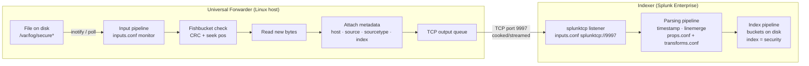

# Universal Forwarder — Installation, Inputs, and Forwarding to an Indexer

> Deep reference on the Universal Forwarder (UF): what it is, how it differs from full Splunk Enterprise, how to install it on Linux, how to configure it to monitor files and forward data to an indexer over port 9997, and how to configure the receiving indexer. Covers the full data flow from endpoint to indexed bucket, including the critical file-ownership and config-layering details that catch people in practice. Companion `pre-class.md` holds the short primer and official-doc links.

---

## 0. Orientation

The Universal Forwarder is Splunk's purpose-built, lightweight data-collection agent. In any real deployment — distributed, cloud, or enterprise — it runs on the endpoints (servers, VMs, containers) and ships data to indexers. Understanding how to install it correctly, configure it to collect the right data, and wire it to indexers is foundational to operating Splunk at any scale. This topic also introduces the receiving side: what the indexer must have configured to accept that data, and how to verify the pipeline is working end-to-end.

---

## 1. The Universal Forwarder — what it is and what it is not

The Universal Forwarder is a **separate, stripped-down Splunk binary**. It is not a full Splunk Enterprise installation with a reduced mode — it is a distinct, smaller package (~50–100 MB) that contains only the components needed to:

- Monitor files, directories, network ports, and (on some platforms) scripted inputs
- Buffer data locally in a queue
- Forward data reliably to a receiving indexer over TCP

**What the UF deliberately omits:**
- No web interface (no Splunk Web, no browser UI)
- No search capability
- No indexing pipeline — it does **not** parse, timestamp-extract, or line-merge events
- No `props.conf`/`transforms.conf` processing (except for very limited structured-data field extraction)
- Minimal `splunkd` process footprint — designed to have near-zero impact on production hosts

**What the UF does have:**
- `inputs.conf` — to define what to monitor
- `outputs.conf` — to define where to forward
- `server.conf` — for identity (server name, phone-home interval)
- The full `$SPLUNK_HOME/etc/apps/` structure and configuration layering (same precedence rules apply)
- The `splunk` CLI for most management operations

**The "cooked" forwarding model:**

The UF sends data in what Splunk calls **cooked format** — the data has been minimally pre-processed (line-breaking has occurred, the `host`, `source`, and `sourcetype` metadata fields have been attached) but it has **not been parsed** in the full index-time sense (no timestamp recognition, no prop/transform processing). The indexer handles all of that. This is the correct and default behavior. You can force raw (unprocessed) forwarding by setting `sendCookedData = false` in `outputs.conf`, but this is rarely useful and loses metadata.

---

## 2. Linux installation

### 2.1 Where it installs

By convention and Splunk's recommendation, the UF is installed under `/opt/splunkforwarder`. This is different from a full Splunk Enterprise instance, which goes to `/opt/splunk`. The separation is deliberate — having both on the same host (uncommon, but possible for an indexer that also needs to forward its own OS logs) requires distinct `$SPLUNK_HOME` paths.

### 2.2 Package formats

Splunk distributes the UF as:
- `.tgz` (tar archive) — the most portable option; manual extraction
- `.rpm` — Red Hat / CentOS / RHEL family
- `.deb` — Debian / Ubuntu

The steps below use the `.tgz` path, which is platform-agnostic and what most admins use when scripting deployments.

### 2.3 The `splunk` OS user

Before installing, create a dedicated, non-privileged OS user. Splunk's own documentation and every security best-practice guide agree on this:

```
sudo useradd -m splunk
```

This user:
- Owns all files under `/opt/splunkforwarder/`
- Is the user under which `splunkd` runs
- Has **no sudo rights** by default (this is intentional)

The implication: any file or directory the UF needs to read must be readable by this user. Log files owned by `root` (e.g., `/var/log/syslog` on Debian, `/var/log/secure` on RHEL) will silently fail to be read unless you:
1. Change their ownership to `splunk`, or
2. Add `splunk` to the group that owns them (e.g., `adm` on Ubuntu), or
3. Use `sudo`/`setcap` with the systemd boot-start mechanism (least-privileged mode)

File-permission failures are the most common reason a newly-configured UF appears to be running but produces no data.

### 2.4 Extraction and ownership

```bash
# As root or via sudo
cd /opt
sudo tar -xf /tmp/splunkforwarder-<version>-Linux-x86_64.tgz

# Change ownership of the entire tree to the splunk user
sudo chown -R splunk:splunk /opt/splunkforwarder
```

### 2.5 First start — accepting the license and creating admin credentials

```bash
# Switch to the splunk user, then start
sudo -u splunk /opt/splunkforwarder/bin/splunk start --accept-license
```

On first start you are prompted to create an admin username and password. These credentials are used for local CLI management of this UF instance only. They have no relationship to your indexer's admin credentials.

### 2.6 Enabling boot-start

Without boot-start, the UF stops when the host reboots. Enable it:

```bash
# Systemd-managed (recommended for modern Linux, Splunk 9.x)
sudo /opt/splunkforwarder/bin/splunk enable boot-start \
    -systemd-managed 1 \
    -user splunk \
    -group splunk
```

This creates a systemd unit file (`SplunkForwarder.service`) that starts `splunkd` under the `splunk` user at boot. For SysV init systems (older RHEL 6, legacy installs), omit `-systemd-managed 1`.

### 2.7 Verifying the UF is running

```bash
sudo -u splunk /opt/splunkforwarder/bin/splunk status
```

Expected output: `splunkd is running (PID XXXXX).`

---

## 3. Configuring inputs on the UF — monitoring files

### 3.1 The app pattern

Splunk's own guidance (and sound operational practice) is to **never put your custom configuration in `system/local`** on a forwarder. Instead, create a dedicated app under `$SPLUNK_HOME/etc/apps/` and put all your `inputs.conf` and `outputs.conf` there, in the app's `local/` directory. This:
- Makes configurations portable and visible
- Allows the Deployment Server to push and manage the app as a unit
- Keeps your changes separated from Splunk's own system configs
- Matches the configuration-layering model (app `local/` wins over `system/local` only in app/user context; for index-time inputs, `system/local` is highest — so putting inputs in an app is fine and works correctly, it just won't override `system/local` settings)

```
/opt/splunkforwarder/etc/apps/
└── my_uf_inputs/
    ├── default/        (empty or boilerplate — app.conf)
    └── local/
        ├── inputs.conf
        └── outputs.conf
```

After copying or creating the app directory, recursively change ownership:

```bash
sudo chown -R splunk:splunk /opt/splunkforwarder/etc/apps/my_uf_inputs/
```

### 3.2 The `inputs.conf` monitor stanza

To monitor a file or directory:

```ini
[monitor:///var/log/secure*]
disabled   = 0
index      = security
sourcetype = linux_secure
host_segment = 3
```

Key attributes:

| Attribute | Purpose |
|---|---|
| `[monitor://<path>]` | Stanza header; path supports wildcards (`*`) |
| `disabled` | `0` = enabled; `1` = disabled. Confusingly, the `true`/`false` boolean also works: `false` = enabled |
| `index` | Target index on the **indexer**. Must already exist on the indexer or data is quarantined/lost |
| `sourcetype` | Attached to every event; used by `props.conf` for parsing |
| `host_segment` | Sets `host` metadata by taking the Nth `/`-delimited segment of the monitored path (1-based). E.g., with `host_segment = 3` and path `/var/log/secure.log`, the host becomes `log` (segment 3) |
| `host` | Can also hard-code a host value: `host = webserver01` |
| `crcSalt` | Helps Splunk distinguish files with identical content (by default Splunk uses a CRC of the first 256 bytes as a file identity) |

### 3.3 CLI shortcut for adding a monitor

The CLI wraps the conf file change but immediately edits `$SPLUNK_HOME/etc/system/local/inputs.conf` (not your app). Use it as a quick test, then migrate to an app:

```bash
sudo -u splunk /opt/splunkforwarder/bin/splunk add monitor /var/log/secure* \
    -index security \
    -sourcetype linux_secure
```

### 3.4 The fish bucket — how the UF tracks what it has read

The UF maintains a directory at `$SPLUNK_HOME/var/lib/splunk/fishbucket/` that functions as a key-value database (powered by Berkeley DB). For each monitored file, it stores:
- A cyclic redundancy check (CRC) hash of the first 256 bytes — used as a **file identity fingerprint**
- The **seek position** (byte offset) — the last position successfully read and forwarded

On startup the UF checks each monitored file against the fishbucket: if the CRC matches and the seek position is beyond the start, it resumes from where it left off (no re-reading). If the CRC does not match or the fishbucket entry is absent, it reads from the beginning.

**Why this matters operationally:**

If you configure an input but lose data (e.g., the target index didn't exist), simply fixing the index configuration does not cause the UF to re-read. The fishbucket already has a seek position at the end of the file. To force a re-read you must:

```bash
sudo -u splunk /opt/splunkforwarder/bin/splunk stop

# Remove the fishbucket database (nuclear option — re-reads ALL monitored files)
sudo rm -rf /opt/splunkforwarder/var/lib/splunk/fishbucket/

sudo -u splunk /opt/splunkforwarder/bin/splunk start
```

Or use `splunk clean eventdata` for more surgical control. Note that `splunk cmd btprobe` can also clear individual fishbucket entries for a specific source path.

---

## 4. Configuring forwarding — `outputs.conf`

### 4.1 Structure of `outputs.conf`

`outputs.conf` has three stanza types you need to know:

| Stanza | Purpose |
|---|---|
| `[tcpout]` | Global tcpout settings; the `defaultGroup` attribute selects which target group is active |
| `[tcpout:<group_name>]` | A named target group defining one or more receiving indexers |
| `[tcpout-server://<host>:<port>]` | Per-server overrides (rarely needed) |

### 4.2 Minimal single-indexer configuration

```ini
[tcpout]
defaultGroup = primary_indexers

[tcpout:primary_indexers]
server = 10.20.2.10:9997
```

This is the minimal working configuration. `defaultGroup` tells the UF which group to use by default. The group stanza lists the receiving server(s).

### 4.3 Multi-indexer load balancing

When you list multiple servers in a group, the UF **load-balances** across them automatically:

```ini
[tcpout]
defaultGroup = idx_pool

[tcpout:idx_pool]
server          = 10.20.2.10:9997, 10.20.2.11:9997, 10.20.2.12:9997
autoLBFrequency = 30
```

`autoLBFrequency` (default: 30 seconds) controls how often the forwarder switches to the next receiver in the list. The UF round-robins through the server list: it sends to the first server for `autoLBFrequency` seconds, then switches to the next, cycling through. If a server becomes unreachable, the UF automatically switches to the next available one. This is the production pattern for fault tolerance.

### 4.4 CLI shortcut for forwarding

```bash
sudo -u splunk /opt/splunkforwarder/bin/splunk add forward-server 10.20.2.10:9997
```

This writes to `$SPLUNK_HOME/etc/system/local/outputs.conf`. Again, prefer the app-based approach for production.

### 4.5 Applying config changes

After editing any conf file on the UF, you must either restart or reload. For `inputs.conf` and `outputs.conf` changes, a full restart is the safest approach:

```bash
sudo -u splunk /opt/splunkforwarder/bin/splunk restart
```

You can also use `debug/refresh` via the CLI to reload some configs without a full restart, but this is less reliable for input and output changes.

---

## 5. Configuring the indexer to receive data

### 5.1 Why the indexer needs explicit configuration

By default, a fresh Splunk Enterprise installation does not listen for incoming forwarder data. You must explicitly open a receiving port. Without this, the UF's TCP connections are refused, and nothing arrives at the indexer.

### 5.2 The receiving port — 9997

Port 9997 is the **conventional** receiving port for Splunk forwarder traffic, but it is not hardcoded. You can use any available TCP port above 1023. Port 9997 has become a de facto standard and you will see it everywhere in Splunk documentation and community practice. In enterprise environments, firewall rules typically open 9997 inbound to indexers and 9997 outbound from forwarder hosts.

### 5.3 Method 1 — Splunk Web

In Splunk Web on the indexer:

`Settings → Forwarding and receiving → Configure receiving → New Receiving Port`

Enter `9997`, save. This writes the following to `$SPLUNK_HOME/etc/system/local/inputs.conf` on the indexer.

### 5.4 Method 2 — CLI

```bash
/opt/splunk/bin/splunk enable listen 9997 -auth admin:<password>
```

Splunk must be restarted for this to take effect.

### 5.5 Method 3 — Direct conf file edit

Create or edit `$SPLUNK_HOME/etc/system/local/inputs.conf` on the indexer (or in an app's `local/`):

```ini
[splunktcp://9997]
disabled = 0
```

The `[splunktcp://9997]` stanza (also written `[splunktcp://:9997]` — both forms work; the double-colon means "all interfaces") tells `splunkd` to open a TCP listener specifically expecting traffic from a Splunk forwarder. This is distinct from `[tcp://9997]`, which expects plain (non-Splunk-protocol) TCP data.

After editing the file, restart or reload.

### 5.6 Verifying the listener is open

On the indexer host:

```bash
# Linux
ss -tlnp | grep 9997
# or
netstat -an | grep 9997
```

Expected output shows `0.0.0.0:9997` or `:::9997` in LISTEN state.

### 5.7 The index must exist

This is the most common mistake in a first deployment: the UF is forwarding, the indexer is listening, but the target index (e.g., `security`) does not exist on the indexer. What happens:

- Splunk logs a warning to `$SPLUNK_HOME/var/log/splunk/splunkd.log`: `Configured disabled or deleted index '<name>'`
- The events are **dropped** — they are not queued waiting for the index to appear
- The fishbucket on the UF advances past those events, so they will not be re-sent automatically

The fix: create the index on the indexer first, then use the fishbucket-clearing technique to re-read the files.

---

## 6. The end-to-end data flow



Key points in the flow:
1. The UF reads new bytes from monitored files (tracked by fishbucket)
2. It attaches `host`, `source`, `sourcetype`, and `index` metadata from `inputs.conf`
3. It transmits over TCP using the Splunk forwarder protocol (cooked, not raw)
4. The indexer's `splunktcp` listener receives the stream
5. The indexer runs the full parsing pipeline: line-merging, timestamp recognition, `props.conf`/`transforms.conf` processing
6. Events land in the target index's buckets on disk

The UF does **no parsing**. All parsing happens at the indexer. This is why you install `props.conf`/`transforms.conf` (via a technology add-on) on the **indexer** (and search head), not on the UF.

---

## 7. Verification — confirming data arrives

### 7.1 From Splunk Web on the indexer (direct search)

```
index=security sourcetype=linux_secure
```

If events appear, the full pipeline is working.

### 7.2 Checking internal logs from the indexer

The UF sends its own internal telemetry logs (health, throughput, errors) to the indexer and indexes them in `_internal`:

```
index=_internal source=*splunkd.log host=<uf_hostname>
```

This confirms network connectivity and that the UF is phoning home to the indexer, even before you configure any real data inputs.

### 7.3 From the UF CLI — checking forwarding status

```bash
sudo -u splunk /opt/splunkforwarder/bin/splunk list forward-server
```

This shows the configured forwarding targets and their connection status (`active` or `disabled`).

---

## 8. Deployment Server aside — `splunk set deploy-poll`

In any environment larger than a handful of forwarders, you manage UF configuration through a **Deployment Server** rather than logging into each UF individually. The UF is pointed at the Deployment Server on installation or via:

```bash
sudo -u splunk /opt/splunkforwarder/bin/splunk set deploy-poll <ds-hostname>:8089
```

The Deployment Server pushes **server classes** (groups of apps) to UFs that match defined criteria. The UF polls the DS at regular intervals (`phoneHomeIntervalInSecs`, default 60 seconds) and downloads any new or updated apps. The `inputs.conf` and `outputs.conf` you would otherwise configure manually are packaged as apps on the DS and deployed automatically. This pattern is covered in its own topic; the manual configuration in this topic is the foundation that the DS automates.

---

## 9. Terminology & version notes

- **UF vs heavy forwarder vs light forwarder:** The heavy forwarder is a full Splunk Enterprise instance configured to forward. It can parse data before forwarding (runs the full parsing pipeline). Light forwarders are deprecated and no longer appear in Splunk 9.x documentation; treat them as historical. The UF is the right choice for nearly all modern deployments.
- **`[splunktcp://9997]` vs `[tcp://9997]`:** The former is for Splunk forwarder protocol (compressed, authenticated); the latter is plain TCP (syslog, network devices). Use `splunktcp` for UF connections.
- **Port 9997:** Conventional, not mandatory. Splunk 9.x documentation consistently cites 9997 as the default receive port. Enterprise deployments sometimes use custom ports; the key is matching the UF's `outputs.conf` port with the indexer's listener port.
- **Boot-start with systemd:** The `-systemd-managed 1` flag was introduced in Splunk 7.x and is the recommended approach on Splunk 9.x for all systemd-capable Linux systems. The legacy `init.d` approach still works but is not recommended.
- **`host_segment`:** Stable across versions; the numbering is 1-based against the `/`-split path segments.

---

## 10. Common misconceptions

- **"The UF parses data."** It does not. It attaches metadata (host, source, sourcetype, index) and transmits cooked bytes. All timestamp recognition, line-merging, and field extraction happen at the indexer.
- **"Port 9997 is mandatory."** It is conventional only. You can configure any available TCP port as long as both sides agree.
- **"I can put my inputs.conf anywhere and it will work."** It will work — but putting it in `system/local` on the UF creates a management problem. Always use an app under `etc/apps/`.
- **"The index I specified in inputs.conf will be created automatically on the indexer."** It will not. A non-existent index causes events to be dropped. Pre-create the index.
- **"The UF will re-read files after I fix a missing index."** Only if you clear the fishbucket. The UF marks files as read and won't re-forward already-advanced data.
- **"Running the UF as root is fine."** It violates least-privilege and is Splunk's explicit anti-recommendation. Run as a dedicated non-root user.
- **"I only need to configure the UF; the indexer handles receiving automatically."** Receiving is disabled by default. You must explicitly open a receiving port on the indexer.

---

## 11. Mastery checklist — what you should be able to explain

- What the Universal Forwarder is: separate binary, no UI, no parsing, no indexing — only collect and forward.
- The concept of "cooked" forwarding: metadata attached, data not parsed, parsing happens at indexer.
- Linux install steps: download, extract to `/opt/splunkforwarder`, create `splunk` OS user, `chown -R`, first start, enable boot-start with systemd.
- Why file ownership matters: the `splunk` user must be able to read log files.
- The app-based config pattern: put `inputs.conf`/`outputs.conf` in an app under `etc/apps/`, not in `system/local`.
- `inputs.conf` monitor stanza: `[monitor://<path>]`, `disabled`, `index`, `sourcetype`, `host_segment`.
- The fishbucket: what it does, why clearing it forces re-reads, and when you need to do that.
- `outputs.conf` structure: `[tcpout]` with `defaultGroup`, `[tcpout:<group>]` with `server = <host>:<port>`.
- Load balancing: multiple servers in a group + `autoLBFrequency`.
- Indexer receiving: `[splunktcp://9997]` in `inputs.conf`, how to enable via Web/CLI/conf, verify with `ss`/`netstat`.
- The full data flow: UF reads → attaches metadata → TCP to indexer → indexer parses → events in index.
- Two verification paths: search `index=security` and check `index=_internal` for UF internal logs.

---

## 12. Key terms (flashcard seeds)

- **Universal Forwarder** — separate lightweight binary; no UI, no search, no full parsing; installs to `/opt/splunkforwarder`.
- **`splunk` OS user** — non-root system user that owns and runs the UF process.
- **boot-start** — `splunk enable boot-start -systemd-managed 1 -user splunk -group splunk`; registers systemd service.
- **cooked data** — UF output: metadata attached, not fully parsed; indexer does the parsing.
- **`[monitor://<path>]`** — `inputs.conf` stanza for file/directory monitoring.
- **`disabled = 0`** — enables the stanza; `disabled = 1` disables it.
- **fishbucket** — `$SPLUNK_HOME/var/lib/splunk/fishbucket/`; CRC + seek position database preventing re-reads.
- **`[tcpout]` / `[tcpout:<group>]`** — `outputs.conf` stanzas: global default group + named target group with server list.
- **`[splunktcp://9997]`** — indexer `inputs.conf` stanza for receiving Splunk forwarder protocol traffic.
- **`splunk enable listen 9997`** — CLI to open a receiving port on the indexer.
- **Port 9997** — conventional Splunk forwarder receive port (not hardcoded).
- **`autoLBFrequency`** — `outputs.conf` attribute controlling load-balance switch interval (default 30 s).
- **`splunk add forward-server`** — CLI shortcut to add a forwarding target.
- **`splunk add monitor`** — CLI shortcut to add a file monitor input.

---

## 13. Questions to drill (quiz seeds)

1. Name three things the Universal Forwarder does **not** do that a full Splunk Enterprise instance does.
2. After extracting the UF tarball to `/opt/splunkforwarder` as root, what two steps are required before starting the UF?
3. What command enables the UF to start automatically on boot using systemd, running as the `splunk` user?
4. A `inputs.conf` stanza has `disabled = 1`. Is the input active or inactive? What value enables it?
5. You configure `index = security` in `inputs.conf` on the UF, but no events appear after restart. Name two things to check.
6. Write the minimal `outputs.conf` to forward data to an indexer at `10.20.2.10` on port `9997`.
7. Write the `inputs.conf` stanza to enable receiving on the indexer for Splunk forwarder traffic on port 9997.
8. What is the fishbucket and why does clearing it cause the UF to re-read monitored files?
9. A UF is monitoring `/var/log/auth.log` but the file is owned by `root:adm`. No data arrives. What is the likely cause and how do you fix it?
10. Describe the data flow from the moment the UF reads a new line in a log file until the event is searchable in Splunk.
11. You list three indexers in a `[tcpout:<group>]` stanza. What is the default behavior, and what attribute controls how often the forwarder switches between them?
12. What is the difference between `[splunktcp://9997]` and `[tcp://9997]` in `inputs.conf` on the indexer?
