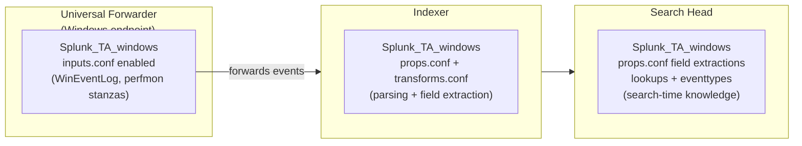
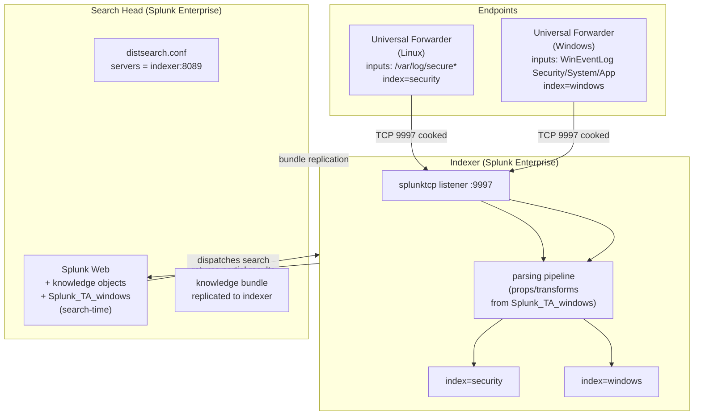

# Windows Forwarders, Technology Add-ons, and Distributed Search

> Deep reference covering: installing the Universal Forwarder on Windows via MSI; Windows-specific data inputs (event logs, performance monitoring) delivered through the Splunk Add-on for Microsoft Windows; the critical architectural pattern of splitting a technology add-on across tiers; and the foundational distributed-search model — a dedicated search head that dispatches to indexer search peers, knowledge bundle replication, and the map-reduce result flow. Companion `pre-class.md` holds the short primer and official-doc links.

---

## 0. Orientation

Two concepts come together in this topic that persist through every larger Splunk deployment. First: Windows is not an afterthought — Windows Event Logs are among the most data-rich sources in most enterprise environments, and the UF + Windows add-on is how you collect them correctly. Second: the distributed search model — where a dedicated search head dispatches to indexers and merges results — is the basis of all scaled Splunk architectures. Getting these patterns right at the two-node level (one UF, one indexer, one search head) makes the multi-node, clustered version straightforward.

---

## 1. Installing the Universal Forwarder on Windows

### 1.1 The MSI installer

Splunk distributes the Windows UF as a `.msi` file. On Windows, the MSI installer is the recommended method. It handles:
- Extracting the UF binaries (default path: `C:\Program Files\SplunkUniversalForwarder\`)
- Creating a Windows service (`SplunkForwarder`) set to start automatically
- Optionally configuring the receiving indexer and deployment server during setup

The directory structure under `C:\Program Files\SplunkUniversalForwarder\` mirrors the Linux layout exactly: `etc\apps\`, `etc\system\`, `bin\`, `var\`. The same configuration-layering rules apply.

### 1.2 GUI installation — key screens

The MSI wizard has a few screens that matter:

**Receiving Indexer:** Enter `<indexer-hostname-or-IP>:<port>` (e.g., `10.20.2.10:9997`). This writes `outputs.conf` pointing at that indexer. If left blank, you must configure `outputs.conf` manually after installation.

**Deployment Server (optional):** Enter `<ds-hostname>:8089`. This writes a `deploymentclient.conf` pointing the UF at a Deployment Server for ongoing configuration management. You can skip this and add it later.

**Service account:** By default the UF service runs as `Local System`. In security-conscious environments, configure a dedicated service account with minimal privileges. The account only needs `Log on as a service` and read access to the log sources it monitors.

### 1.3 Silent/unattended installation

The MSI supports command-line installation, which is the real-world method for any more than a handful of machines:

```
msiexec.exe /i splunkuniversalforwarder_x86_64.msi ^
    RECEIVING_INDEXER="10.20.2.10:9997" ^
    DEPLOYMENT_SERVER="10.20.1.10:8089" ^
    AGREETOLICENSE=Yes ^
    LAUNCHSPLUNK=1 ^
    /quiet
```

Key MSI properties:

| Property | Purpose |
|---|---|
| `RECEIVING_INDEXER` | Sets the target indexer in `outputs.conf` |
| `DEPLOYMENT_SERVER` | Sets the DS phone-home address in `deploymentclient.conf` |
| `AGREETOLICENSE=Yes` | Accepts the license non-interactively |
| `LAUNCHSPLUNK=1` | Starts the service immediately after install |
| `WINEVENTLOG_SEC_ENABLE=1` | Enables Security event log input (sets `disabled=0` in the Windows add-on's inputs.conf) |
| `WINEVENTLOG_SYS_ENABLE=1` | Enables System event log input |
| `WINEVENTLOG_APP_ENABLE=1` | Enables Application event log input |

The `WINEVENTLOG_*` properties only take effect if the Splunk Add-on for Windows is being co-installed or is already present.

### 1.4 Verifying the service

After installation:

`Windows Services panel → SplunkForwarder → Status: Running`

Or from an elevated command prompt:

```
sc query SplunkForwarder
```

The UF on Windows has no web UI — all management is via the CLI (`C:\Program Files\SplunkUniversalForwarder\bin\splunk.exe`) or conf file edits.

---

## 2. Windows data inputs

### 2.1 The Windows Event Log

Windows Event Logs are structured, channel-based logs produced by the Windows Event Logging service. The main channels relevant to security and operations are:

| Channel | Content |
|---|---|
| Security | Logon/logoff, privilege use, account management, object access |
| System | OS-level events: services, drivers, hardware, kernel |
| Application | Application-specific events (SQL Server, IIS, etc.) |
| Microsoft-Windows-Sysmon/Operational | Sysmon process/network/registry telemetry (if Sysmon installed) |
| Microsoft-Windows-DNS-Server/Analytical | DNS server logs (Windows DNS role) |

Unlike Linux file-based logs, Windows Event Logs are not files on disk — they are exposed through the Windows Event Log API. The Splunk UF uses this API to read events via the `WinEventLog` input stanza.

### 2.2 The `WinEventLog` input stanza

```ini
[WinEventLog://Security]
disabled    = 0
index       = windows
sourcetype  = WinEventLog:Security
renderXml   = true

[WinEventLog://System]
disabled    = 0
index       = windows
sourcetype  = WinEventLog:System
renderXml   = true

[WinEventLog://Application]
disabled    = 0
index       = windows
sourcetype  = WinEventLog:Application
renderXml   = true
```

Key attributes:

| Attribute | Notes |
|---|---|
| `[WinEventLog://<channel>]` | The channel name; case-sensitive; must match the exact Windows channel name |
| `disabled` | `0` = enabled; `1` = disabled |
| `renderXml` | `true` = collect events in XML format (recommended; richer fields); `false` = classic text format |
| `index` | Target index on the indexer |
| `sourcetype` | Typically `WinEventLog:<channel>` by convention |
| `start_from` | `oldest` (default) or `newest`; where to begin reading when the input is first activated |

The Splunk Add-on for Windows (see §3) manages these stanzas and many others. You rarely write them from scratch in production.

### 2.3 Performance monitoring — `[perfmon]`

The Splunk Add-on for Windows also provides `[perfmon://...]` stanzas for collecting Windows Performance Monitor counters (CPU, memory, disk I/O, network adapters, process metrics):

```ini
[perfmon://CPU]
disabled   = 0
counters   = % Processor Time
instances  = *
interval   = 60
object     = Processor
index      = windows
sourcetype = PerfmonMk:CPU
```

These are highly configurable. The add-on ships with pre-built stanzas for the most common counters.

---

## 3. The Splunk Add-on for Microsoft Windows

### 3.1 What a technology add-on is

A **technology add-on (TA)** is a Splunk app that delivers:
- `inputs.conf` stanzas (what to collect)
- `props.conf` stanzas (how to parse: line-merging, timestamp recognition, field aliases)
- `transforms.conf` lookups or field extractions
- CIM-compatible field names and eventtypes

TAs are the standard packaging unit for source-type expertise. The Splunk Add-on for Microsoft Windows (`Splunk_TA_windows`) is maintained by Splunk and covers Windows Event Logs, performance counters, host metadata, and more.

### 3.2 The critical split-tier pattern

This is one of the most important operational patterns in Splunk and the one most commonly misunderstood by newcomers:

**A technology add-on must be deployed to multiple tiers simultaneously — and different parts of it are relevant on each tier.**



**On the Universal Forwarder:**
- Deploy the TA with `inputs.conf` stanzas enabled (set `disabled = 0` for the channels you want)
- The UF uses only the `inputs.conf` from the TA; it ignores `props.conf`/`transforms.conf` entirely
- The TA's `inputs.conf` stanzas in `default/` ship with everything `disabled = 1` — you activate what you need in `local/`

**On the Indexer:**
- Deploy the TA with `props.conf` and `transforms.conf` active
- Disable the `inputs.conf` stanzas (or simply don't push them) — you do not want the indexer trying to open its own Windows Event Log inputs (it may not be a Windows machine, or it may not be the intended collection point)
- The indexer uses the TA's parsing config to correctly line-merge, timestamp, and structure the incoming events

**On the Search Head:**
- Deploy the TA to make `props.conf` field extractions, CIM field aliases, eventtypes, and tags available at search time
- Again, `inputs.conf` stanzas are irrelevant here and should be disabled

### 3.3 Why the split matters

If you only deploy the TA on the UF:
- Data is collected and forwarded
- But at the indexer, events may have incorrect timestamps, wrong line-merging, or miss the structured field extractions
- At search time, CIM-normalized fields (`src_ip`, `user`, `action`) will be missing

If you only deploy on the indexer and search head but not the UF:
- No data is collected — the `inputs.conf` stanzas on the UF are what trigger collection

Both halves are required. In large environments managed by a Deployment Server, this is handled by deploying two versions of the TA: one configured for forwarders (inputs enabled), one for indexers/search heads (inputs disabled, parsing active).

### 3.4 Where the TA is installed on Windows

The TA directory goes to:
```
C:\Program Files\SplunkUniversalForwarder\etc\apps\Splunk_TA_windows\
```

Structure:
```
Splunk_TA_windows/
├── default/
│   ├── inputs.conf      (all stanzas disabled = 1 by default)
│   ├── props.conf
│   └── transforms.conf
└── local/
    └── inputs.conf      (your enabled stanzas go here)
```

After placing the TA, restart the UF service or use `splunk restart`.

---

## 4. Distributed search — architecture and mechanics

### 4.1 The problem distributed search solves

In a single-instance Splunk deployment, one process does everything: index data AND answer search queries. At scale, this creates a ceiling: as data volume grows, search latency grows; as concurrent users increase, indexing throughput suffers. The solution is **role separation**:

- **Indexers** index data and answer sub-searches against their local data only
- **Search heads** coordinate searches, merge results from multiple indexers, and present to users

A dedicated search head has **no data of its own**. Its indexes are empty. Its entire job is to receive user queries, fan them out to indexers, collect partial results, and merge them into a final result set.

### 4.2 The search head and search peers

In distributed search terminology:
- The **search head** is the Splunk instance users connect to for searching
- The **search peers** are the indexers that hold the data

The search head is configured with a list of search peers. When a user runs a search, the search head:

1. Parses and validates the SPL
2. Replicates the **knowledge bundle** to peers that don't have the latest version (see §4.4)
3. Dispatches a sub-search to each peer simultaneously
4. Each peer searches its local indexes and returns partial results
5. The search head **merges** the partial results (aggregation, sorting, deduplication) and returns the final output to the user

This is the **map-reduce pattern** at Splunk's scale:
- Map phase: each peer independently searches its own data
- Reduce phase: the search head combines all partial results

### 4.3 Adding a search peer — three methods

The search peer relationship is defined on the **search head** — you tell the search head which indexers to dispatch to.

**Method 1 — Splunk Web (simplest):**

`Settings → Distributed search → Search peers → Add new`

Enter:
- Peer URI: `https://<indexer-ip>:8089` (the management port, not the data port)
- Remote username: admin credential on the indexer
- Remote password

After saving, Splunk establishes a trust relationship and begins replicating the knowledge bundle.

**Method 2 — CLI:**

```bash
splunk add search-server https://10.20.2.10:8089 \
    -auth admin:<sh_password> \
    -remoteUsername admin \
    -remotePassword <indexer_password>
```

Run this on the search head. The CLI automatically handles the authentication token exchange.

**Method 3 — `distsearch.conf` directly:**

```ini
[distributedSearch]
servers = https://10.20.2.10:8089, https://10.20.2.11:8089
```

Location: `$SPLUNK_HOME/etc/system/local/distsearch.conf` on the search head. When using this method, Splunk does **not** automatically configure authentication — you must distribute trust key files manually. Use Web or CLI in practice; direct file editing is for automation/IaC scenarios.

### 4.4 Knowledge bundle replication

The **knowledge bundle** is a compressed archive of the search head's knowledge objects — primarily:
- `props.conf` and `transforms.conf` (parsing/field extraction rules)
- `lookups` (CSV files and definitions)
- `eventtypes.conf`, `tags.conf`
- `macros.conf`

The search head sends this bundle to each peer so that the peer can apply the same field extractions and parsing rules when executing sub-searches locally. Without it, a peer would not know how to extract fields that the search head's apps define.

The bundle is located at `$SPLUNK_HOME/var/run/splunk/dispatch/` on the search head and pushed to `$SPLUNK_HOME/var/run/splunk/searchpeers/` on each peer.

Replication happens:
- When a search is initiated and the peer's bundle is stale
- Periodically in the background (controlled by `replicationPeriodInSecs` in `distsearch.conf`, default 60 s)
- When you force it via `debug/refresh`

The `maxBundleSize` setting (default 2048 MB) caps bundle size. If your knowledge bundle grows beyond this (usually due to large lookup files), you'll see errors and need to tune it or move large files out of the bundle.

### 4.5 Distributed search configuration file — `distsearch.conf`

The full `distsearch.conf` on the search head after adding one peer looks like:

```ini
[distributedSearch]
servers          = https://10.20.2.10:8089
disabled         = false
defaultUriScheme = https

[replicationSettings]
replicationPeriodInSecs = 60
maxBundleSize           = 2048
```

Key attributes:

| Attribute | Section | Notes |
|---|---|---|
| `servers` | `[distributedSearch]` | Comma-separated list of `scheme://host:port` for each peer |
| `disabled` | `[distributedSearch]` | `false` = distributed search active |
| `defaultUriScheme` | `[distributedSearch]` | `https` (recommended; uses management port 8089 with TLS) |
| `replicationPeriodInSecs` | `[replicationSettings]` | How often the SH checks if peers need a fresh bundle |
| `maxBundleSize` | `[replicationSettings]` | Max compressed bundle size in MB |

### 4.6 Verifying distributed search

**From Splunk Web on the search head:**

`Settings → Distributed search → Search peers`

Shows each peer with status (`Active`, `Down`, or `Quarantine`) and the last bundle replication time.

**From a search:**

Run a search and check the `splunk_server` field — it shows which indexer the events came from:

```
index=windows | stats count by splunk_server
```

If events are coming from the indexer (not from the search head's local storage), distributed search is working.

**From the CLI:**

```bash
splunk show distributed-search
```

### 4.7 Quarantine mode

In a multi-peer environment, if one indexer is experiencing performance issues (high CPU, slow disk, network latency), it can be placed in **quarantine mode**:

`Settings → Distributed search → Search peers → [peer] → Edit → Quarantine`

A quarantined peer is excluded from distributed searches. This prevents a slow peer from degrading the search experience for all users. Events on the quarantined peer are not lost — they are simply not searched until the peer is de-quarantined.

### 4.8 Why multiple search heads?

A single search head is a single point of failure and a concurrency bottleneck. Multiple dedicated search heads are used for:
- **Access control isolation:** Different user groups or business units can have separate search heads, each connected to the same indexers but with different role/permissions configurations
- **Search performance:** More concurrent searches can run in parallel across search heads
- **High availability:** If one search head fails, others continue serving users

When multiple search heads need to share knowledge objects (saved searches, dashboards, lookups) and provide seamless failover, they form a **Search Head Cluster** — that is its own topic involving a deployer, captain election, and artifact replication.

---

## 5. The full distributed architecture — what you have built

At the end of this topic, the architecture consists of:



---

## 6. Terminology & version notes

- **`WinEventLog` vs `XmlWinEventLog`:** Since Splunk Add-on for Windows 6.0.0, the default collection mode is XML (`renderXml = true`), which produces the `XmlWinEventLog` sourcetype family. This is richer and preferred. The classic `WinEventLog` sourcetype (text format) is still available but deprecated in practice.
- **Management port 8089:** The Splunk management API port, used by distributed search, the CLI, REST API calls, and Deployment Server communication. Separate from the data-receive port (9997) and the web port (8000).
- **`distsearch.conf` trust keys:** When adding peers via Web/CLI, Splunk automatically exchanges `server.pem`-based trust tokens. When editing `distsearch.conf` directly, you must copy `$SPLUNK_HOME/etc/auth/distServerKeys/trusted.pem` to each peer manually — a common gotcha when bypassing the UI.
- **Splunk_TA_windows version:** The add-on is independently versioned from Splunk Enterprise. As of 2026, version 8.x is current. Check compatibility on Splunkbase before deploying to a new Splunk version.
- **SHC vs standalone SH:** A standalone dedicated search head (this topic) and a Search Head Cluster member are architecturally the same in terms of `distsearch.conf` — the cluster adds a Deployer, a Captain, and artifact replication on top.

---

## 7. Common misconceptions

- **"The search head indexes data."** A dedicated search head holds no data — its indexes are empty. It searches the indexers' data by dispatching sub-searches over the management port.
- **"I only need to install the TA on the UF to get parsed Windows events."** The TA must be on the indexer for index-time parsing and on the search head for search-time field extraction. The UF only uses `inputs.conf` from the TA.
- **"Port 9997 is for distributed search."** No — 9997 is for forwarder data ingestion. Distributed search uses the management port (8089).
- **"Adding a search peer via Splunk Web changes the indexer's config."** It only changes the search head's `distsearch.conf`. The indexer is passive in this relationship.
- **"The knowledge bundle contains indexes/raw data."** No — it contains only knowledge objects (conf files for parsing, lookups, field extractions). Raw data stays on the indexer.
- **"Quarantine deletes data on the quarantined peer."** Quarantine only excludes a peer from search execution. All data remains intact.
- **"The UF Windows service needs full admin privileges."** It needs `Log on as a service` and read access to the specific log channels you're collecting. Least privilege applies here too.

---

## 8. Mastery checklist — what you should be able to explain

- The Windows UF MSI install flow: wizard screens (receiving indexer, deployment server), silent install with `msiexec`, service verification.
- Windows Event Log collection: the `WinEventLog` input type, the main channels (Security, System, Application), and how `renderXml` affects the sourcetype.
- What a technology add-on is and what it contains (inputs, props, transforms, field extractions).
- The split-tier TA deployment pattern: why `inputs.conf` goes to the UF, `props.conf`/`transforms.conf` goes to the indexer, and both plus search-time knowledge go to the search head.
- The distributed search model: dedicated search head with no data, dispatches to indexer search peers, merges results.
- Three ways to add a search peer (Web, CLI, `distsearch.conf`).
- What the knowledge bundle is and why it must be replicated to peers.
- The `distsearch.conf` `[distributedSearch]` stanza with `servers` pointing to `https://<indexer>:8089`.
- Verifying distributed search: status in Settings, `splunk_server` field in search results.
- Quarantine mode: purpose, effect (excludes from search, does not delete data).
- Why multiple search heads are used (access control, concurrency, HA) and when they become a cluster.

---

## 9. Key terms (flashcard seeds)

- **Splunk Add-on for Windows (`Splunk_TA_windows`)** — TA delivering WinEventLog/perfmon inputs + parsing/field extraction for Windows data.
- **`[WinEventLog://<channel>]`** — `inputs.conf` stanza on the Windows UF for a named event log channel.
- **`renderXml = true`** — collect Windows events in XML format (richer fields; preferred); produces `XmlWinEventLog` sourcetype family.
- **Technology add-on (TA)** — packaged app with inputs + parsing + knowledge objects for a specific data source.
- **Split-tier TA deployment** — `inputs.conf` active on UF; `props.conf`/`transforms.conf` active on indexer; both + search knowledge on search head.
- **Dedicated search head** — Splunk Enterprise instance with no local data; only dispatches searches to indexer search peers.
- **Search peers** — indexers registered on the search head that receive and execute sub-searches.
- **Map phase** — each peer independently searches its local data.
- **Reduce phase** — search head merges partial results from all peers into the final output.
- **Knowledge bundle** — compressed archive of knowledge objects (props, transforms, lookups, eventtypes) replicated from search head to peers.
- **`distsearch.conf`** — `$SPLUNK_HOME/etc/system/local/distsearch.conf` on the search head; `[distributedSearch] servers = https://<indexer>:8089`.
- **Management port 8089** — used for distributed search dispatch, DS communication, REST API, CLI.
- **`splunk add search-server`** — CLI to add a peer: `splunk add search-server https://<ip>:8089 -auth ...`.
- **Quarantine mode** — excludes a slow/failing peer from distributed searches; data is not deleted.
- **`splunk_server` field** — appears in search results; identifies which indexer each event came from.

---

## 10. Questions to drill (quiz seeds)

1. What are the key screens in the Windows UF MSI wizard that affect post-install configuration? What do they configure?
2. Write the `inputs.conf` stanzas to collect Security, System, and Application Windows Event Logs, sending them to an index named `windows` in XML format.
3. Explain the split-tier TA deployment pattern. If you only deploy the Splunk Add-on for Windows on the UF and not on the indexer, what breaks and why?
4. A dedicated search head has its own `index=windows` with zero events. When a user searches `index=windows`, where does the data actually come from?
5. Name the three ways to add a search peer to a search head and state one advantage or caution for each.
6. Write the `distsearch.conf` stanza to configure a search head to dispatch to two indexers at `10.20.2.10` and `10.20.2.11` on the management port.
7. What is the knowledge bundle? Name three types of content it contains and explain why it must be replicated to search peers.
8. A search returns results from some indexers but not all. How would you check whether a specific peer is active or in quarantine?
9. What does the `splunk_server` field in search results tell you? Write the SPL to count events by indexer across all peers.
10. You add a third indexer to the cluster and want the search head to dispatch to it. What exactly do you change on which machine?
11. Explain the difference between port 9997 and port 8089 in the context of a three-tier Splunk architecture (UF → indexer → search head).
12. What is the difference in behavior between a standalone dedicated search head and a Search Head Cluster member, in terms of distributed search configuration?
