# Data Collection Methods, Metadata Fields & Sourcetypes

> Deep reference on how data gets into a Splunk distributed deployment: the collection mechanisms, the default metadata fields that travel with every event, where in the processing pipeline each field is assigned, and — most critically — why sourcetype is the single field that governs everything downstream. Companion `pre-class.md` holds the short primer and official-doc links.

---

## 0. Orientation

Every event Splunk stores arrived through an input, was labelled with metadata, and was parsed according to its sourcetype. These three things are inseparable: the input method determines where the data comes from and sets initial metadata; the sourcetype tells Splunk how to break that stream into discrete events, extract the timestamp, and apply all downstream parsing and field extraction rules. Get any of these wrong and the damage propagates through every search, report, dashboard, and CIM mapping that touches the data.

This document covers: (1) the collection methods available in a distributed environment; (2) the four primary default metadata fields and exactly where in the pipeline each is assigned; (3) sourcetype — what it is, why it is the most consequential field in Splunk, how automatic recognition works and when to override it, naming conventions, and the consequences of getting it wrong.

---

## 1. The data pipeline: four stages

Before discussing inputs and metadata it helps to fix the pipeline model that governs where things happen:

| Stage | Where it runs | What happens |
|---|---|---|
| **Input** | Forwarder / data collector | Raw data is acquired; 64 KB blocks are formed; initial metadata (host, source, sourcetype, index) is attached per block |
| **Parsing** | Indexer (or HF before forwarding) | Blocks are broken into events (LINE_BREAKER / SHOULD_LINEMERGE); timestamp is extracted and normalised; transforms fire |
| **Indexing** | Indexer | Events are segmented, index structures built, raw data and tsidx written to disk |
| **Search** | Search head | Search-time field extractions run; CIM normalisations applied |

The key point: **metadata is attached at the input stage**; event breaking and timestamp extraction happen at the parsing stage. A Universal Forwarder (UF) performs the input stage and forwards raw blocks. An indexer performs parsing and indexing. A Heavy Forwarder (HF) can perform parsing before forwarding — that's the distinction that matters operationally.

---

## 2. Data collection methods in a distributed environment

### 2.1 Monitor inputs (file and directory monitoring)

The most common collection method. A `[monitor://<path>]` stanza in `inputs.conf` tells a UF (or a full instance) to watch a file or directory tree. Splunk tails the file, detects new data by comparing a CRC hash stored in the fishbucket, and sends 64 KB blocks downstream.

```ini
# inputs.conf on a Universal Forwarder
[monitor:///var/log/]
index = linux_os
sourcetype = syslog
host_segment = 3
```

Key behaviours:
- Splunk monitors **continuously**; it does not re-read already-indexed data unless the fishbucket entry is removed.
- `...` (ellipsis) recurses into subdirectories. `*` matches within one path segment only.
- `blacklist` / `whitelist` (pre-9.0) or `denylist` / `allowlist` (9.0+) filter which files are monitored.
- `host_segment` assigns the `host` field from a path segment rather than the machine name.

### 2.2 Network inputs: TCP and UDP

Used to receive syslog or other network-streamed data.

```ini
[tcp://514]
sourcetype = syslog
index = network

[udp://514]
sourcetype = syslog
connection_host = dns
```

**`[splunktcp://9997]`** (not `[tcp://9997]`) is the stanza used on a *receiving indexer* to accept data from Splunk forwarders. The distinction matters: `splunktcp` signals that the sending peer is a Splunk instance and enables the S2S (Splunk-to-Splunk) protocol, which carries compressed blocks and metadata. Plain `[tcp://...]` expects non-Splunk senders.

`connection_host` controls what gets assigned to the `host` field: `dns` (reverse-DNS of sender IP), `ip` (raw IP), or `none` (use the value from the stanza's `host` attribute).

### 2.3 HTTP Event Collector (HEC)

HEC exposes an HTTP/HTTPS endpoint (default port 8088) that accepts JSON-structured events via POST requests. Applications, SOAR platforms, logging frameworks, and custom scripts push events directly to it without a Splunk agent on the sending host. Each request carries metadata (sourcetype, index, host, time) in the JSON body or headers.

```
POST https://<splunk>:8088/services/collector/event
Authorization: Splunk <token>
{"time": 1716000000, "host": "fw01", "sourcetype": "pan:traffic", "index": "network", "event": "<raw log line>"}
```

HEC tokens are created in Splunk Web (Settings → Data Inputs → HTTP Event Collector) and map to a specific index and sourcetype. A UF does not need to be installed on the sending application — the application posts directly. HEC requires a HF or full Splunk instance to host the endpoint; a UF cannot run HEC.

### 2.4 Scripted inputs

A `[script://<path/to/script>]` stanza runs an executable (Python, bash, PowerShell) on a schedule defined by `interval`. The script's stdout is consumed as the input stream. Used for API polling, querying databases, or any data source that has no native file or network output.

```ini
[script:///opt/scripts/collect_api.py]
interval = 300
sourcetype = custom:api
index = app_data
```

Splunk ships with built-in scripted inputs for many purposes (Windows registry, perfmon, etc.).

### 2.5 Modular inputs

The production replacement for scripted inputs. A modular input is a packaged, configurable extension (typically Python or C) that integrates with Splunk's configuration framework — it appears in Splunk Web's data inputs UI, supports scheme-based configuration, and handles its own checkpointing. Many Splunk add-ons deliver data collection as modular inputs.

### 2.6 Windows-specific inputs

When a UF is deployed on a Windows host, additional stanza types become available:

| Stanza | What it collects |
|---|---|
| `[WinEventLog://<channel>]` | Windows Event Log channels (Security, System, Application, etc.) |
| `[perfmon://<name>]` | Performance Monitor counters |
| `[admon://<name>]` | Active Directory changes |
| `[WinRegMon://<name>]` | Registry changes |
| `[WinPrintMon://<name>]` | Print monitor |

These stanzas produce structured sourcetypes (e.g., `WinEventLog:Security`) that the Splunk Add-on for Windows expects.

### 2.7 Push vs pull: a framework

| Dimension | Push (data comes to Splunk) | Pull (Splunk fetches data) |
|---|---|---|
| **Model** | HEC, syslog/TCP/UDP receivers, S2S from forwarders | Monitor inputs, scripted/modular inputs polling an API |
| **Agent required** | No (HEC, syslog) or yes (forwarder pushing) | Usually yes (UF running the monitor/script) |
| **Latency** | Low (sender controls timing) | Determined by poll interval |
| **Best for** | Agentless sources, high-volume streams | Files on managed endpoints |

---

## 3. The four primary default metadata fields

These fields are automatically assigned to every event. They are stored in the index and are always searchable without any extraction.

### 3.1 `host`

**What it is:** The hostname, IP address, or FQDN of the machine that originated the data.

**Where it is assigned:** At the **input stage**, from the machine running the forwarder. On a UF, `host` defaults to the UF's own hostname.

**How to override:**
- `host = <value>` in the stanza sets a static override.
- `host_segment = <n>` assigns the nth segment of the monitored path.
- `host_regex = <regex>` extracts the value from the path using a regex.
- For network inputs: `connection_host = {dns|ip|none}` controls derivation.

Overriding `host` is important when a centralised syslog forwarder relays logs on behalf of many devices — without an override, every event shows the syslog relay's hostname rather than the originating device.

### 3.2 `source`

**What it is:** The name of the originating file or stream — typically the full path (for monitor inputs) or `hostname:port` (for network inputs).

**Where it is assigned:** At the **input stage**, automatically derived from the stanza target (the file path, or the connecting host and port).

**Override:** `source = <value>` in the stanza.

`source` is primarily useful for narrowing searches to a specific file. It is the "what file did this come from?" field, not the "what kind of data is this?" field — that is `sourcetype`.

### 3.3 `sourcetype`

**What it is:** A classification label that tells Splunk what kind of data this event is. It is the reference key for all downstream processing: line breaking, timestamp extraction, field extractions, CIM mappings, and searches.

**Where it is assigned:** Assigned at the **input stage** (configured in the stanza) or derived automatically by Splunk's pre-trained sourcetype classifier during the parsing phase if not explicitly set. Once assigned at input, it travels with the data block into parsing.

**This is the single most important field in Splunk.** See §4 for full detail.

### 3.4 `index`

**What it is:** The name of the index where the event will be stored.

**Where it is assigned:** At the **input stage** via `index = <name>` in the stanza. If not set, data goes to the `main` index.

Choosing the correct index at input time is critical for RBAC (index-based access control), retention policy, and search performance. Once data is written to an index it cannot be moved without re-indexing.

### 3.5 `_time`

**What it is:** The event's timestamp, expressed as Unix epoch.

**Where it is assigned:** At the **parsing stage** (on the indexer, or on an HF that parses before forwarding). Splunk applies timestamp extraction rules from `props.conf` (TIME_PREFIX, TIME_FORMAT, MAX_TIMESTAMP_LOOKAHEAD) to derive `_time` from the raw event text. If no timestamp is found, Splunk uses the current time — a silent failure that corrupts the event's temporal position in the index.

`_time` is not set at input time (unlike host/source/sourcetype/index). This is architecturally significant: timestamp extraction depends on the event text, which requires the data to be broken into discrete events first, which requires sourcetype-based line breaking. The correct pipeline is: input metadata → event breaking (sourcetype-driven) → timestamp extraction → indexing.

---

## 4. Why sourcetype is the most important field

Sourcetype is not just a label — it is the lookup key into `props.conf`, which controls every aspect of how Splunk processes and interprets the data. A wrong or missing sourcetype causes cascading failures.

### 4.1 What sourcetype controls

| Function | Controlled by | Keyed on sourcetype in |
|---|---|---|
| Event line breaking | `LINE_BREAKER` | `props.conf` |
| Multi-line event assembly | `SHOULD_LINEMERGE`, `BREAK_ONLY_BEFORE`, `MUST_BREAK_AFTER` | `props.conf` |
| Timestamp extraction | `TIME_PREFIX`, `TIME_FORMAT`, `MAX_TIMESTAMP_LOOKAHEAD` | `props.conf` |
| Field extractions (search-time) | `EXTRACT-*`, `REPORT-*`, `EVAL-*` | `props.conf` |
| Lookup auto-calls | `LOOKUP-*` | `props.conf` |
| CIM field aliases | `FIELDALIAS-*` | `props.conf` (shipped in TA) |
| Source type transforms | `TRANSFORMS-*` | `props.conf` → `transforms.conf` |
| Index-time transforms (masking, routing) | `TRANSFORMS-*` | `props.conf` → `transforms.conf` |

Every one of these is written as `[<sourcetype>]` in `props.conf`. Without a correct sourcetype, none of these configurations fire.

### 4.2 Automatic sourcetype recognition

If no `sourcetype` is set in the input stanza, Splunk's parser attempts to classify the data automatically using a pre-trained classifier. The classifier examines the raw text and matches it against patterns for known data types. It is reasonably accurate for common formats (syslog, access logs, Windows Event Log) but unreliable for custom or proprietary formats.

When automatic recognition fires, the assigned sourcetype appears as `sourcetype::auto_assigned_<match>`. In practice this means you may get lucky with common formats, but for any production onboarding **explicit sourcetype assignment in the input stanza is mandatory**.

### 4.3 Sourcetype naming conventions

Splunk and the add-on community follow a convention of `<vendor>:<product>` or `<vendor>:<product>:<format>` for add-on-sourced types:

| Pattern | Example |
|---|---|
| `vendor:product` | `cisco:ios`, `pan:traffic`, `aws:cloudtrail` |
| `vendor:product:format` | `cisco:asa:syslog` |
| Generic format names | `syslog`, `access_combined`, `json` |
| Custom | `acme:firewall:json` |

The naming convention is important for CIM mappings. A Technology Add-on (TA) ships with `props.conf` stanzas keyed to its sourcetypes, normalising field names to CIM standards (e.g., `src_ip`, `dest_ip`, `action`). If you name your sourcetype `myfw_logs` instead of `pan:traffic`, the Palo Alto TA's extractions will never fire against your data.

### 4.4 Consequences of a wrong or missing sourcetype

- **Wrong line breaking:** Events are split at the wrong boundaries, producing truncated or merged events. Multi-line events are especially vulnerable.
- **Wrong or missing timestamps:** `_time` defaults to ingestion time or is extracted incorrectly, rendering temporal searches and correlation inaccurate.
- **No field extractions:** SPL searches that reference extracted fields return null. Dashboards and alerts built on those fields silently show no data.
- **CIM mapping failure:** Data appears in the index but is invisible to CIM-reliant searches and pivots (the most common cause of "my Splunk add-on does nothing").
- **Wrong event count / license waste:** Over-merged events inflate event count; under-broken events make searching harder.

### 4.5 Overriding sourcetype per input

Set in the input stanza:

```ini
[monitor:///var/log/secure]
sourcetype = linux:secure
index = os

[tcp://514]
sourcetype = pan:traffic
index = network
connection_host = dns
```

Sourcetype can also be overridden at index time on a per-event basis using `props.conf` + `transforms.conf` with `DEST_KEY = MetaData:Sourcetype` and `FORMAT = sourcetype::<new_value>`. This is an advanced pattern used when a single input stream contains multiple data types.

---

## 5. Overriding all four metadata fields per input

All four default metadata fields can be set or overridden in `inputs.conf`:

```ini
[monitor:///opt/app/logs/app.log]
host = webserver-prod-01
source = /opt/app/logs/app.log
sourcetype = acme:webapp
index = app_prod
```

And also at index time via `props.conf` + `transforms.conf` using `DEST_KEY = MetaData:Host`, `MetaData:Source`, `MetaData:Sourcetype`, or `_MetaData:Index`. This is the mechanism used for dynamic routing and re-labelling.

---

## 6. The inputs.conf stanza types — quick reference

| Stanza prefix | Collection method |
|---|---|
| `[monitor://<path>]` | File / directory monitoring |
| `[batch://<path>]` | One-time file read (file is deleted after indexing) |
| `[tcp://<port>]` | Plain TCP (non-Splunk senders) |
| `[splunktcp://<port>]` | TCP from Splunk forwarders (S2S protocol) |
| `[udp://<port>]` | UDP (syslog) |
| `[http]` / `[http:///<token>]` | HTTP Event Collector |
| `[script://<path>]` | Scripted input |
| `[WinEventLog://<channel>]` | Windows Event Log (UF on Windows) |
| `[perfmon://<name>]` | Windows perfmon |

---

## 7. Putting it together: data flow from source to index

```mermaid
flowchart LR
    A[Data Source<br/>file / syslog / API] -->|raw stream| B[Universal Forwarder]
    B -->|inputs.conf assigns<br/>host / source / sourcetype / index| C[64KB blocks + metadata]
    C -->|S2S protocol port 9997| D[Indexer]
    D -->|props.conf keys on sourcetype:<br/>LINE_BREAKER → events<br/>TIME_FORMAT → _time| E[Parsed Events]
    E --> F[Index on disk<br/>tsidx + rawdata]
    F -->|search-time:<br/>EXTRACT, FIELDALIAS, LOOKUP| G[Search Head]
```



The forwarder's job ends at block formation. The indexer's parsing pipeline uses sourcetype as the lookup key into `props.conf`. Search-time extractions, also keyed to sourcetype, run on the search head when a query matches events. This pipeline model explains why a wrong sourcetype assigned at the forwarder breaks things on the indexer (bad event boundaries, bad timestamps) **and** on the search head (no extractions, no CIM).

---

## 8. Terminology & version notes

- **`allowlist` / `denylist`** — replaced `whitelist` / `blacklist` for monitor inputs in Splunk 8.2.x. The old names still work for backward compatibility in 9.x but `allowlist`/`denylist` are preferred.
- **Modular inputs** — introduced in Splunk 5.0; the standard for add-on data collection since Splunk 6+.
- **HEC** — introduced in Splunk 6.3; the standard for agent-free application log ingestion. The `/services/collector/event` and `/services/collector/raw` endpoints behave differently: the former expects JSON-wrapped events, the latter accepts raw text.
- **`splunktcp` vs `tcp`** — the distinction between Splunk-to-Splunk (S2S) and generic TCP has been stable since early versions. S2S carries metadata in the wire protocol; generic TCP does not.
- **`_time` assignment** — always at parse time (indexer or parsing HF), never at the forwarder for a standard UF. The UF does not parse.

---

## 9. Common misconceptions

- **"Sourcetype is just a label for searching."** It controls line breaking and timestamp extraction — if it's wrong, the data is physically broken before it ever reaches the search layer.
- **"Splunk will figure out the sourcetype automatically, it's fine not to set it."** Automatic recognition is unreliable for anything but the most common formats. Explicit assignment in the input stanza is always required for production onboarding.
- **"The host field always reflects the machine that generated the data."** On a centralised syslog relay, host defaults to the relay's hostname unless explicitly overridden with `connection_host = dns` or a static override.
- **"I can change the index after data is written."** No. Index is assigned at input time and is immutable. Data in the wrong index must be re-ingested.
- **"`_time` is set when the forwarder reads the file."** `_time` is extracted from the event text during parsing on the indexer. The forwarder attaches a receive-time hint to blocks, but the actual timestamp comes from the content during parsing.
- **"Setting sourcetype in the input stanza is optional if the TA is installed."** A TA's `props.conf` stanzas are keyed to specific sourcetype names. If the sourcetype on the event does not match the stanza name in the TA, nothing in the TA fires.
- **"source and sourcetype are the same thing."** Source is *where* the data came from (a file path, a port). Sourcetype is *what kind* of data it is (governs all parsing rules).

---

## 10. Mastery checklist — what you should be able to explain

- The four stages of the data pipeline and which component performs each.
- The six main collection methods (monitor, TCP/UDP, HEC, scripted, modular, Windows) and when to choose each.
- The four primary default metadata fields: what each represents, where in the pipeline it is assigned, and how to override it.
- Why `_time` is assigned at parse time (not input time) and what happens if timestamp extraction fails.
- Why sourcetype is the most important field: what it controls (line breaking, timestamp extraction, field extractions, CIM mappings) and how all of these are keyed to it in `props.conf`.
- The difference between automatic sourcetype recognition and explicit assignment, and why explicit is always required for production.
- The `vendor:product` naming convention and its relationship to Technology Add-on CIM mappings.
- The four consequences of a wrong sourcetype: bad event breaking, bad timestamps, missing extractions, CIM failure.
- How to override all four metadata fields per input in `inputs.conf`.
- The difference between `[splunktcp://9997]` (forwarder S2S) and `[tcp://514]` (plain TCP).

---

## 11. Key terms (flashcard seeds)

- **Input stage** — where raw data is acquired and initial metadata (host, source, sourcetype, index) is attached; runs on the forwarder.
- **Parsing stage** — where blocks are broken into events and `_time` is extracted; runs on the indexer (or HF).
- **`host`** — originating machine; assigned at input; overrideable per stanza.
- **`source`** — originating file path or stream identifier; assigned at input.
- **`sourcetype`** — data classification label; the lookup key for all `props.conf` processing; assigned at input (or auto-detected at parse time).
- **`index`** — destination index; assigned at input; immutable post-write.
- **`_time`** — event timestamp in Unix epoch; assigned at parsing via TIME_FORMAT/TIME_PREFIX; NOT set by the forwarder.
- **`[monitor://]`** — inputs.conf stanza for file/directory monitoring with continuous tail.
- **`[splunktcp://9997]`** — receiving stanza on an indexer for Splunk-to-Splunk (S2S) traffic.
- **HEC** — HTTP Event Collector; agent-free push mechanism accepting JSON over HTTP/HTTPS.
- **Scripted input** — runs a script on a schedule, consumes its stdout.
- **Modular input** — add-on-packaged configurable input extension; production standard.
- **LINE_BREAKER** — `props.conf` regex defining event boundaries; keyed to sourcetype.
- **SHOULD_LINEMERGE** — `props.conf` bool; set to `false` when using LINE_BREAKER for performance.
- **Automatic sourcetype recognition** — classifier-based fallback; unreliable for custom formats.
- **`vendor:product` naming** — convention for add-on sourcetypes; required for CIM TA mappings to fire.
- **`connection_host`** — `inputs.conf` network input attribute: `dns|ip|none`; controls what populates `host`.

---

## 12. Questions to drill (quiz seeds)

1. Walk through the four pipeline stages. At which stage does each of the five default fields (`host`, `source`, `sourcetype`, `index`, `_time`) get assigned?
2. A centralised syslog server relays logs from 20 firewalls to Splunk. Without any override, what value will the `host` field contain, and why is that wrong? How do you fix it using `connection_host`?
3. A UF is monitoring `/var/log/` and you want events to land in the `linux_os` index with sourcetype `linux:secure` only for `/var/log/secure`. Write the `inputs.conf` stanza.
4. What stanza do you use on a Splunk indexer to receive forwarded data from a UF, and how is it different from `[tcp://9997]`?
5. Explain why setting sourcetype incorrectly breaks timestamp extraction. Trace the failure through the pipeline.
6. An application is posting logs via REST API to a central forwarder. What input method should you use, and what component must run HEC?
7. You install the Palo Alto Networks TA but your firewall events have sourcetype `my_palo_logs` instead of `pan:traffic`. What fails and why?
8. Name two consequences of incorrect line breaking caused by a wrong sourcetype.
9. What does `SHOULD_LINEMERGE = false` do, and when should you set it (and what should you also set when you do)?
10. A script runs every 5 minutes and posts metrics to stdout. Write the minimal `inputs.conf` stanza to ingest it. Which `inputs.conf` attribute sets the run interval?
