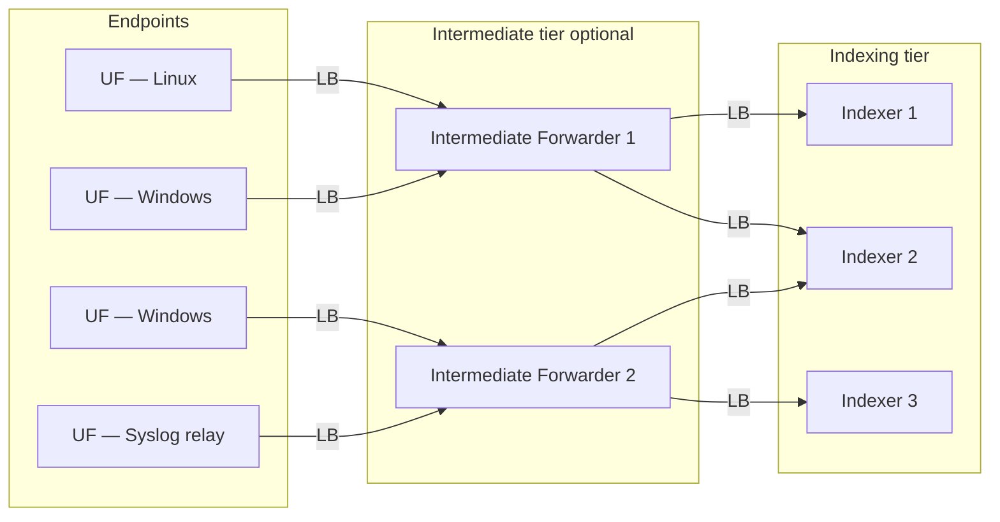

# Routing, Load Balancing & Event Breaking

> Deep reference on how data moves from many forwarders to many indexers in a production Splunk deployment: automatic load balancing and its constraints, event breaking as the mechanism that makes load balancing work for continuous streams, routing data to specific indexes or indexer groups, filtering (dropping) unwanted events before they count against license, tiered forwarding through intermediate forwarders, and when to use a Universal Forwarder vs a Heavy Forwarder. Companion `pre-class.md` holds the short primer and official-doc links.

---

## 0. Orientation

A single Universal Forwarder sending all its data to a single indexer is a simple topology useful for testing. A production deployment has dozens to thousands of forwarders sending to multiple indexers. The questions that arise immediately are: how do forwarders distribute load across indexers fairly? What happens when a file is too large to pause mid-stream for a switch? Can you send security logs to one indexer and network logs to another? Can you drop noisy, low-value events before they inflate your license? And when should the intermediate tier use a full Heavy Forwarder instead of another UF?

These questions are answered by four interlocking mechanisms: automatic load balancing (in `outputs.conf`), event breaking (in `props.conf` on the UF), data routing (in `props.conf` + `transforms.conf` + `outputs.conf`), and filtering to `nullQueue`. Getting these right is the difference between a deployment that scales and one that bottlenecks.

---

## 1. Data consolidation topology

The standard distributed model consolidates many endpoint forwarders into a smaller indexing tier:



Each tier load-balances to the next. The intermediate forwarder tier is optional but recommended for large deployments (see §6).

---

## 2. Automatic load balancing

### 2.1 The mechanism

When `outputs.conf` lists multiple indexers in a `[tcpout:<group>]` stanza, the forwarder automatically distributes data across them. The switch between indexers is governed by two attributes:

```ini
# outputs.conf on the forwarder
[tcpout]
defaultGroup = primary_indexers

[tcpout:primary_indexers]
server = idx1.example.com:9997, idx2.example.com:9997, idx3.example.com:9997
autoLBFrequency = 30
autoLBVolume = 0
compressed = true
```

| Attribute | Default | Meaning |
|---|---|---|
| `autoLBFrequency` | `30` | Seconds before switching to the next indexer in the list |
| `autoLBVolume` | `0` (disabled) | Bytes to send before switching; 0 = use frequency only |
| `compressed` | `false` | Enable S2S compression; reduces wire overhead, adds CPU |

**Combined behaviour:** if `autoLBVolume` is set to a non-zero value, the forwarder switches when *either* the volume threshold is reached *or* the frequency timer expires — whichever comes first. When `autoLBVolume` is 0, switching is purely time-based at `autoLBFrequency` seconds.

The next indexer is selected randomly from the configured server list (not strictly round-robin). This provides reasonable distribution without requiring any coordination between forwarders.

### 2.2 Why load balancing matters

In a distributed search architecture, each indexer holds a partition of the data. To search across all data, the search head fans out queries to all indexers. If all data lands on one indexer:
- That indexer's storage fills while others sit idle.
- Search performance degrades because one peer answers all queries.
- RF/SF replication (in clustered environments) is imbalanced.

Even distribution across indexers is a prerequisite for horizontal scalability.

### 2.3 The large-file / continuous-stream problem

The `autoLBFrequency` timer is straightforward for files that rotate frequently. But there is a critical constraint: **the forwarder will only switch indexers at an event boundary or end-of-file**. It will not split an event mid-stream to change destinations.

For large, continuously growing files (e.g., a Windows Security Event Log that is never rotated, or a high-volume syslog stream being piped to a file), the forwarder may monitor the file indefinitely without encountering a clean end-of-file. The result is that the file "sticks" to one indexer indefinitely, regardless of the `autoLBFrequency` setting. All events from that source land on one indexer. Load balancing breaks down.

The fix is **event breaking on the UF** — telling the forwarder exactly where events end, so it can switch cleanly at those boundaries.

---

## 3. Event breaking — enabling load balancing for continuous streams

### 3.1 The core concepts: LINE_BREAKER and SHOULD_LINEMERGE

These two `props.conf` settings, keyed to a sourcetype stanza, define how Splunk breaks a raw byte stream into discrete events:

**`LINE_BREAKER`** — a regex that identifies event boundaries. Every position in the raw stream where the regex matches is treated as the boundary between two events. The default is `([\r\n]+)` — a newline — which works for single-line events but is wrong for multi-line events.

**`SHOULD_LINEMERGE`** — a boolean (default `true`). When `true`, Splunk uses the line-merging pipeline (BREAK_ONLY_BEFORE, MUST_BREAK_AFTER, etc.) to reassemble individual lines into multi-line events after line breaking. This is relatively slow.

**Performance rule:** when using `LINE_BREAKER` to delimit multi-line events, always set `SHOULD_LINEMERGE = false`. The `LINE_BREAKER` regex itself defines the boundaries; line merging is unnecessary and adds overhead.

```ini
# props.conf — a multi-line Windows Event Log sourcetype
[WinEventLog:Security]
SHOULD_LINEMERGE = false
LINE_BREAKER = ([\r\n]+)(?=\d{2}/\d{2}/\d{4})
```

### 3.2 EVENT_BREAKER and EVENT_BREAKER_ENABLE (UF-specific)

`LINE_BREAKER` and `SHOULD_LINEMERGE` are index-time settings that run on the indexer's parsing pipeline. On a UF, they have no effect because the UF does not parse. For load balancing to work cleanly on a UF, you need a UF-specific mechanism: `EVENT_BREAKER_ENABLE` and `EVENT_BREAKER`.

These settings activate Splunk's **ChunkedLBProcessor** on the UF — a lightweight event boundary detector that runs before forwarding:

```ini
# props.conf on the Universal Forwarder
[WinEventLog:Security]
EVENT_BREAKER_ENABLE = true
EVENT_BREAKER = ([\r\n]+)(?=\w.+\s\d{1,2}/\d{1,2}/\d{4})
```

| Setting | Default | Scope |
|---|---|---|
| `EVENT_BREAKER_ENABLE` | `false` | UF only; activates ChunkedLBProcessor |
| `EVENT_BREAKER` | `([\r\n]+)` | UF only; regex defining event boundary for LB switching |

**Key operational point:** `EVENT_BREAKER` is only for enabling clean switching during load balancing on the UF. It is **not** a replacement for `LINE_BREAKER` / `SHOULD_LINEMERGE` on the indexer, which still define how the indexer parses the data into events. Both sets of settings may coexist: `EVENT_BREAKER*` on the UF for clean LB switching; `LINE_BREAKER` / `SHOULD_LINEMERGE` on the indexer for correct parsing.

### 3.3 The output queue buffer: maxQueueSize

When all target indexers are unreachable, the forwarder needs somewhere to hold data temporarily. `maxQueueSize` in the `[tcpout:<group>]` stanza controls this:

```ini
[tcpout:primary_indexers]
server = idx1:9997, idx2:9997
maxQueueSize = 10MB
```

The forwarder buffers up to `maxQueueSize` bytes in its output queue. As soon as any indexer becomes reachable, it flushes the queue. In a multi-indexer environment, the forwarder only triggers the queue if *all* indexers are simultaneously unreachable — if even one is reachable it switches to that one first.

---

## 4. Routing data to specific indexes and indexer groups

### 4.1 The two routing mechanisms

Splunk provides two distinct routing mechanisms that are often confused:

| Mechanism | What it does | Configured in |
|---|---|---|
| `_TCP_ROUTING` | Routes data to a named output group (a set of indexers) | `inputs.conf` → `outputs.conf` |
| `_MetaData:Index` | Changes the destination index for events matching a rule | `props.conf` → `transforms.conf` |

### 4.2 TCP routing — sending different inputs to different indexer groups

`_TCP_ROUTING` routes a specific input stanza's data to a named `[tcpout:<group>]` group in `outputs.conf`. This is the mechanism for physically directing some data to one set of indexers and other data to another:

```ini
# inputs.conf
[monitor:///var/log/secure]
sourcetype = linux:secure
_TCP_ROUTING = security_indexers

[monitor:///var/log/messages]
sourcetype = syslog
_TCP_ROUTING = general_indexers
```

```ini
# outputs.conf
[tcpout:security_indexers]
server = siem-idx1:9997, siem-idx2:9997

[tcpout:general_indexers]
server = gen-idx1:9997, gen-idx2:9997
```

The string `_TCP_ROUTING` is a special attribute in `inputs.conf` that overrides the `defaultGroup` setting. Without it, all data from the forwarder goes to `defaultGroup`.

### 4.3 Index routing via transforms — dynamically assigning events to indexes

The `_MetaData:Index` mechanism is more powerful: it uses a regex or field match in `transforms.conf` to dynamically re-route events to a different index based on their content or source. This is configured as a transform chain in `props.conf` + `transforms.conf`:

```ini
# props.conf
[source::/var/log/secure]
TRANSFORMS-setindex = route_to_security_index

# transforms.conf
[route_to_security_index]
REGEX = .
DEST_KEY = _MetaData:Index
FORMAT = security
```

`REGEX = .` matches everything (no content filtering — just re-label the index). For conditional routing, use a meaningful regex. `FORMAT = security` sets the destination index name. The stanza name in `props.conf` (`TRANSFORMS-setindex`) is arbitrary; it just needs to match the stanza name in `transforms.conf`.

---

## 5. Filtering (dropping) unwanted events — nullQueue

Not all data arriving at a forwarder or indexer is worth storing. Noisy, low-value events inflate license consumption without providing analytical value. Splunk provides a mechanism to drop events permanently: routing them to the `nullQueue`.

Events sent to `nullQueue` are discarded — they are never indexed and do not count toward license volume. This is the Splunk equivalent of `/dev/null`.

```ini
# props.conf
[source::/var/log/debug]
TRANSFORMS-drop_debug = drop_debug_events

[sourcetype::syslog]
TRANSFORMS-drop_heartbeats = drop_syslog_heartbeats

# transforms.conf
[drop_debug_events]
REGEX = .
DEST_KEY = queue
FORMAT = nullQueue

[drop_syslog_heartbeats]
REGEX = (?i)heartbeat|keepalive
DEST_KEY = queue
FORMAT = nullQueue
```

**Key points:**
- `DEST_KEY = queue` targets the processing queue (not a metadata field).
- `FORMAT = nullQueue` is the literal string that drops the event.
- The `REGEX` in the transform stanza is a content filter: only events matching the regex are dropped. Use `REGEX = .` to drop everything from the input specified in `props.conf`.
- Filtering can be done on a Heavy Forwarder (before the data is forwarded) or on the indexer (at index time). Filtering on the HF saves license and indexer CPU.
- **Important:** `nullQueue` filtering is not reversible — data dropped here is permanently gone. Test regexes carefully before deploying.

### 5.1 Combining routing and filtering in a single chain

A stanza in `props.conf` can reference multiple transforms simultaneously by defining multiple `TRANSFORMS-<name>` attributes. Each fires in turn. This enables composable pipelines: re-label sourcetype, route to a specific index, and drop a subset of events, all from one sourcetype stanza.

---

## 6. Intermediate forwarders — tiered forwarding

### 6.1 What an intermediate forwarder is

An intermediate forwarder is any Splunk instance that receives data from other forwarders and forwards it onward to the indexing tier — it is not an endpoint collector itself. Intermediate forwarders:
- Concentrate traffic from many UFs into fewer, larger connections to the indexer tier.
- Can load-balance across multiple indexers at the forwarding tier (not just at the UF tier).
- Can be UFs or HFs, depending on what processing is needed.

### 6.2 Why intermediate forwarders are recommended

In a large environment:
- Direct UF-to-indexer connections multiply with each new UF. An environment with 500 UFs each connecting to 3 indexers generates 1500 persistent TCP connections to the indexer tier. This is expensive for the indexers to maintain.
- Aggregating through intermediate forwarders reduces indexer-tier connection count and smooths traffic bursts.
- Intermediate forwarders provide a central point for syslog aggregation (firewalls, switches, and other agentless sources that cannot run a UF).
- They provide an additional resiliency tier: if an intermediate forwarder fails, its UFs detect the connection loss and switch to other available intermediate forwarders within `autoLBFrequency` seconds.

### 6.3 Intermediate UF: the default choice

An intermediate forwarder configured as a UF:
- Adds zero parsing overhead — data passes through as raw blocks.
- Requires no Splunk Enterprise license (UF license is free).
- Forwards compressed, uncooked data.
- Scales well; the bottleneck is network bandwidth, not CPU.
- Cannot do data masking, content-based routing, or HEC hosting.

### 6.4 Intermediate HF: when it's actually needed

A Heavy Forwarder at the intermediate tier is justified when you need capabilities the UF cannot provide:

| Requirement | Why HF is needed |
|---|---|
| Data masking (PII, credit cards) | UF cannot parse or transform event content |
| Content-based routing | UF can only route by input source, not by event content |
| HEC hosting | Only full instances and HFs can run HEC |
| DB Connect | Requires a full Splunk instance or HF |
| Syslog aggregation with parsing | If you need to normalise syslog before forwarding |
| License enforcement before indexer | To drop events and save license at an earlier stage |

An HF **consumes a Splunk Enterprise license** and forwards data as "cooked" (parsed) — the indexer receives already-parsed events, which adds overhead to the wire protocol and reduces what the indexer can do with the data. Use HF intermediaries only when the capabilities justify the cost.

---

## 7. Indexer acknowledgment

Indexer acknowledgment (`useACK = true` in `outputs.conf`) provides end-to-end delivery confirmation. When enabled, the indexer sends an acknowledgment back to the forwarder after successfully writing received data. If the forwarder does not receive an ack within the timeout window, it retransmits the data.

```ini
# outputs.conf on the forwarder
[tcpout:primary_indexers]
server = idx1:9997, idx2:9997
useACK = true
```

In a tiered environment with intermediate forwarders, ack must be enabled at **each hop independently** — UF → intermediate forwarder, and intermediate forwarder → indexer — to get end-to-end protection. Enabling ack only at the first hop gives no protection against loss between the intermediate forwarder and the indexer.

Ack adds latency to the forwarding pipeline (the forwarder waits for confirmation before discarding buffered data). Use it when data loss is unacceptable and additional latency is tolerable.

---

## 8. Universal Forwarder vs Heavy Forwarder — decision framework

| Dimension | Universal Forwarder | Heavy Forwarder |
|---|---|---|
| **License** | Free (included in Enterprise) | Consumes Enterprise license |
| **Parsing** | None — raw blocks only | Full parsing pipeline |
| **Data on wire** | Uncooked (raw), compressed | Cooked (parsed) |
| **Resource footprint** | Very low; designed for endpoints | Significantly higher CPU and RAM |
| **Scalability** | Excellent; thousands per deployment | Limited by license and resources |
| **Content-based routing** | Not possible | Full props/transforms routing |
| **Data masking** | Not possible | Full transforms support |
| **HEC** | Cannot host | Can host |
| **DB Connect** | Cannot run | Can run |
| **Event breaking for LB** | EVENT_BREAKER_ENABLE = true | LINE_BREAKER in props.conf |

**Decision rule:**
- Default to UF for all endpoint data collection and intermediate forwarding.
- Use HF at the intermediate tier only when content parsing, masking, advanced routing, or HEC hosting is specifically required.
- Never use HF at the endpoint tier unless it is also functioning as a search head or indexer for local purposes.

---

## 9. Putting it all together: a worked routing configuration

**Scenario:** A UF on a Linux host monitors two log paths. Security logs go to a security-specific indexer group; syslog goes to a general group. Noisy debug messages are dropped. The UF load-balances across two indexers per group.

```ini
# inputs.conf on the UF
[monitor:///var/log/secure]
sourcetype = linux:secure
index = security
_TCP_ROUTING = security_group

[monitor:///var/log/syslog]
sourcetype = syslog
index = os
_TCP_ROUTING = general_group
TRANSFORMS-drop_debug = drop_debug_noise

# props.conf on the UF (for event breaking on continuous syslog stream)
[syslog]
EVENT_BREAKER_ENABLE = true
EVENT_BREAKER = ([\r\n]+)(?=\w{3}\s+\d{1,2}\s+\d{2}:\d{2}:\d{2})

# transforms.conf on the UF
[drop_debug_noise]
REGEX = (?i)\bdebug\b
DEST_KEY = queue
FORMAT = nullQueue

# outputs.conf on the UF
[tcpout]
defaultGroup = general_group

[tcpout:security_group]
server = siem-idx1:9997, siem-idx2:9997
autoLBFrequency = 30
compressed = true

[tcpout:general_group]
server = gen-idx1:9997, gen-idx2:9997
autoLBFrequency = 30
compressed = true
```

**What this achieves:**
1. `/var/log/secure` routes exclusively to the security indexers; `/var/log/syslog` routes to general indexers.
2. Any syslog event containing "debug" is dropped before forwarding — does not count against license.
3. `EVENT_BREAKER` tells the UF where syslog events end, enabling clean load-balancing switches on the continuous stream.
4. Both groups load-balance across two indexers with a 30-second frequency.

---

## 10. Terminology & version notes

- **`autoLBFrequency`** and **`autoLBVolume`** — stable since Splunk 4.x; defaults (`30` seconds, `0` bytes) unchanged in 9.x.
- **`EVENT_BREAKER_ENABLE` / `EVENT_BREAKER`** — introduced in Splunk 6.5 as `ChunkedLBProcessor`. On Splunk 9.x it is the recommended approach for UF load balancing over large/continuous files, replacing the older `forceTimebasedAutoLB` setting.
- **`forceTimebasedAutoLB`** — a legacy `outputs.conf` setting that forced time-based switching even without event boundaries; it could split events mid-stream. Replaced by `EVENT_BREAKER_ENABLE` on the UF. Still present in 9.x but not recommended.
- **`nullQueue` filtering** — stable across all Splunk versions; the `queue` DEST_KEY and `nullQueue` FORMAT are well-established.
- **`_TCP_ROUTING`** — inputs.conf attribute, stable across versions.
- **`useACK`** (indexer acknowledgment) — `outputs.conf` attribute, supported since Splunk 4.x; enabling it on both hops of a tiered deployment is a 9.x best practice.
- **`compressed`** in `outputs.conf` — when `true`, Splunk uses S2S compression on the wire. Saves bandwidth at the cost of CPU on both ends. Default `false`.

---

## 11. Common misconceptions

- **"Load balancing is round-robin and always works."** Load balancing only switches at event boundaries or end-of-file. A large, continuously growing file with no `EVENT_BREAKER` will stick to one indexer indefinitely, defeating load balancing entirely.
- **"EVENT_BREAKER replaces LINE_BREAKER."** They operate at different points in different components. `EVENT_BREAKER` runs on the UF for clean switching. `LINE_BREAKER` runs on the indexer's parsing pipeline for correct event formation. Both are often needed simultaneously.
- **"Filtering to nullQueue is reversible."** No. Dropped data is gone permanently. Test filter regexes in a development environment and verify exactly what they match before applying to production.
- **"Use a Heavy Forwarder everywhere for more capability."** HF consumes a license, adds CPU overhead, forwards cooked data, and is harder to scale. UF is the correct default; HF is for specific, justified use cases.
- **"_TCP_ROUTING and index routing do the same thing."** They operate at different layers. `_TCP_ROUTING` determines which indexer(s) the data is physically sent to (outputs.conf group). `_MetaData:Index` determines which index on the indexer the data is stored in. You can combine them.
- **"maxQueueSize buffers data even when some indexers are reachable."** The forwarder only uses the disk buffer if all configured indexers are simultaneously unreachable. If even one is reachable, the forwarder switches to it — the queue is not filled.
- **"Intermediate forwarders must be Heavy Forwarders."** UFs work perfectly as intermediate forwarders for raw data forwarding. HF is only needed when parsing or transformation is required at the intermediate tier.

---

## 12. Mastery checklist — what you should be able to explain

- How automatic load balancing works: `autoLBFrequency`, `autoLBVolume`, and the interaction between the two.
- Why large continuous files break load balancing, and how `EVENT_BREAKER_ENABLE` + `EVENT_BREAKER` solves the problem.
- The difference between `LINE_BREAKER` / `SHOULD_LINEMERGE` (indexer parsing) and `EVENT_BREAKER*` (UF LB mechanism).
- The two routing mechanisms: `_TCP_ROUTING` (physical routing to indexer group) vs `_MetaData:Index` (index assignment via transforms).
- How to configure nullQueue filtering: the `props.conf` TRANSFORMS reference and the `transforms.conf` stanza with `DEST_KEY = queue` / `FORMAT = nullQueue`.
- When to use an intermediate forwarder, why UF is the default choice, and the specific use cases that justify an HF at the intermediate tier.
- What indexer acknowledgment does and why it must be enabled at each hop in a tiered deployment.
- The UF vs HF decision framework: license, parsing, footprint, capabilities.

---

## 13. Key terms (flashcard seeds)

- **`autoLBFrequency`** — seconds before switching to next indexer; default 30.
- **`autoLBVolume`** — bytes before switching; 0 = disabled (time-only switching).
- **End-of-file / event boundary constraint** — LB switches only happen here; root cause of large-file stickiness.
- **`EVENT_BREAKER_ENABLE`** — UF-only `props.conf` bool; activates ChunkedLBProcessor for clean LB switching.
- **`EVENT_BREAKER`** — UF-only regex defining event boundary for LB; must contain a capturing group.
- **`LINE_BREAKER`** — `props.conf` regex on indexer defining event boundaries in the parsing pipeline.
- **`SHOULD_LINEMERGE`** — set `false` when using `LINE_BREAKER` for multi-line events; improves performance.
- **`_TCP_ROUTING`** — `inputs.conf` attribute pointing to a named `tcpout` group; routes physical traffic.
- **`_MetaData:Index`** — `transforms.conf` DEST_KEY for dynamically re-assigning the destination index.
- **`nullQueue`** — `FORMAT = nullQueue` in `transforms.conf`; permanently drops matched events; not reversible.
- **`DEST_KEY = queue`** — targets the processing queue; use with `FORMAT = nullQueue` to filter.
- **Intermediate forwarder** — receives from UFs, forwards to indexers; UF by default, HF when parsing needed.
- **`useACK`** — `outputs.conf` bool; enables indexer acknowledgment for in-flight data protection.
- **`maxQueueSize`** — `outputs.conf` disk buffer size when all indexers unreachable.
- **`compressed`** — `outputs.conf` bool; S2S compression; reduces bandwidth, adds CPU.
- **`[tcpout:<group>]`** — named output group in `outputs.conf`; defines a set of indexers to forward to.
- **HF intermediate** — justified for: data masking, content-based routing, HEC hosting, DB Connect.
- **UF intermediate** — default; free license, raw/uncooked, low overhead, scales well.

---

## 14. Questions to drill (quiz seeds)

1. A UF monitors a high-volume continuously growing log file and load-balances across three indexers. The `autoLBFrequency` is set to 30 seconds, but all events for this file keep going to indexer 1. Explain why and how you fix it.
2. What is the difference between `EVENT_BREAKER` (in `props.conf` on a UF) and `LINE_BREAKER` (in `props.conf` on an indexer)? Can you have both configured simultaneously?
3. Write the `outputs.conf` stanza that load-balances to two indexers, switching every 60 seconds and after 50 MB of data, with compression enabled.
4. You want to route `/var/log/audit/audit.log` to indexer group `security_indexers` and everything else to `default_indexers`. What attribute in `inputs.conf` achieves this, and what does `outputs.conf` need?
5. Write the `props.conf` and `transforms.conf` stanzas to drop all events from sourcetype `noisy:vendor` that contain the string "INFO" before they are indexed.
6. Explain why `nullQueue` filtering on an HF saves both license and indexer CPU, while filtering on the indexer only saves indexer CPU.
7. Your organisation has 800 UFs, each connecting to 4 indexers directly. What operational problem does this create, and how does introducing an intermediate forwarder tier solve it?
8. Give three specific requirements that justify deploying a Heavy Forwarder at the intermediate tier instead of a UF, and explain why a UF cannot meet them.
9. You enable indexer acknowledgment (`useACK = true`) on the UF-to-intermediate-forwarder leg but not on the intermediate-forwarder-to-indexer leg. What gap in data protection remains?
10. `autoLBVolume = 10485760` is set in a UF's `outputs.conf`. The UF is sending 1 MB/s. `autoLBFrequency = 30`. When does the UF actually switch indexers?
