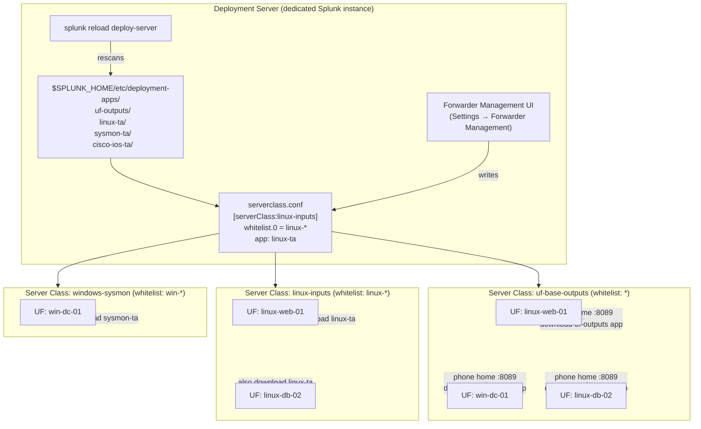

# Deployment Server, Clients & Server Classes

> Deep reference on the Deployment Server (DS) as Splunk's centralized configuration push mechanism for forwarders and other clients: the pull model, deployment clients, deployment apps, server classes, the Forwarder Management UI, `deploymentclient.conf`, `serverclass.conf`, the `reload deploy-server` workflow, sizing constraints, and how the DS fits into the broader multi-tier management picture alongside the cluster manager and SHC deployer. Companion `pre-class.md` holds the short primer and official-doc links.

---

## 0. Orientation

When an environment has tens, hundreds, or thousands of universal forwarders deployed across endpoints, servers, and network devices, manually touching `inputs.conf` or `outputs.conf` on each one is not viable. The **Deployment Server (DS)** solves this: a single Splunk instance that acts as a central configuration distribution point. Forwarders and other clients periodically **phone home** to the DS, compare what they have against what the DS is offering, download anything new or changed, and optionally restart. The admin's job is to place config bundles in the right directory on the DS and define **which clients get which bundles** — that mapping is the **server class**.

Mastering the DS means understanding three layers:
1. **The client side** — how a Splunk instance becomes a deployment client and knows where to phone home.
2. **The server side** — how the DS stores, organizes, and distributes config bundles (deployment apps).
3. **The mapping layer** — server classes in `serverclass.conf` that bind specific clients to specific apps.

---

## 1. What the Deployment Server is (and is not)

The DS is a **full Splunk Enterprise instance** with one specific role enabled. It does not have to be a dedicated instance — any Splunk Enterprise instance can serve as a DS — but in production with more than ~50 clients it **must** be a dedicated instance to avoid resource contention with other roles (indexing, searching).

**What it does:**
- Stores config bundles under `$SPLUNK_HOME/etc/deployment-apps/` on the DS.
- Maintains server class definitions in `serverclass.conf` that map client groups to app groups.
- Serves those bundles to clients that phone home on the management port (default **8089**).
- Reloads its configuration (rescans `deployment-apps/` and `serverclass.conf`) on demand via `splunk reload deploy-server`.

**What it does NOT do:**
- It does not manage indexer cluster peers — that is the **cluster manager** (CM), communicating via its own replication port and peer-apps directory.
- It does not manage search head cluster members — that is the **SHC deployer**, using a dedicated deployer-push mechanism (`splunk apply shcluster-bundle`).
- It does not replace Splunk Web-level app management on a standalone search head.
- **Critically:** you must not use the DS to push configs to indexer cluster peers or SHC members — doing so creates configuration conflicts because the cluster manager and deployer have separate, authoritative config paths for those components.

| Component | Manages | Mechanism |
|---|---|---|
| Deployment Server | Forwarders (UF/HF), standalone non-clustered instances | Pull: client phones home, downloads changed apps |
| Cluster Manager | Indexer cluster peers | Push: CM bundles `master-apps/`, applies via `splunk apply cluster-bundle` |
| SHC Deployer | Search head cluster members | Push: deployer bundles `shcluster/apps/`, applies via `splunk apply shcluster-bundle` |

---

## 2. The deployment client — phone-home model

A **deployment client** is any Splunk instance (UF, HF, full Enterprise, or even another Splunk instance) that has been configured to poll a DS for updates. The DS itself never pushes proactively — it is strictly a **pull model**: the client initiates contact.

### 2.1 How to configure a deployment client

There are two methods:

**Method 1 — `deploymentclient.conf` directly**

Create or edit `$SPLUNK_HOME/etc/system/local/deploymentclient.conf` (or, more neatly, place it inside a dedicated app under `etc/apps/<your-dc-app>/local/deploymentclient.conf`):

```ini
[deployment-client]
phoneHomeIntervalInSecs = 60

[target-broker:deploymentServer]
targetUri = 192.168.10.20:8089
```

- `[deployment-client]` — controls client-side behaviour (poll interval, client name overrides, etc.).
- `[target-broker:deploymentServer]` — tells the client **where** to phone home. The stanza name must be exactly `target-broker:deploymentServer`.
- `targetUri` — `<DS hostname or IP>:<management port>`. The management port is **8089** by default on both sides.
- `phoneHomeIntervalInSecs` — how frequently the client contacts the DS. Default is **60 seconds**. For large environments with thousands of clients, tune this up (300–600 s) to reduce DS load.

**Method 2 — CLI shortcut**

On the forwarder (run as a user with appropriate OS permissions):

```
splunk set deploy-poll <DS-host-or-IP>:8089
splunk restart
```

This writes the same `deploymentclient.conf` stanza automatically. A restart is required for the client to begin phoning home.

**Verification on the client:**

```
splunk btool deploymentclient list --debug
```

This shows the merged effective `deploymentclient.conf` and which file each line came from, confirming the DS address is set correctly.

### 2.2 The phone-home cycle

1. Client starts and reads `deploymentclient.conf`.
2. At the configured interval (default 60 s), the client opens a connection to the DS on port **8089** (the Splunk management/REST API port).
3. The client sends its **clientName** (defaults to the hostname) and a **checksum/hash** of each app it already has from the DS.
4. The DS compares against the current versions under `deployment-apps/`.
5. If an app is new or changed (hash mismatch), the DS transfers the updated app bundle to the client.
6. The client writes the received app to `$SPLUNK_HOME/etc/apps/` and, if configured, restarts Splunk or reloads inputs.

> Note the firewall implication: **port 8089 must be open bidirectionally** between each forwarder and the DS. Forwarders behind a NAT/firewall commonly miss this — they can reach the DS but the DS cannot initiate to them — however since the DS is purely passive (the client polls), only the **client → DS** direction is strictly required for the pull. Ensure no stateful firewall is blocking the return traffic.

---

## 3. Deployment apps

A **deployment app** is a configuration bundle — it can be a full Splunk app with UI, a TA (Technology Add-on) with just `inputs.conf`/`props.conf`/`transforms.conf`, or even a minimal one-file config package. The format is identical to any other Splunk app directory structure:

```
$SPLUNK_HOME/etc/deployment-apps/
    my-uf-outputs/
        local/
            outputs.conf
    cisco-ta/
        default/
            inputs.conf
            props.conf
        README
    uf-base-inputs/
        local/
            inputs.conf
        bin/
            collect_netstat.sh
        metadata/
            default.meta
```

**Key rules for deployment apps:**

- Apps must be placed under `$SPLUNK_HOME/etc/deployment-apps/` on the DS — **not** under `etc/apps/` on the DS. The DS's own `etc/apps/` is its local app space; `etc/deployment-apps/` is the repository for what it distributes.
- File ownership: on Linux, ensure the `deployment-apps/` contents are owned by the `splunk` user (`chown -R splunk:splunk <app-dir>`), otherwise Splunk cannot read or serve them.
- When a client receives an app from the DS, the app lands under `$SPLUNK_HOME/etc/apps/` on the **client** — not in a separate directory. It becomes a normal app from the client's perspective.
- Apps follow the standard `default/` and `local/` structure. Changes in `local/` inside a deployment app survive upgrades; `default/` is the shipped config.

**The base-outputs pattern** — a nearly universal real-world practice is creating a single `uf-outputs` (or similar) deployment app containing only `outputs.conf`, assigning it to a server class that matches all forwarders. This pushes the forwarding destination (indexer IP/port, load balancing config) to every forwarder centrally, eliminating the need to touch each forwarder's `outputs.conf` manually. Updating the indexer address is then a one-file change on the DS.

---

## 4. Server classes — the mapping layer

A **server class** is a named grouping that binds a set of clients to a set of deployment apps. It answers: "which clients get which apps?"

Server classes are defined in `serverclass.conf` on the DS at `$SPLUNK_HOME/etc/system/local/serverclass.conf` (or inside a dedicated app on the DS). The Forwarder Management UI writes to this same file.

### 4.1 `serverclass.conf` structure

```ini
[serverClass:<name>]
whitelist.0 = *
restartSplunkd = false

[serverClass:<name>:app:<app-name>]
stateOnClient = enabled
restartSplunkd = false
```

Three levels of stanza in `serverclass.conf`:

| Level | Stanza form | Scope |
|---|---|---|
| Global | `[global]` | Defaults applied to all server classes |
| Server class | `[serverClass:<name>]` | Filter and options for one server class |
| App override | `[serverClass:<name>:app:<app>]` | Per-app options within a server class |

**Client filtering attributes** (set at global, serverClass, or app level — most specific wins):

| Attribute | Function |
|---|---|
| `whitelist.<n>` / `allowlist.<n>` | Patterns that must match for a client to be included. `n` is a 0-based index (0, 1, 2…). Each entry is matched independently — any match includes the client. |
| `blacklist.<n>` / `denylist.<n>` | Patterns that, if matched, exclude the client even if it was whitelisted. |
| `filterType` | `whitelist` (default) or `blacklist` — controls whether the filter is additive or subtractive. |

> Terminology note: Splunk 8.x docs used `whitelist`/`blacklist`. From Splunk 9.x, the preferred terms are `allowlist`/`denylist`, but both forms remain valid in the conf files for backward compatibility. The UI and new documentation use the updated terminology.

Pattern matching in filters can use:

- **Exact hostname** — `whitelist.0 = web-server-01`
- **Wildcard** — `whitelist.0 = uf-*` (matches `uf-linux-01`, `uf-win-02`, etc.)
- **IP address** — `whitelist.0 = 10.20.4.*`
- **clientName** — matched against the `clientName` set in the client's `deploymentclient.conf` (if set; otherwise defaults to hostname)
- **DNS name** — matched against the client's resolved DNS name

**Behaviour and restart options:**

| Attribute | Values | Meaning |
|---|---|---|
| `stateOnClient` | `enabled` \| `disabled` \| `noop` | Whether the app is enabled/disabled on the client. `noop` leaves the client's current state unchanged. Default: `enabled`. |
| `restartSplunkd` | `true` \| `false` | Restart `splunkd` on the client after an app is deployed/updated. Default: `false`. |
| `restartIfNeeded` | `true` \| `false` | Restart the client only if the deployed app requires it (e.g., changes to inputs that need a restart to take effect). |

### 4.2 A complete `serverclass.conf` example

```ini
[global]
phoneHomeIntervalInSecs = 60

[serverClass:uf-base-outputs]
whitelist.0 = *
restartSplunkd = false

[serverClass:uf-base-outputs:app:uf-outputs]
stateOnClient = enabled
restartSplunkd = false

[serverClass:linux-inputs]
whitelist.0 = linux-*
whitelist.1 = uf-nix-*
blacklist.0 = linux-test-*
restartSplunkd = true

[serverClass:linux-inputs:app:linux-ta-inputs]
stateOnClient = enabled

[serverClass:windows-sysmon]
whitelist.0 = win-*
restartSplunkd = false

[serverClass:windows-sysmon:app:sysmon-ta]
stateOnClient = enabled
```

Reading this:
- `uf-base-outputs` — every client (`*`) gets the `uf-outputs` app, no restart.
- `linux-inputs` — clients whose name starts with `linux-` or `uf-nix-`, except those starting with `linux-test-`, get the Linux TA inputs. Splunk restarts after deployment.
- `windows-sysmon` — clients named `win-*` get the Sysmon TA.

### 4.3 Client identity: hostname, IP, and clientName

By default a deployment client identifies itself by its **hostname**. You can override this in `deploymentclient.conf`:

```ini
[deployment-client]
clientName = prod-linux-web-01
```

Setting `clientName` explicitly is useful when hostnames are unreliable (DHCP, auto-generated cloud names, etc.) or when you want a stable, human-readable identity for filter matching in `serverclass.conf`.

---

## 5. Forwarder Management UI

`Settings → Forwarder Management` in Splunk Web provides a graphical interface over the same `serverclass.conf` and `deployment-apps/` filesystem. It shows:

- **Apps tab** — all apps currently in `deployment-apps/`, with a count of how many clients have received each.
- **Server Classes tab** — all defined server classes, with edit controls for client filters and app assignments.
- **Clients tab** — all clients that have phoned home, with their IP, hostname, clientName, last phone-home time, and which apps are deployed to each.

The UI is purely a front-end for reading/writing `serverclass.conf` and for triggering reloads. All the same operations can be done entirely with conf files and the CLI — the UI adds nothing that `serverclass.conf` cannot express.

**Important:** the Forwarder Management UI becomes available as soon as at least one app exists in `deployment-apps/` and at least one client has phoned home. Before either condition is met, the UI shows "No clients or apps are currently available."

---

## 6. Applying changes: `reload deploy-server`

Editing `serverclass.conf` or adding/updating an app under `deployment-apps/` does **not** automatically trigger a redistribution. The DS must be told to re-read its configuration and re-evaluate which clients need updated apps.

**CLI:**

```
splunk reload deploy-server
```

This is a lightweight reload — it does not restart `splunkd` on the DS. It:
1. Re-reads `serverclass.conf`.
2. Rescans all apps under `deployment-apps/`.
3. For any app whose checksum has changed, queues it for distribution to matching clients at their next phone-home.

If you use the Forwarder Management UI to make changes (add/edit server classes, add apps), the UI triggers this reload automatically. If you edit `serverclass.conf` or `deployment-apps/` directly on disk, you must run `reload deploy-server` manually or wait for the DS's own internal rescan interval.

> There is also a REST endpoint equivalent: `POST /services/deployment/server/config/_reload` — useful when scripting DS management.

---

## 7. The DS pull flow — end-to-end diagram



Reading the diagram:
- All three UFs phone home to the DS on port 8089 and receive `uf-outputs` (matched by `*`).
- `linux-web-01` and `linux-db-02` additionally receive `linux-ta` (matched by `linux-*`).
- `win-dc-01` additionally receives `sysmon-ta` (matched by `win-*`).
- The DS's view of what each client should have is defined entirely by which server classes the client matches.

---

## 8. DS sizing and scaling

### 8.1 Single DS limits

| Threshold | Guidance |
|---|---|
| ≤ 50 clients | DS can share an instance with another role (e.g., a lightweight search head or deployer) |
| > 50 clients | DS must be a **dedicated** Splunk Enterprise instance |
| ~1,000–10,000 clients | Single dedicated DS; tune `phoneHomeIntervalInSecs` upward (300–600 s); set `dedicatedIoThreads` in `server.conf` to CPU cores / 2 |
| > 10,000 clients | Consider a **DS cluster** (introduced in Splunk 9.2) |

### 8.2 DS cluster (Splunk 9.2+)

For very large deployments, Splunk 9.2 introduced a **deployment server cluster** — up to three DS nodes sharing load, each servicing up to 25,000 clients, for a theoretical maximum of 75,000 clients across three nodes. Each node still runs `splunk reload deploy-server` independently; the cluster does not automatically synchronize config changes — the `deployment-apps/` content must be kept consistent across nodes by an external mechanism (rsync, shared storage, etc.).

### 8.3 Phone-home interval tuning

The default 60-second interval is aggressive for large environments. Each phone-home is a REST call to port 8089, and with thousands of clients the DS can become a bottleneck:

```ini
[deployment-client]
phoneHomeIntervalInSecs = 300
```

Set this in a base deployment app pushed to all clients via the DS itself, or pre-configure it in the initial `deploymentclient.conf` before onboarding. A 300–600 second interval is typical for environments with > 1,000 clients.

---

## 9. Typical real-world patterns

### Pattern 1: Base outputs app (universal)

Every forwarder needs to know where to send data. Push a minimal `uf-outputs` app to all clients:

```
deployment-apps/uf-outputs/local/outputs.conf:

[tcpout]
defaultGroup = primary-indexers

[tcpout:primary-indexers]
server = idx1.corp.com:9997,idx2.corp.com:9997,idx3.corp.com:9997
```

Server class: `whitelist.0 = *`. This is always the first server class set up — without forwarding, no data flows.

### Pattern 2: OS-specific input collectors

Separate server classes for Linux and Windows, each containing a TA with the relevant `inputs.conf`:
- `whitelist.0 = linux-*` → Linux TA (monitors `/var/log/syslog`, `/var/log/auth.log`, etc.)
- `whitelist.0 = win-*` → Windows TA (monitors Windows Event Log channels)

### Pattern 3: Application-specific TAs

Push a specific TA only to hosts running a particular application:
- Name those hosts with a consistent prefix in `clientName` (e.g., `prod-apache-*`).
- Server class `whitelist.0 = prod-apache-*` → Apache TA.

### Pattern 4: Staged rollout

Use `blacklist` to exclude a test group:
```ini
[serverClass:new-ta-rollout]
whitelist.0 = linux-*
blacklist.0 = linux-test-*
```

Deploy to production `linux-*` hosts while excluding `linux-test-*`. Remove the blacklist entry once you're confident in the app.

---

## 10. What goes where — directory summary

| Path | On which instance | What it contains |
|---|---|---|
| `$SPLUNK_HOME/etc/deployment-apps/` | Deployment Server | Config bundles the DS distributes; **source of truth** for what gets pushed |
| `$SPLUNK_HOME/etc/system/local/serverclass.conf` | Deployment Server | Server class definitions — client filters + app mappings |
| `$SPLUNK_HOME/etc/system/local/deploymentclient.conf` | Deployment Client | DS address (`targetUri`), poll interval, clientName override |
| `$SPLUNK_HOME/etc/apps/` | Deployment Client | Where the DS-pushed apps **land** on the client |

---

## 11. Relationship to the conf layering model

Apps received from the DS land in the client's `etc/apps/` directory and are subject to the **same conf layering and precedence rules** as any other app. If a client has a locally-modified `local/outputs.conf` inside an app, and the DS pushes a new version of that same app, the DS-pushed content goes into the app's `default/` or `local/` depending on how the app was structured — and local always wins over default per the standard precedence rules.

This is a subtle but important operational point: if you push an app whose `local/outputs.conf` is meant to be authoritative, and the client already has a `local/outputs.conf` for that same stanza from a local edit, the client's local copy wins over the DS-pushed `local/`. For this reason, best practice is to structure DS-pushed apps so that the settings you want to win are in the app's `default/` for client-overrideable settings, or test with `btool` after deployment.

---

## 12. Terminology & version notes

- **Whitelist / blacklist vs. allowlist / denylist:** the conf files accepted both forms from Splunk 8.x onward. Splunk 9.x documentation uses `allowlist`/`denylist` as the primary terms; both work in the conf files. Do not mix them in the same stanza.
- **"Deployment server" vs. "cluster manager":** prior to Splunk 7.x the cluster manager was called the "master node." The naming was changed; the DS was always called "deployment server."
- **DS cluster (9.2+):** a new feature; single-DS deployments remain the norm for most environments below 10K clients.
- **`master-apps/` renaming:** on indexer cluster peers, the bundle directory was `slave-apps/` pre-9.0 and became `peer-apps/` in 9.0. The DS `deployment-apps/` naming has not changed.
- **REST API:** `splunk reload deploy-server` wraps `POST /services/deployment/server/config/_reload`. Useful in scripted/automated workflows.

---

## 13. Common misconceptions

- **"The DS pushes configs proactively."** No — it is strictly a **pull** model. The client phones home; the DS never initiates a connection to clients. This matters for firewall design.
- **"Use the DS to push to indexers and search heads."** Never for cluster members. DS is for forwarders and standalone instances. Cluster peers use the cluster manager; SHC members use the deployer.
- **"Changing a file in `deployment-apps/` takes effect immediately."** Not until the next client phone-home after a `reload deploy-server`.
- **"A server class is a push group."** Technically it is a **pull mapping** — the DS only hands out apps when clients ask. Think of it as a policy, not a queue.
- **"Every forwarder needs only one server class."** A forwarder can match multiple server classes simultaneously and receive all the apps from each.
- **"The `uf-outputs` app lands in `deployment-apps/` on the client."** No — it lands in `etc/apps/` on the client. `deployment-apps/` only exists on the DS.
- **"You need to restart the DS after adding an app."** No — `splunk reload deploy-server` (or the UI equivalent) is a live reload; no DS restart needed.
- **"`clientName` defaults to the IP."** It defaults to the **hostname** (`server.serverName` in `server.conf`). The IP is only used as a fallback if DNS cannot resolve it.

---

## 14. Mastery checklist — what you should be able to explain

- The DS pull model: why it is pull, not push; what the client does on each phone-home cycle; what happens to apps that already match the checksum.
- Both methods for configuring a deployment client (`deploymentclient.conf` stanzas vs. `splunk set deploy-poll`) and how to verify with `btool`.
- The directory separation: `deployment-apps/` on the DS (source) vs. `apps/` on the client (destination).
- The structure of a server class: the three stanza levels (global / serverClass / serverClass:app), and the role of `whitelist`/`allowlist`, `blacklist`/`denylist`, `filterType`, `stateOnClient`, and `restartSplunkd`.
- Pattern matching in filters: wildcards, IP ranges, explicit names, and the `clientName` override.
- The role of `reload deploy-server` vs. waiting for the next phone-home; why you do not need to restart the DS.
- When a DS must be dedicated (> 50 clients) and the rough scaling numbers (up to ~10K clients on a single well-tuned DS; DS cluster for larger).
- The DS's distinct role vs. the cluster manager (indexer peers) and SHC deployer (search head cluster members), and why they cannot be substituted for each other.
- The base-outputs pattern and why it is the first server class every environment sets up.

---

## 15. Key terms (flashcard seeds)

- **Deployment Server (DS)** — a Splunk Enterprise instance that distributes config bundles to deployment clients via a pull model over port 8089.
- **Deployment client** — any Splunk instance configured with `deploymentclient.conf` (or `splunk set deploy-poll`) to poll a DS for app updates.
- **Deployment app** — a config bundle (app directory) placed under `$SPLUNK_HOME/etc/deployment-apps/` on the DS; distributed to matching clients where it lands in `etc/apps/`.
- **Server class** — a named mapping in `serverclass.conf` that binds a set of clients (filtered by name/IP/wildcard) to a set of deployment apps.
- **`deploymentclient.conf`** — conf file on the client. Key stanza: `[target-broker:deploymentServer]` with `targetUri = <DS>:8089`; key attribute: `phoneHomeIntervalInSecs`.
- **`serverclass.conf`** — conf file on the DS. Stanzas: `[serverClass:<name>]`, `[serverClass:<name>:app:<app>]`. Key attributes: `whitelist.<n>`/`allowlist.<n>`, `blacklist.<n>`/`denylist.<n>`, `stateOnClient`, `restartSplunkd`.
- **`phoneHomeIntervalInSecs`** — how often (in seconds) the client contacts the DS. Default: 60. Tune up for large environments.
- **`targetUri`** — the DS address as seen by the client. Format: `<host>:8089`. Set in `[target-broker:deploymentServer]`.
- **`splunk set deploy-poll <host>:8089`** — CLI shortcut to configure `targetUri` on a deployment client.
- **`splunk reload deploy-server`** — CLI command on the DS to re-read `serverclass.conf` and rescan `deployment-apps/`; does not restart splunkd.
- **`stateOnClient`** — controls whether a DS-pushed app is enabled (`enabled`), disabled (`disabled`), or left as-is (`noop`) on the client.
- **`restartSplunkd`** — whether the client restarts after receiving a new/updated app from the DS.
- **`clientName`** — an override identity for a deployment client used in server class filter matching; set in `[deployment-client]` stanza of `deploymentclient.conf`.
- **Forwarder Management UI** — Splunk Web interface (`Settings → Forwarder Management`) for managing server classes, apps, and viewing connected clients; writes to `serverclass.conf`.
- **Base-outputs pattern** — a `uf-outputs` deployment app containing only `outputs.conf`, assigned to a `whitelist.0 = *` server class; pushes forwarding config to all UFs centrally.
- **DS cluster** — Splunk 9.2+ feature; up to 3 DS nodes, each handling up to 25K clients (75K total).
- **Port 8089** — Splunk's management port; used for all DS–client communication.

---

## 16. Questions to drill (quiz seeds)

1. Describe the DS pull model in detail: who initiates contact, on what port, how often, what is exchanged, and what happens if an app's checksum matches.
2. What is the difference between `$SPLUNK_HOME/etc/deployment-apps/` and `$SPLUNK_HOME/etc/apps/` — which exists on the DS and which on the client?
3. Write the minimum `deploymentclient.conf` stanzas needed to point a UF at a DS with IP `10.20.1.10` and a phone-home interval of 120 seconds.
4. What does `splunk set deploy-poll 10.20.1.10:8089` actually do under the hood?
5. Explain the three stanza levels in `serverclass.conf` (global, serverClass, serverClass:app) and how a setting at the app level interacts with a setting at the serverClass level.
6. You have 500 UFs named `linux-web-01` through `linux-web-500`. Write a `serverclass.conf` snippet that deploys `linux-apache-ta` to all of them but excludes `linux-web-099`.
7. What is `stateOnClient = noop` and when would you use it?
8. You update an app under `deployment-apps/`. Nothing happens for 10 minutes. What two things must occur before clients receive the updated app?
9. Why must you never use the DS to distribute configs to indexer cluster peers or SHC members?
10. A new UF has been added and its `deploymentclient.conf` is configured correctly, but it does not appear in Forwarder Management after 2 minutes. Walk through your diagnostic steps.
11. Describe the "base-outputs pattern" — what app does it push, to which server class filter, and what problem does it solve?
12. At what client count must a DS become a dedicated instance? What is the approximate upper limit for a single well-tuned DS, and what is the option beyond that?
