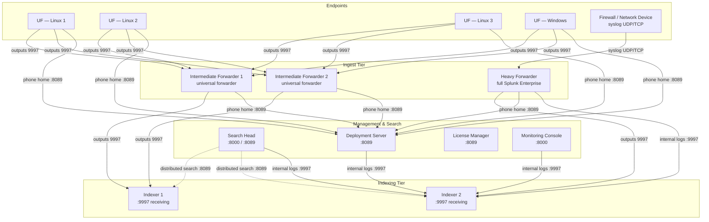

# Distributed Splunk Deployment: Components, Topology, and Forwarders

> Deep reference on building a full distributed Splunk environment from scratch — the roles, the topology, provisioning compute on any cloud or on-premises infrastructure, port requirements, installing each Splunk role from the same package, wiring forwarding end to end, and verifying data flow. This is the practical engineering side of Splunk administration: how all the pieces actually fit together into a running system.

---

## 0. Orientation

A production Splunk deployment is not a single instance. It is an assembly of specialized roles — indexers that store and search data, search heads that coordinate queries, forwarders that collect and ship data, and management components (deployment server, license manager, monitoring console) that keep the whole fleet operating. Understanding how these roles communicate, which ports they use, and how configuration flows between them is the foundation of Splunk administration.

This topic covers building that environment from zero: provisioning compute, installing Splunk, assigning roles, and wiring forwarder chains end to end. The concepts are identical on every cloud platform and on bare metal; only the IaaS tooling differs.

---

## 1. The component roles in a distributed deployment

A distributed Splunk environment is assembled from these distinct roles. Each runs on a separate instance for production scale, though a single instance can carry multiple roles in a lab:

| Role | What it does | Typical listening ports |
|---|---|---|
| **Indexer (search peer)** | Receives events from forwarders, parses/indexes them to disk, and responds to distributed search requests from search heads | 9997 (splunktcp receiving), 8089 (management/REST), 8000 (optional local web) |
| **Search Head** | Accepts queries from users, fans out distributed searches to all indexers, merges/presents results | 8000 (Splunk Web), 8089 (management/REST) |
| **Deployment Server (DS)** | Pushes app bundles to registered deployment clients (forwarders, indexers in non-clustered environments). Runs Splunk Enterprise | 8089 (management), 8000 (Forwarder Management UI) |
| **License Manager (LM)** | Enforces the Splunk license; all indexers phone home here | 8089 (management) |
| **Monitoring Console (MC)** | Aggregates platform health dashboards across all components; uses distributed search | 8000 (web), 8089 |
| **Heavy Forwarder (HF)** | Full Splunk Enterprise install in "forwarder mode"; performs index-time parsing, event routing, data masking, and network input (syslog/TCP/UDP) before forwarding to indexers | 8089, any custom network input port (e.g., 514/UDP or 5555/UDP) |
| **Intermediate Forwarder (IF)** | A universal forwarder used as a relay — receives data from other UFs and forwards to indexers; provides bandwidth concentration and fault isolation | 9997 (receiving from upstream UFs), 9997 outbound to indexers |
| **Universal Forwarder (UF)** | Lightweight agent for endpoints and servers; monitors files, WinEventLog, and scripted inputs; forwards raw/minimally processed data to indexers or IFs | 8089 (management), 9997 outbound |

> In a flat lab topology you may forward UFs directly to indexers. In production, an intermediate forwarder tier sits between UFs and indexers for: bandwidth aggregation across geography, fault tolerance (if one indexer is down the IF can buffer and redirect), and data masking/transformation at the edge before data reaches disk.

---

## 2. Reference topology

The following topology is what a foundational distributed lab builds toward. It is cloud-agnostic — "instance" means any compute node (VM, bare metal).



**Key architectural decisions captured in this diagram:**

- UFs load-balance across both IFs using Splunk's automatic load balancing (`autoLB`).
- IFs forward to a single indexer group in this example (Indexer 1). HF forwards to Indexer 2 (the "internal logs" indexer).
- All non-indexer Splunk components (SH, DS, MC, HF, IFs) forward their **internal `_internal` logs** to an indexer so platform health data is centrally searchable.
- The DS pushes configuration apps to all forwarder-tier components. It does not push to indexers or search heads in a non-clustered setup (for clustered peers, use the cluster manager's bundle; for SHC members, use the deployer).

---

## 3. Cloud-agnostic compute and networking: IaaS mapping

The Splunk concepts in this document are identical regardless of where you run the compute. The table below maps the AWS-centric terminology used in many Splunk lab walkthroughs to the equivalent Azure and generic terms:

| Concept | AWS term | Azure equivalent | Generic / on-prem |
|---|---|---|---|
| Virtual machine | EC2 instance | Azure VM | Server / VM |
| Virtual private network | VPC | VNet | Private network |
| Network subnet | Subnet | Subnet | Subnet / VLAN |
| Firewall rules (inbound/outbound) | Security Group | Network Security Group (NSG) | Firewall rules / ACL |
| Managed block storage | EBS volume | Managed Disk | Local/SAN disk |
| SSH key pair | Key pair (.pem) | SSH public key / key pair | SSH key pair |
| Instance sizing | e.g., t3.medium (2 vCPU, 4 GB) | e.g., Standard_B2s (2 vCPU, 4 GB) | 2 vCPU, 4 GB RAM |
| OS image | AMI | Marketplace image | ISO / template |
| Public IP | Elastic IP or auto-assigned public IP | Public IP address (static or dynamic) | Routable IP |
| Private IP | Private IP within VPC | Private IP within VNet | RFC-1918 address |

**Sizing guidance (minimum for a lab; scale up for production):**

| Role | vCPU | RAM | Disk |
|---|---|---|---|
| Universal Forwarder / Intermediate Forwarder | 1 | 1 GB | 5 GB |
| Heavy Forwarder | 2 | 4 GB | 15 GB |
| Indexer (search peer) | 2–4 (lab) / 16+ physical (prod) | 4 GB (lab) / 12 GB+ (prod) | 15+ GB (lab) |
| Search Head | 2 (lab) / 16+ virtual (prod) | 4 GB (lab) / 12 GB+ (prod) | 15 GB |
| Deployment Server / MC / LM | 2 | 4 GB | 15 GB |

Splunk's official hardware sizing guide documents minimum specs at 1.5 GHz CPU, 512 MB RAM, 5 GB disk for a UF. Anything running full Splunk Enterprise needs significantly more.

---

## 4. Security group / NSG port requirements

Before any Splunk component can talk to another, the network layer must permit the traffic. Define ingress rules scoped to source IP ranges — never open ports to `0.0.0.0/0` in production except where unavoidable.

| Port | Protocol | Direction | Purpose | Who opens it |
|---|---|---|---|---|
| 22 | TCP | Inbound | SSH management access | All Linux instances (from admin subnet only) |
| 3389 | TCP | Inbound | RDP (Windows UF instances) | Windows instances |
| 8000 | TCP | Inbound | Splunk Web UI | Indexers, SH, DS, MC, HF (from admin IP) |
| 8089 | TCP | Inbound | Management port (REST API, deployment client phone-home, DS push) | All Splunk Enterprise instances; UFs connecting to DS |
| 9997 | TCP | Inbound | Splunk indexer receiving (splunktcp) | Indexers (from IF/HF private IPs); IFs (from UF private IPs) |
| 514 | UDP/TCP | Inbound | Syslog default | HF (from firewall/network device IP) |
| Custom (e.g., 5555) | UDP/TCP | Inbound | Custom syslog port | HF |

> Important: when a UF on a machine external to the cloud environment (e.g., a local laptop) connects to a DS or IF in the cloud, it must use the **public IP** of the DS/IF, not the private IP. Conversely, all intra-cloud communication between instances on the same VNet/VPC should use **private IPs** — they are stable, do not change on restart, and are cheaper (no egress).

---

## 5. Installing Splunk: one package, many roles

All full Splunk Enterprise roles (indexer, search head, DS, MC, LM, HF) are installed from the **same Splunk Enterprise `.tgz` package**. What distinguishes one role from another is the configuration applied afterward, not different binaries.

Universal Forwarders use a **separate, lightweight package** (`splunkforwarder-*.tgz`) that installs only the forwarding components.

### Linux installation steps (common across all Enterprise roles)

```bash
# 1. Create a dedicated Splunk OS user
sudo adduser splunk

# 2. Download the package (get the wget command from splunk.com → Free Trials & Downloads)
sudo wget -O /opt/splunk.tgz 'https://download.splunk.com/...'

# 3. Extract to /opt/
sudo tar -xzf /opt/splunk.tgz -C /opt/

# 4. Set ownership
sudo chown -R splunk:splunk /opt/splunk

# 5. Start as the splunk user, accept license, set admin credentials
sudo -u splunk /opt/splunk/bin/splunk start --accept-license

# 6. (Optional) Enable boot-start so Splunk starts on reboot
sudo /opt/splunk/bin/splunk enable boot-start -user splunk

# 7. Set hostname (for correct host= metadata in events)
sudo nano /etc/hostname   # then reboot, or use 'hostnamectl set-hostname <name>'
```

The key post-install steps are:
- Set the OS hostname before generating any events (it stamps every event's `host` field).
- Create a dedicated low-privilege `splunk` OS user; do not run as root.
- Configure `ulimit` (open file descriptors) and disable Transparent Huge Pages — Splunk's production best-practice for Linux. These can be skipped in a short-lived lab but are mandatory in production.

### Windows UF installation

On Windows, the Universal Forwarder installs via a graphical MSI wizard. The installer prompts for:
- Admin username and password for Splunk
- Deployment server address and port (format: `<IP_or_FQDN>:8089`) — entering this during install writes `deploymentclient.conf` automatically
- Receiving indexer (optional at install time — the DS will push `outputs.conf` later)

This is the primary difference from Linux: the Windows installer can join the UF to the DS in a single step.

---

## 6. Setting the server name in Splunk Web

After installing Splunk Enterprise on any role, navigate to **Settings → General Settings** to:
- Confirm or set the **Splunk Server Name** — this value stamps the `host` field on internally generated events. Match it to the OS hostname.
- Note the **Management Port** (default 8089) — all configuration push, phone-home, and REST API communication uses this port.
- Enable HTTPS for Splunk Web (self-signed cert is fine for a lab; use a proper cert in production).

After saving General Settings changes, Splunk requires a restart.

---

## 7. Forwarding internal logs to the indexing tier

A well-designed distributed deployment has every non-indexer Splunk component (search heads, DS, MC, HF, IFs) forwarding its own **`_internal` index logs** to the indexers. This means the platform's own operational data is centrally searchable via the search head, without having to SSH into each component.

This is implemented by creating an app with an `outputs.conf` and deploying it to each component:

```
# App directory layout (manual deploy before DS is ready):
$SPLUNK_HOME/etc/apps/forwarding_to_indexers/
├── local/
│   └── outputs.conf
└── metadata/
    └── local.meta
```

**`outputs.conf` for forwarding internal logs:**

```ini
[tcpout]
defaultGroup = indexers

[tcpout:indexers]
server = 10.20.2.10:9997
```

Replace `10.20.2.10` with the private IP of the target indexer.

**`local.meta` (sets access/sharing for the app):**

```ini
[]
access = read : [ * ], write : [ admin ]
export = system
```

After deploying this app and restarting the component, verify the indexer is receiving by running on the search head:

```
index=_internal | stats count by host
```

You should see the component's hostname appear in the results.

---

## 8. Configuring indexer receiving on port 9997

An indexer does not accept inbound forwarded data until you configure it to listen. Listening is enabled by creating an `inputs.conf` app with a `[splunktcp://9997]` stanza:

```ini
# $SPLUNK_HOME/etc/apps/listen_inputs/local/inputs.conf

[splunktcp://9997]
disabled = false
```

After a restart, verify the indexer is listening:

```bash
ss -an | grep 9997
# Should show: LISTEN ... 0.0.0.0:9997
```

Alternatively, configure listening through Splunk Web: **Settings → Forwarding and Receiving → Configure Receiving → Add New**.

---

## 9. The deployment server and deployment clients

The deployment server (DS) is the central configuration-push mechanism for forwarder fleets. It avoids the need to SSH into each UF/IF individually when configurations change.

**Key concepts:**

- The DS is a full Splunk Enterprise instance. Its role is purely management — it does not index data.
- Deployment apps live in `$SPLUNK_HOME/etc/deployment-apps/` on the DS, not in `etc/apps/`.
- Clients are any Splunk instance configured with a `deploymentclient.conf` pointing at the DS.
- A **server class** maps one or more apps to one or more clients. Apps are deployed to all clients matching the server class filter.
- Clients **phone home** to the DS on port 8089 at a configurable interval (default: every 60 seconds). The DS pushes updated apps on the next phone-home.

### Making a Splunk instance a deployment client

Create an app on the target instance (UF, IF, or HF) with a `deploymentclient.conf`:

```
$SPLUNK_HOME/etc/apps/deployment_client_app/
├── local/
│   └── deploymentclient.conf
└── metadata/
    └── local.meta
```

**`deploymentclient.conf`:**

```ini
[deployment-client]
phoneHomeIntervalInSecs = 60

[target-broker:deploymentServer]
targetUri = 10.20.1.20:8089
```

Replace `10.20.1.20` with the private IP of your DS. For a UF on a machine outside the cloud environment, use the public IP of the DS.

After deploying this app and restarting, the client appears in **Settings → Forwarder Management → Clients** on the DS within one phone-home interval.

### Server class configuration

Server classes are managed through the Forwarder Management UI or directly in `$SPLUNK_HOME/etc/system/local/serverclass.conf` on the DS. Via UI:

1. Navigate to **Settings → Forwarder Management → Apps** — confirm the app is visible (it was copied to `deployment-apps/`).
2. **Server Classes → New Server Class** — give it a meaningful name (e.g., `IF_base_outputs_to_IDX1`).
3. Add the app to the server class.
4. Add clients using a hostname filter, e.g., `if-*` to match all hosts whose name starts with `if-`, or an exact hostname.
5. Save — the DS deploys the app to matching clients on their next phone-home.

To force immediate re-evaluation of all server classes without restarting:

```bash
sudo -u splunk /opt/splunk/bin/splunk reload deploy-server
```

---

## 10. Wiring forwarders: `outputs.conf` patterns

`outputs.conf` is the configuration file that controls where a forwarder sends data. It lives in the forwarder's app `local/` directory (or in a base app pushed by the DS).

### Universal Forwarder → Intermediate Forwarders (load-balanced)

```ini
# outputs.conf
[tcpout]
defaultGroup = intermediate_forwarders

[tcpout:intermediate_forwarders]
server = 10.20.4.10:9997,10.20.4.11:9997

# autoLB is ON by default; the UF switches targets every 30 seconds
autoLBFrequency = 30
```

`server` is a comma-separated list of all forwarding targets. Splunk's automatic load balancing (`autoLB`) randomly selects a target and holds it for `autoLBFrequency` seconds before switching. This ensures data is distributed across both IFs and provides failover if one becomes unreachable.

### Intermediate Forwarder → Indexer

```ini
# outputs.conf on IF
[tcpout]
defaultGroup = indexers

[tcpout:indexers]
server = 10.20.2.10:9997
```

### Heavy Forwarder → Indexer 2

```ini
# outputs.conf on HF
[tcpout]
defaultGroup = indexers_idx2

[tcpout:indexers_idx2]
server = 10.20.2.11:9997
```

---

## 11. Deploying Universal Forwarders on Linux

Linux UF installation mirrors the Splunk Enterprise install but uses the UF package:

```bash
sudo wget -O /opt/splunkforwarder.tgz 'https://download.splunk.com/...'
sudo tar -xzf /opt/splunkforwarder.tgz -C /opt/
sudo chown -R splunk:splunk /opt/splunkforwarder
sudo -u splunk /opt/splunkforwarder/bin/splunk start --accept-license
```

Default install path is `/opt/splunkforwarder/`. The binary is at `/opt/splunkforwarder/bin/splunk`.

After starting, install the deployment client app (copy to `etc/apps/`, set ownership, restart) so the UF phones home to the DS. The DS then pushes all subsequent configuration — you do not need to SSH into individual UFs after initial deployment.

---

## 12. Deploying Universal Forwarders on Windows

1. Download the UF Windows installer (`.msi`) from splunk.com.
2. Run the installer; agree to license; set admin credentials.
3. When prompted for Deployment Server, enter: `<DS_public_or_private_IP>:8089`. Use the public IP if the Windows host is outside the cloud environment.
4. Skip the receiving indexer field — the DS will push `outputs.conf` via a server class later.
5. Click Install.

The installer writes `deploymentclient.conf` automatically under `C:\Program Files\SplunkUniversalForwarder\etc\apps\`.

Verify the UF appears in Forwarder Management on the DS. Then create the appropriate server class to push `outputs.conf` (pointing to the IFs' IPs). If the Windows machine is outside the cloud, the IFs' public IPs must be used in `outputs.conf` and the IFs' security group/NSG must allow inbound TCP 9997 from that public IP (or `0.0.0.0/0` for a lab).

---

## 13. Verifying end-to-end data flow

Once forwarders are wired and the indexer is listening, verify on the search head:

```
index=_internal | stats count by host
```

Every Splunk component that has been configured to forward should appear here. Missing hosts indicate either: `outputs.conf` not deployed/loaded, the indexer `inputs.conf` not enabling port 9997, or a firewall/NSG blocking TCP 9997.

Additional verification steps:

```bash
# On the indexer — confirm it's listening
ss -an | grep 9997

# On a forwarder — check the current forwarding state
sudo -u splunk /opt/splunkforwarder/bin/splunk list forward-server

# Check splunkd.log on the forwarder for connection errors
tail -f /opt/splunkforwarder/var/log/splunk/splunkd.log | grep -i "tcpout\|connect"
```

---

## 14. Adding the search head to distributed search

After indexers are running, add them as search peers on the search head:

**Via Splunk Web on the search head:** Settings → Distributed Search → Search Peers → Add New → enter `<indexer_private_IP>:8089`.

Alternatively, via CLI:

```bash
sudo -u splunk /opt/splunk/bin/splunk add search-server <indexer_IP>:8089 -auth admin:<password>
```

From this point on, searches run on the search head fan out to all search peers (indexers), and the search head merges the results.

---

## 15. Terminology & version notes

- **`splunktcp`** — the Splunk proprietary forwarding protocol (cooked mode, with metadata). Runs over TCP, default port 9997. UF/IF/HF use this by default to send to indexers.
- **`autoLB`** (automatic load balancing) — the mechanism by which a forwarder distributes data across multiple target servers. Round-robin is no longer supported; autoLB is the only method as of Splunk 6.x+.
- **Deployment apps directory** — `$SPLUNK_HOME/etc/deployment-apps/` on the DS; distinct from `etc/apps/` which holds apps active on the DS instance itself.
- **Phone-home** — the client-initiated connection from a deployment client to the DS on port 8089 at `phoneHomeIntervalInSecs` intervals. The DS is purely passive (no push until the client checks in).
- **Internal logs** — `index=_internal`; every Splunk instance generates these. Forwarding them to the indexing tier makes the entire platform's operational data searchable centrally.
- On Splunk 9.x, the cluster manager was renamed from "master" to "cluster manager" and the peer-apps directory is `slave-apps` in older versions, `peer-apps` conceptually in current docs.

---

## 16. Common misconceptions

- **"I can use the same Splunk package for UFs and indexers."** Not quite — UFs use a separate, smaller package. Everything else (indexer, SH, DS, MC, LM, HF) uses the full Splunk Enterprise package.
- **"The DS pushes config to indexers in a cluster."** No — the cluster manager distributes config bundles to peer indexers. The DS manages forwarders and non-clustered components only. Never use DS for clustered peers.
- **"Intermediate forwarders do parsing."** Not by default — an IF is just a UF configured as a relay. Only a heavy forwarder (full Splunk Enterprise) performs index-time parsing, masking, and event routing.
- **"Once I set up a forwarder, I SSH into it for every config change."** No — that's the point of the DS. Deploy a deployment client app once; from then on push all changes through server classes.
- **"autoLBFrequency=30 means data is split 50/50 between two indexers in real time."** It means the forwarder switches its active target every 30 seconds, not that it splits each event. Within any 30-second window, all data goes to one target.
- **"Port 9997 is open by default on a new Splunk install."** No — you must explicitly configure `[splunktcp://9997]` in `inputs.conf` on the indexer (or enable receiving via Splunk Web). The port is not open until you do this.
- **"I can give the DS a private IP to a cloud-based DS from a UF outside the cloud."** No — cross-environment connections require the public IP (or VPN/private peering). Private IPs are only routable within their own VNet/VPC.

---

## 17. Mastery checklist — what you should be able to explain

- Name every component in a distributed Splunk environment and describe what it does.
- Draw the data flow from a UF on an endpoint through IFs to indexers to the search head.
- Explain why intermediate forwarders exist and three reasons to use them instead of forwarding directly to indexers.
- List which ports must be open (with direction) for: DS↔client, UF→IF, IF→indexer, search head→indexer, admin SSH.
- Describe the difference between the Splunk Enterprise package and the Universal Forwarder package.
- Write `outputs.conf` for a UF load-balancing across two IFs, and for an IF forwarding to a single indexer.
- Write `inputs.conf` to enable indexer receiving on port 9997.
- Write `deploymentclient.conf` to register a UF with a DS, and explain what `phoneHomeIntervalInSecs` controls.
- Describe what `index=_internal | stats count by host` tells you and why you'd run it.
- Explain why internal logs should be forwarded from all non-indexer components to the indexers.
- State the distinction between the DS's `deployment-apps/` and `apps/` directories.
- Explain why you use private IPs for intra-cloud communication but public IPs when a local machine connects to a cloud instance.

---

## 18. Key terms (flashcard seeds)

- **Indexer / search peer** — receives and indexes data (port 9997); serves distributed search queries from search heads (port 8089).
- **Search Head** — coordinates distributed search across all indexed peers; user-facing UI on port 8000.
- **Deployment Server (DS)** — pushes app bundles to registered clients; manages forwarder configuration at scale.
- **License Manager (LM)** — enforces indexing volume license; all indexers must reach it.
- **Monitoring Console (MC)** — aggregates platform health across all components using distributed search.
- **Universal Forwarder (UF)** — lightweight, file/WinEvent/scripted input agent; no index-time parsing.
- **Intermediate Forwarder (IF)** — UF used as relay; aggregates data from other UFs before passing to indexers.
- **Heavy Forwarder (HF)** — full Splunk Enterprise in forwarder mode; performs parsing, masking, routing, and network input.
- **`outputs.conf`** — controls forwarding target(s) and load balancing on a forwarder.
- **`inputs.conf` `[splunktcp://9997]`** — enables indexer receiving on port 9997.
- **`deploymentclient.conf`** — registers an instance as a DS client; sets `targetUri` and `phoneHomeIntervalInSecs`.
- **`deployment-apps/`** — directory on the DS where apps destined for clients are staged.
- **Server class** — DS mechanism that maps apps to a filtered set of clients.
- **autoLB** — automatic load balancing; forwarder switches active target every `autoLBFrequency` seconds (default 30).
- **Phone-home** — client-initiated DS check-in on port 8089 at configurable intervals.
- **`index=_internal`** — Splunk's own operational logs; forwarding these from all components to the indexers makes platform health centrally searchable.
- **Private IP vs public IP** — use private IPs for intra-cloud communication; public IPs for cross-environment connections.

---

## 19. Questions to drill (quiz seeds)

1. You have 200 UFs across three geographies. What architecture argument justifies adding an intermediate forwarder tier rather than pointing all UFs directly at indexers?
2. Draw the port requirements (number, protocol, direction) for a UF on an endpoint to successfully reach a DS in a cloud environment. What changes if the UF is on a machine outside the cloud?
3. What is the difference between `$SPLUNK_HOME/etc/apps/` and `$SPLUNK_HOME/etc/deployment-apps/` on the DS? What happens if you accidentally put a client app in `etc/apps/` instead of `etc/deployment-apps/`?
4. Write the `outputs.conf` for a UF that load-balances between two IFs at private IPs `10.20.4.10` and `10.20.4.11`, both on port 9997. What does `autoLBFrequency = 30` mean operationally?
5. You have deployed `outputs.conf` to a UF via the DS. You verify the DS shows 100% deployment. But `index=_internal | stats count by host` on the search head does not show the UF's host. Name three possible causes and how you'd diagnose each.
6. Why does a new Splunk Enterprise install not listen on port 9997 by default? What exactly do you need to configure to enable it?
7. What is the minimum `inputs.conf` stanza to enable indexer receiving on port 9997? How do you verify the port is open after a restart?
8. Your Windows UF is installed on a local laptop. The DS is a VM in a cloud VNet. The DS has a private IP of `10.20.1.20` and a public IP of `20.30.40.50`. Which IP do you put in `deploymentclient.conf`? What NSG/security group rule must be in place?
9. Explain why all non-indexer Splunk components (SH, DS, MC, HF) should forward `_internal` logs to the indexers, and what query you'd use to verify it.
10. What is the functional difference between a Universal Forwarder used as an intermediate forwarder and a Heavy Forwarder? When would you choose a Heavy Forwarder for a relay role?
