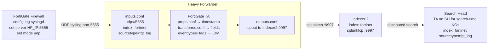

# Base Apps, Forwarder Use Cases, Heavy Forwarder, and Firewall Log Ingestion

> Deep reference on the BASE APPS pattern for managing forwarder configuration at scale through the deployment server; the real-world use cases for UF monitoring (Linux logs, Windows events, scripted inputs, custom indexes); deploying a Heavy Forwarder via the DS and when an HF is the right choice; and ingesting firewall/syslog logs through an HF with a vendor Technology Add-On, CIM normalization, and sourcetype/index assignment. Companion `pre-class.md` holds the short primer and official-doc links.

---

## 0. Orientation

The deployment server is only as useful as the apps you push through it. Once your forwarder fleet phones home, the question shifts from infrastructure to content: what configuration bundles does each class of host need, how do you manage those bundles cleanly, and what do you do when a device cannot run a forwarder at all?

This topic answers those questions through three lenses: (1) the **base-apps pattern** — a structured naming and scoping convention for DS-pushed apps; (2) **UF use cases** — concrete `inputs.conf` patterns for Linux logs, Windows events, scripted inputs, and how to correctly assign sourcetype and index; (3) **the Heavy Forwarder** — when and why to deploy one, how to configure it via the DS, and the full path from a firewall sending syslog to structured, CIM-normalized data in a Splunk index.

---

## 1. The base-apps pattern

The term "base app" refers to a DS-pushed app whose sole purpose is to provide a standardized, minimal configuration to a class of Splunk clients. Rather than hand-configuring each forwarder, you define a small set of apps, stage them in `deployment-apps/`, and wire them to server classes. The result is that every host of a given type receives identical, auditable, version-controlled configuration.

A practical distributed deployment typically uses three categories of base apps:

| App category | What it configures | Deployed to |
|---|---|---|
| **Outputs base app** | `[tcpout]` stanza pointing at the correct indexer(s) | All UFs and IFs of a given class |
| **Inputs base app** | `[splunktcp://9997]` to enable receiving | IFs that accept data from upstream UFs |
| **TA / use-case app** | `inputs.conf` stanzas enabling specific monitors, WinEventLog, or scripted inputs with correct `index=` and `sourcetype=` | The specific UF class that generates that data type |

The naming convention matters: use descriptive names that encode purpose and target, for example:
- `base_outputs_uf_to_if` — UF outputs pointing at IFs
- `base_inputs_if_receive` — IF receiving on 9997
- `base_outputs_hf_to_idx2` — HF outputs pointing at Indexer 2
- `ta_windows_uf_windows` — Splunk Add-on for Microsoft Windows deployed to Windows UFs
- `ta_linux_uf_linux2` — Splunk Add-on for Unix and Linux deployed to Linux UFs
- `ta_fortigate_hf` — FortiGate TA deployed to the HF

In large environments this list can grow to dozens of apps and hundreds of server classes. A consistent naming convention is the difference between a manageable fleet and chaos.

---

## 2. Managing server classes at scale

### The three-stanza server class model

A server class in `serverclass.conf` has three configurable levels:
1. **Global stanza** `[serverClass]` — defaults that apply to all classes unless overridden.
2. **Server class stanza** `[serverClass:<name>]` — class-level settings and the list of apps.
3. **App stanza** `[serverClass:<name>:app:<appname>]` — per-app overrides within a class (e.g., whether to restart after deploy).

In the Forwarder Management UI, these translate to the server class → app → client workflow, but the underlying file is `serverclass.conf` at `$SPLUNK_HOME/etc/system/local/serverclass.conf` on the DS.

### Client filters

Clients are matched by hostname patterns using wildcards. Examples:

| Pattern | Matches |
|---|---|
| `if-*` | All clients whose hostname starts with `if-` |
| `uf-linux-*` | All clients whose hostname starts with `uf-linux-` |
| `DESKTOP-*` | All Windows workstations with auto-generated names |
| Exact hostname | Only that one client |

The filter is evaluated against the client's `clientName` (set in `deploymentclient.conf`, defaults to the OS hostname). Using a consistent hostname naming convention at provisioning time (e.g., prefixing with role: `uf-`, `if-`, `hf-`) pays dividends here — you can target entire classes with a single wildcard.

### Triggering restarts

By default the DS deploys an app and does not restart the receiving Splunk daemon. For `inputs.conf` and `outputs.conf` changes to take effect, the receiving instance must restart. You can configure this per server class or per app in the UI or in `serverclass.conf`:

```ini
[serverClass:UF_base_outputs:app:base_outputs_uf_to_if]
restartSplunkd = true
```

### Reloading the DS without a restart

After directly editing `serverclass.conf` (rather than through the UI), trigger a deployment reload:

```bash
sudo -u splunk /opt/splunk/bin/splunk reload deploy-server
```

This re-evaluates all server class memberships and pushes changed apps to clients on their next phone-home.

---

## 3. Forwarder use cases: `inputs.conf` patterns

### 3.1 Monitoring Linux log files

The Splunk Add-on for Unix and Linux (available from Splunkbase) provides pre-built `inputs.conf` stanzas for common Linux paths. Best practice is to copy the stanzas you want from the TA's `default/inputs.conf` into a `local/inputs.conf` (never edit `default/`), then enable the specific stanzas and assign the correct index.

```ini
# local/inputs.conf within the Linux TA (after copying from default/)

[monitor:///var/log/syslog]
disabled = false
index = linux
sourcetype = syslog

[monitor:///var/log/auth.log]
disabled = false
index = linux
sourcetype = linux_secure

[monitor:///var/log/messages]
disabled = false
index = linux
sourcetype = syslog
```

**Key attributes:**
- `disabled = false` (or `0`) — enables the stanza. Many TA stanzas ship disabled.
- `index = <name>` — the destination index. This **must** exist on the receiving indexer before data arrives, or events land in `main` (or are dropped if `main` is the default and you're strict about index routing).
- `sourcetype = <name>` — tags events for parsing. The TA's `props.conf` uses this to apply the correct timestamp extraction and field definitions.

**Allowlist and denylist filtering:**

To restrict which files under a monitored directory are collected:

```ini
[monitor:///var/log/app/]
disabled = false
index = linux
sourcetype = app_log
whitelist = \.log$       # deprecated name, still valid; prefer 'allowlist' in 9.x
# allowlist = \.log$    # 9.x preferred attribute name
# denylist = \.gz$      # exclude compressed rotated logs
```

In Splunk 9.x, `allowlist` and `denylist` replaced the deprecated `whitelist` and `blacklist` attribute names (the old names still function unless the new names are also present). If both are defined, the `denylist` filter takes precedence.

### 3.2 Monitoring Windows Event Logs

The Splunk Add-on for Microsoft Windows provides `inputs.conf` stanzas for WinEventLog:

```ini
# local/inputs.conf within the Windows TA

[WinEventLog://Application]
disabled = 0
index = windows
sourcetype = WinEventLog:Application

[WinEventLog://System]
disabled = 0
index = windows
sourcetype = WinEventLog:System

[WinEventLog://Security]
disabled = 0
index = windows
sourcetype = WinEventLog:Security
```

The UF on Windows does not need to be running as a domain admin to read Application and System logs. Security log collection typically requires the UF service to run as an account with `SeSecurityPrivilege` or as a member of the Event Log Readers group.

### 3.3 Scripted inputs

Scripted inputs run a script on a schedule and collect the stdout output as events:

```ini
[script://./bin/cpu.sh]
disabled = false
interval = 300
index = linux_system
sourcetype = cpu_stats
```

- `interval` is in seconds. `interval = 300` runs the script every 5 minutes.
- The script path is relative to `$SPLUNK_HOME/etc/apps/<appname>/` unless absolute.
- The Splunk Add-on for Unix and Linux ships a set of pre-built scripts (`cpu.sh`, `ps.sh`, `vmstat.sh`, `interfaces.sh`, `top.sh`, etc.) that collect OS-level diagnostic data. These generate `linux_system`-style events useful for performance monitoring.

### 3.4 Creating custom indexes before data arrives

Custom indexes must exist on the receiving indexer **before** a forwarder sends data targeting them. If the index does not exist, events either land in `main` (default index) or are silently dropped depending on your `outputs.conf` and indexer settings.

Create indexes through Splunk Web (**Settings → Indexes → New Index**) or via `indexes.conf`:

```ini
# $SPLUNK_HOME/etc/system/local/indexes.conf on the indexer
[windows]
homePath = $SPLUNK_DB/windows/db
coldPath = $SPLUNK_DB/windows/colddb
thawedPath = $SPLUNK_DB/windows/thaweddb

[linux]
homePath = $SPLUNK_DB/linux/db
coldPath = $SPLUNK_DB/linux/colddb
thawedPath = $SPLUNK_DB/linux/thaweddb
```

For the deployment topology in this topic, indexes are created directly on each indexer (not pushed via DS — the DS is for forwarder clients, not typically for indexers in a non-clustered lab setup).

---

## 4. Deploying a Windows UF use case end to end via the DS

This sequence captures the complete workflow for deploying and enabling a Windows TA through the DS:

```mermaid
flowchart LR
    A[1. Create index on Indexer\nSettings → Indexes → New] --> B[2. Download TA from Splunkbase\ncopy .tgz to DS deployment-apps/]
    B --> C[3. Extract TA on DS\ntar -xzf TA.tgz\nset ownership splunk:splunk]
    C --> D[4. Copy inputs.conf from default/ to local/\nenable stanzas, set index=windows]
    D --> E[5. Create server class on DS\nForwarder Management → New Server Class]
    E --> F[6. Add TA app to server class\nadd Windows UF client filter]
    F --> G[7. Trigger restart on deploy\nrestartSplunkd = true]
    G --> H[8. Verify: search head\nindex=windows | stats count by host]
```

**Why copy `default/` to `local/` on the DS?** The TA's `default/inputs.conf` ships with all stanzas `disabled = true`. If you enable stanzas directly in `default/`, an upgrade of the TA overwrites your changes. Copying to `local/` keeps changes safe and follows the standard `default`-vs-`local` convention even within the DS staging context.

---

## 5. When to use a Heavy Forwarder

The Universal Forwarder is the right tool for most endpoint data collection. Use a Heavy Forwarder when the situation requires something the UF cannot do:

| Requirement | UF | HF |
|---|---|---|
| Monitor files and directories | Yes | Yes |
| WinEventLog collection | Yes (Windows only) | Yes |
| Scripted inputs | Yes | Yes |
| Index-time parsing (`props.conf`, `transforms.conf`) | No | Yes |
| Event routing — send different events to different indexes based on content | No | Yes |
| Data masking / anonymization at the edge | No | Yes |
| Receive raw TCP/UDP (syslog from network devices) | No | Yes |
| Run as a relay with intermediate parsing | No | Yes |
| Receive data from network devices that cannot install an agent | No — must use HF or indexer directly | Yes |

**The defining capability of the HF is network input + index-time processing.** Firewalls, routers, switches, load balancers, and cloud-managed appliances cannot install a UF. They send syslog (UDP/TCP 514 or custom port) to a listener. The HF is that listener. It receives the raw syslog stream, applies a vendor TA to assign the correct `sourcetype`, parses the events, and forwards them to the indexer.

A secondary HF use case is edge parsing: if data needs sensitive field masking (credit card numbers, PII) before it lands on disk, putting an HF between UFs and indexers lets you apply `SEDCMD` or `TRANSFORMS` at the point of ingestion.

---

## 6. Deploying the Heavy Forwarder via the Deployment Server

The HF joins the DS as a deployment client just like a UF:

1. Copy the `deployment_client_app` (with `deploymentclient.conf`) to `$SPLUNK_HOME/etc/apps/` on the HF.
2. Set ownership to `splunk:splunk`, restart the HF.
3. Verify the HF appears in Forwarder Management on the DS.

Then create a **dedicated server class** for the HF and push three apps to it:

| App | Configuration | Purpose |
|---|---|---|
| `base_outputs_hf_to_idx2` | `outputs.conf` pointing at Indexer 2 private IP:9997 | Defines where the HF forwards data |
| `base_inputs_hf_fortigate` | `inputs.conf` with `[udp://5555]` or `[tcp://5555]`, `index = fortinet` | Tells the HF to listen on the custom syslog port |
| `ta_fortigate` | Vendor TA for FortiGate / Fortinet | Provides `sourcetype` transforms and `props.conf` for parsing |

All three arrive on the HF's next phone-home. Verify with:

```bash
ls -la /opt/splunk/etc/apps/
# Should show all three newly deployed apps
```

---

## 7. Configuring network input on the Heavy Forwarder

The HF receives firewall syslog via a network input stanza in `inputs.conf`. The DS-pushed `base_inputs_hf_fortigate` app contains:

```ini
# local/inputs.conf in base_inputs_hf_fortigate app

[udp://5555]
disabled = false
index = fortinet
sourcetype = fgt_log
connection_host = ip
no_priority_stripping = false
```

**Attribute notes:**
- `[udp://5555]` — listen for UDP syslog on port 5555 (or 514 for default syslog). Using a non-standard port avoids conflicts with any OS-level syslog daemon.
- `[tcp://5555]` — use instead for reliable TCP syslog delivery.
- `index = fortinet` — destination index; must exist on the receiving indexer before data arrives.
- `sourcetype = fgt_log` — the raw sourcetype that the FortiGate TA's `props.conf` expects to transform. Using an incorrect sourcetype here means the TA's parsing rules never fire.
- `connection_host = ip` — sets the `host` field in Splunk to the IP address of the sending device (the firewall). Alternatively `dns` to resolve to hostname, or `none` to leave the host as the HF's hostname.
- `no_priority_stripping` — when `false` (default), Splunk strips the `<priority>` field prefix from syslog messages (`<14>`, etc.). Set `true` if the TA expects the raw syslog header.

After deploying this app, open the relevant port in the cloud security group / NSG:

| Port | Protocol | Source | Note |
|---|---|---|---|
| 5555 (or custom) | UDP | Firewall source IP or `0.0.0.0/0` | HF ingress for syslog |
| 5555 (or custom) | TCP | Firewall source IP | If using TCP syslog |

---

## 8. The FortiGate firewall side: CLI configuration

On a FortiGate, syslog forwarding is configured in the CLI:

```
config log syslogd setting
    set status enable
    set server <HF_private_or_public_IP>
    set port 5555
    set mode udp
end
```

For a FortiGate in the same cloud environment, use the HF's private IP. For a physical FortiGate forwarding to a cloud HF, use the public IP (and open the relevant port in the NSG/security group from the FortiGate's public source IP).

Verify on the HF that syslog is arriving:

```bash
# On the HF — check that the port is bound
ss -an | grep 5555

# Watch splunkd.log for incoming data
tail -f /opt/splunk/var/log/splunk/splunkd.log | grep "udp\|5555"
```

---

## 9. The FortiGate Technology Add-on: what it does

A Technology Add-on (TA) is a Splunk app distributed through Splunkbase that provides:
1. **`props.conf`** — sourcetype definitions: timestamp extraction, line termination, `EXTRACT` or `TRANSFORMS` for field extraction.
2. **`transforms.conf`** — regex-based field extraction rules referenced by `props.conf`.
3. **`eventtypes.conf`** — event type definitions that map FortiGate events into CIM data model categories.
4. **`tags.conf`** — CIM tags applied to event types (e.g., `network`, `communicate`, `firewall`).
5. Optionally: `lookups/` for field normalization (e.g., severity code → label).

The Splunk Add-on for Fortinet / FortiGate (available from Splunkbase, offered by Splunk or community-maintained) handles all of the above for FortiGate syslog. When deployed on the HF, it parses arriving syslog at index time and normalizes fields to CIM standards.

**Deployment location for TAs:**
- **HF** — install the parsing TA on the HF so parsing happens at the edge before forwarding. This offloads regex work from the indexer.
- **Indexer** — install the TA here too if you want index-time field extraction to apply at the indexer (required for `TRANSFORMS` that route data or mask fields at index time).
- **Search Head** — install the TA here for search-time field extractions and knowledge objects (eventtypes, tags, field aliases) to be available to searches.

The typical pattern: TA on HF (for index-time parsing) + TA on SH (for search-time knowledge objects). In a lab, installing it on the HF via the DS and verifying you get parsed events is the priority.

---

## 10. CIM normalization and why it matters

The Common Information Model (CIM) is Splunk's standardized schema for naming fields consistently across data sources. It is implemented as the Splunk CIM add-on (a set of data models) plus TAs for each data source that map vendor-specific field names to the CIM standard names.

For firewall logs, the relevant CIM data models include:
- **Network Traffic** — for connection logs (src_ip, dest_ip, src_port, dest_port, bytes, action, protocol)
- **Intrusion Detection** — for IDS/IPS events
- **Authentication** — for VPN auth events

A well-normalized FortiGate TA maps raw fields like `srcip` → `src_ip`, `dstip` → `dest_ip`, `action=accept` → `action=allowed`. Queries using these normalized field names work identically regardless of whether the data came from a FortiGate, Palo Alto, Cisco ASA, or pfSense — the CIM abstraction layer hides the vendor difference.

This matters operationally: Splunk Enterprise Security's correlation searches and risk-based alerting rely entirely on CIM normalization. If a TA is missing or incorrectly deployed (e.g., wrong sourcetype), CIM searches return nothing for that data source.

---

## 11. Complete data flow: firewall log ingestion



**Step-by-step what happens:**
1. FortiGate sends syslog UDP to the HF's IP:5555.
2. The HF's `[udp://5555]` input stanza receives the raw syslog, stamps it with `index=fortinet`, `sourcetype=fgt_log`, and `host=<firewall_IP>`.
3. The FortiGate TA on the HF applies `props.conf` rules: extracts timestamp, identifies event boundaries, and applies field extractions via `transforms.conf`.
4. The HF forwards parsed events to Indexer 2 via `outputs.conf` (splunktcp:9997).
5. Indexer 2 writes events to the `fortinet` index on disk.
6. The search head queries Indexer 2 via distributed search; the TA installed on the SH provides the `eventtypes` and `tags` knowledge objects for CIM-based searches.

---

## 12. Verifying all use cases

After deploying all server classes and use-case apps, verify on the search head:

```
# Check all hosts are forwarding internal logs
index=_internal | stats count by host

# Verify Windows UF is sending Windows events
index=windows | stats count by host, sourcetype

# Verify Linux UF is sending Linux logs
index=linux | stats count by host, sourcetype

# Verify Linux scripted inputs
index=linux_system | stats count by host, sourcetype

# Verify FortiGate logs are arriving on the HF and being indexed
index=fortinet | stats count by host, sourcetype

# CIM check — if the TA is normalized correctly
index=fortinet sourcetype=fgt_log | stats count by action, src_ip | sort -count
```

The most common failure is an empty result for a custom index — almost always caused by either: (1) the index was not created on the indexer, (2) the `inputs.conf` stanza is still `disabled = true`, (3) the app was staged in `deployment-apps/` but the server class was not reloaded, or (4) the NSG/security group is blocking the relevant port.

---

## 13. Terminology & version notes

- **Base app** — informal term for a DS-pushed app containing minimal configuration (outputs, inputs/receive, or TA activation) for a class of clients. Not a formal Splunk term.
- **Technology Add-on (TA)** — a Splunk app on Splunkbase that provides parsing, field mapping, and CIM normalization for a specific data source. Should be deployed on the parsing point (HF), indexer (for index-time fields), and search head (for search-time knowledge objects).
- **CIM (Common Information Model)** — Splunk's field-naming schema; enables cross-source queries and powers ES correlation searches.
- **`allowlist` / `denylist`** — 9.x attribute names in `inputs.conf` for file filtering. Replaced deprecated `whitelist` / `blacklist`. Both old names still work in 9.x unless the new names are also present in the same stanza.
- **`connection_host`** — `inputs.conf` attribute for network inputs that controls what the `host` field is set to: `ip` (source IP), `dns` (reverse DNS), or `none` (HF's own hostname).
- **`restartSplunkd`** — `serverclass.conf` / Forwarder Management setting that triggers a Splunk daemon restart on the client after app deployment. Required for `inputs.conf` and `outputs.conf` changes to take effect.
- In Splunk 9.x, TA management on a Heavy Forwarder is unchanged from earlier versions. The HF is just a full Splunk Enterprise instance in forwarding mode — all TA deployment mechanisms apply identically.

---

## 14. Common misconceptions

- **"I can push TA apps to indexers via the DS."** For non-clustered indexers you technically can, but it is not recommended practice. Clustered indexers must receive TA updates through the cluster manager's bundle. In a lab with standalone indexers, the DS can push to them, but be aware of the distinction.
- **"Installing the TA on the HF is enough."** For search-time knowledge objects (eventtypes, tags, field aliases, lookups) to be available to searches, the TA must also be on the search head. HF installation handles index-time parsing only.
- **"Any Splunk instance can receive syslog."** Only Splunk instances with network input stanzas configured (`[udp://...]` or `[tcp://...]`) receive raw syslog. A UF cannot. An indexer can (with the right `inputs.conf`), but using the HF as the syslog receiver keeps the indexing tier clean and adds a parsing stage.
- **"I need to restart the DS to push new apps."** No — run `splunk reload deploy-server` after adding new apps to `deployment-apps/`. Changes are picked up on the next client phone-home. A full DS restart is only needed for changes to `server.conf` and similar system-level files.
- **"All UFs in the fleet should get all TAs."** No — TAs should be deployed only to the forwarders that collect that data type. Deploying a Windows TA to Linux UFs wastes resources and creates unnecessary scheduled processes.
- **"The `sourcetype` I set in `inputs.conf` is just a label."** It is much more: `sourcetype` is the key that `props.conf` uses to look up all parsing rules (timestamp extraction, line merging, field extractions). Setting it incorrectly means the TA's parsing rules never fire and CIM normalization fails silently.

---

## 15. Mastery checklist — what you should be able to explain

- Define the base-apps pattern and the three categories of base apps in a distributed deployment (outputs, inputs/receive, TA/use-case).
- Explain the naming convention for DS apps and server classes, and why consistency matters at scale.
- Write an `inputs.conf` stanza to monitor a Linux log file with a specific `index=` and `sourcetype=`.
- Explain `allowlist`/`denylist` in `inputs.conf`: what they filter, which takes precedence, and the deprecated attribute names.
- Explain why you copy from `default/` to `local/` within a TA before making changes, even on the DS.
- State three conditions that require a Heavy Forwarder instead of a Universal Forwarder.
- Describe the three apps you deploy to an HF via the DS to handle firewall syslog ingestion.
- Write the `inputs.conf` stanza for a UDP syslog input on port 5555 with correct index, sourcetype, and `connection_host`.
- Explain what the FortiGate TA does on the HF vs on the search head.
- Describe what CIM normalization is and why it matters for ES correlation searches.
- Walk through the complete data path from FortiGate sending syslog to a `fortinet` index entry searchable on the SH.
- List the four most common causes of an empty custom index and how to diagnose each.

---

## 16. Key terms (flashcard seeds)

- **Base app** — DS-pushed app providing standardized minimal config (outputs/inputs/TA) to a class of clients.
- **Server class** — DS construct mapping apps to a filtered set of clients; filter by hostname wildcard.
- **`deployment-apps/`** — staging directory on the DS for apps destined for clients.
- **`restartSplunkd`** — server class / app setting that triggers daemon restart on the client after deployment.
- **`splunk reload deploy-server`** — forces re-evaluation of server classes and re-deployment of changed apps; no DS restart needed.
- **`inputs.conf` `[monitor://...]`** — file monitoring input; key attributes: `disabled`, `index`, `sourcetype`, `allowlist`, `denylist`.
- **`allowlist` / `denylist`** — 9.x file filter attributes; denylist overrides allowlist; replaces deprecated `whitelist`/`blacklist`.
- **`[WinEventLog://Security]`** — Windows event log input stanza; requires appropriate privileges.
- **`[script://...]`** — scripted input; `interval` in seconds; collects stdout.
- **Technology Add-on (TA)** — Splunk app providing parsing (`props.conf`), field extraction (`transforms.conf`), and CIM mapping (`eventtypes.conf`, `tags.conf`) for a specific data source.
- **Heavy Forwarder** — full Splunk Enterprise in forwarding mode; can receive network/syslog, parse, mask, route; necessary for devices without agent support.
- **`[udp://5555]` / `[tcp://5555]`** — network input stanza for syslog; `connection_host=ip` sets host to sender IP.
- **`sourcetype`** — the key linking raw events to `props.conf` parsing rules; setting it wrong breaks CIM normalization.
- **CIM** — Common Information Model; standard field schema; normalizes `srcip`→`src_ip` etc. across vendors; powers ES correlation.
- **`index=fortinet`** — destination index for firewall logs; must exist on the indexer before data arrives.

---

## 17. Questions to drill (quiz seeds)

1. You have 50 Linux UFs and 20 Windows UFs in the fleet. Describe the server class structure you would create, what apps each class receives, and the naming convention you would use.
2. You deploy the Splunk Add-on for Unix and Linux to a UF via the DS. The UF appears in Forwarder Management as 100% deployed. But `index=linux | stats count by host` returns no events from that UF. Give three possible causes and how you would diagnose each.
3. What is the difference between `allowlist` and `denylist` in a `[monitor://...]` stanza? If a file matches both, which one wins? What were these attributes called before Splunk 9.x?
4. Explain why you copy `inputs.conf` from `default/` to `local/` within a TA on the DS before enabling stanzas. What would happen if you edited `default/inputs.conf` directly and then upgraded the TA?
5. List three scenarios where you must deploy a Heavy Forwarder rather than a Universal Forwarder. For each, explain the technical reason a UF cannot handle it.
6. Write the complete `inputs.conf` stanza for an HF listening for FortiGate UDP syslog on port 5555, routing events to index `fortinet` with sourcetype `fgt_log`, with `host` set to the sender's IP address.
7. Where must the FortiGate TA be installed and why? What breaks if it is only on the HF and not on the search head?
8. A new `fortinet` index was created on Indexer 2. The HF is running. The FortiGate firewall is configured to send syslog to the HF. But `index=fortinet` returns no events. Walk through your diagnostic checklist in order.
9. Explain what CIM normalization does to FortiGate's `srcip` and `dstip` fields, and why it matters if your organization uses Splunk Enterprise Security.
10. After editing `serverclass.conf` directly on the DS, how do you trigger deployment without restarting the DS? What happens if a client's next phone-home interval is 60 seconds and you need faster deployment?
